[拼车教程](/docs/faq-carpool)讲的是「一个套餐拼给几个人」的最短流程。这一篇接着往下走:**同一批服务器上开几个不同的套餐,不同的人拿不同的组合**,并把用户从开始用、用超、重置、续费到退出的整个过程走一遍。

文中的例子:

| 套餐 | 额度 | 节点 | 谁在用 |
| --- | --- | --- | --- |
| 日常套餐 | 100 GB / 月 | 日常上网的节点 | alice、bob |
| 流媒体套餐 | 50 GB / 月 | 流媒体解锁节点 | bob |

alice 只拼日常;bob 两个都拼。开始前需要已经[添加好服务器](/docs/remote-servers)并[建好节点](/docs/nodes)。

## 先弄清三件事

- **套餐是模板,绑到用户身上才是一份「套餐实例」。** 同一个套餐绑给 10 个人就是 10 份实例,各算各的流量、到期时间和重置日。套餐里写的 100 GB 是每个人各 100 GB,不是大家合用 100 GB
- **一个用户可以同时有多份实例。** 每份实例在节点上有自己的一套凭据,所以 bob 的日常套餐用超了,不会影响他的流媒体套餐,反过来也一样
- **流量按用户身份计,不按端口计。** 同一个节点、同一个端口可以放进多个套餐、给很多人用,每个人的用量分开累计,不用给每个人单独开端口

## 第 1 步:建套餐

打开「套餐管理 → 创建套餐模板」,填名称、流量额度,在右侧勾选这个套餐能用的节点,保存。

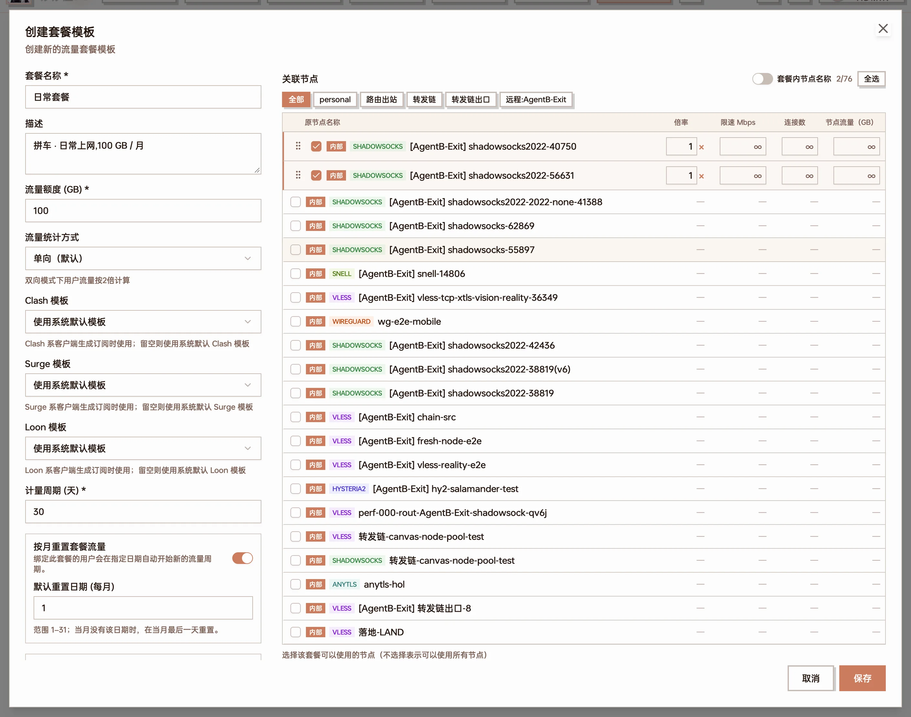

创建「日常套餐」:额度 100 GB,右侧勾了两个日常节点

再用同样的办法建「流媒体套餐」(50 GB,勾流媒体解锁的节点)。

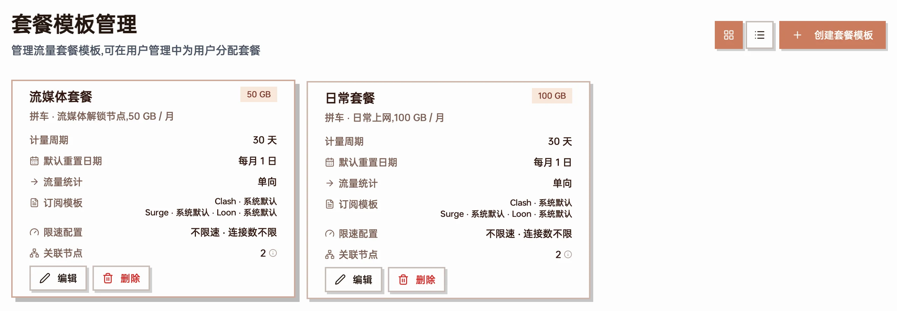

两个套餐建好后的卡片:额度、计量周期、关联节点数一目了然

几个容易选错的地方:

- **关联节点一个都不勾 = 全部节点。** 想让两个套餐用不同的节点,就必须各自勾选
- **两个套餐可以勾同一个节点。** 同一个人在两个套餐里用到同一个节点时,是两套不同的凭据,流量分别记到各自的套餐上
- **计量周期(天)** 只决定绑定时到期时间默认往后推多久;每月哪天清零是绑定时定的(见第 3 步)
- 限速、连接数、流量统计方式(单向 / 双向)、节点倍率等见[套餐管理](/docs/packages)

## 第 2 步:建用户

打开「用户管理 → 新增用户」,每个拼车的人建一个账号。只有用户名必填;初始密码默认随机生成,点「确认创建」时会自动复制到剪贴板,连同面板地址一起发给对方。

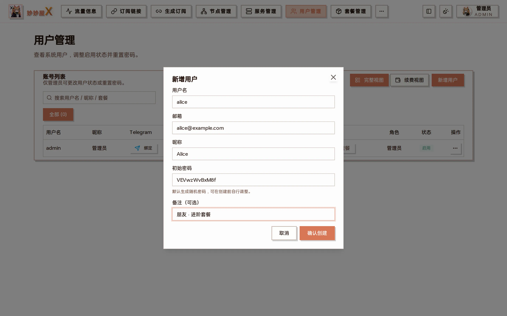

新增用户:用户名必填,其余按需

照这样建好 alice 和 bob。

## 第 3 步:给用户绑套餐

### 绑第一个套餐

在 alice 那一行点「绑定套餐」,选「日常套餐」,确认到期时间和重置日,点「确认保存」。

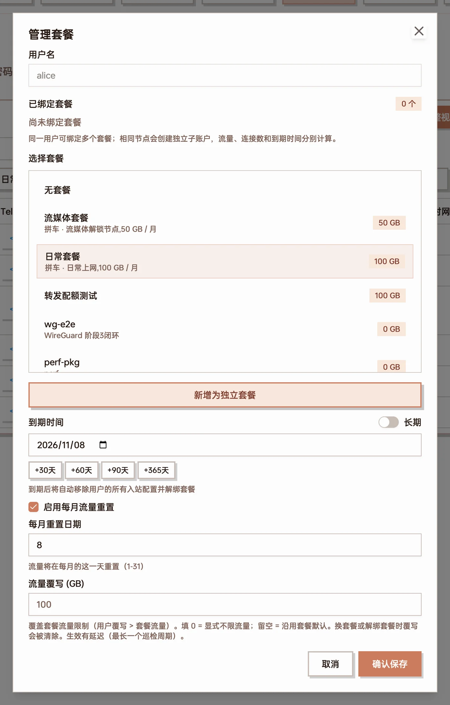

给 alice 绑日常套餐:到期时间默认往后一个月,每月重置日期默认是绑定当天

| 项目 | 怎么填 |
| --- | --- |
| 到期时间 | 默认往后一个月,可以用 +30 / +60 / +90 / +365 天快捷按钮,或打开「长期」不设到期 |
| 启用每月流量重置 | 勾上后,每月到「每月重置日期」那天用量清零。默认填绑定当天,想统一成每月 1 号就改成 1 |
| 流量覆写 (GB) | 只给这个人改额度,不动套餐本身。留空 = 按套餐的额度,填 0 = 不限流量 |

对 bob 做同样的操作,先把「日常套餐」绑上。

### 再加一个套餐

bob 还要流媒体套餐。打开 bob 的「管理套餐」(操作菜单「…」里点套餐名),上方是已经绑定的套餐卡片;在下面选「流媒体套餐」,点 **「新增为独立套餐」**。

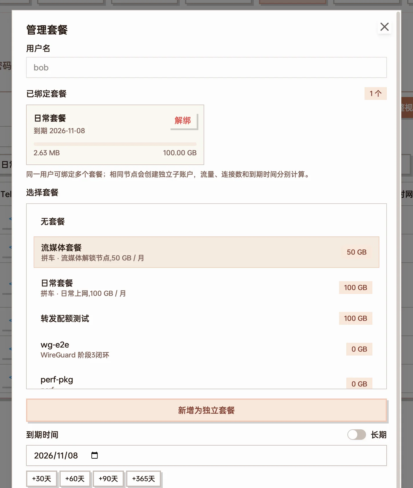

bob 已有日常套餐,选中流媒体套餐后点「新增为独立套餐」

:::caution[别点成「确认保存」]
已经有套餐的用户,选另一个套餐再点「确认保存」是**换套餐**——原来的套餐被替换掉。要让两个套餐同时生效,点的是「新增为独立套餐」。

同一个套餐不能给同一个人绑两次。
:::

绑完以后,用户列表里 bob 的「套餐/流量」一列会有两根进度条,每个套餐一根。

本文为了演示超额,给 bob 的流媒体套餐填了「流量覆写」1 GB,所以后面的截图里它的额度显示为 1.00 GB,而不是套餐的 50 GB。

## 第 4 步:把订阅发给用户

在用户那一行点「复制订阅」。有多个套餐时,会弹出一个列表,**每个套餐各有一条订阅链接**(也可以出二维码):

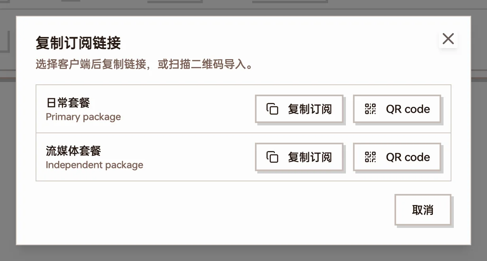

bob 的两个套餐各有一条订阅链接

- 每条链接里只有对应套餐的节点,客户端里显示的已用 / 总量 / 到期时间也是这个套餐自己的
- 两条都导入客户端,就是两个订阅分组,用哪个分组的节点就扣哪个套餐的流量
- 嫌两条麻烦,可以在「系统设置」里打开「合并订阅」:每个用户多一条「全部套餐」链接,内容是他名下所有生效套餐的节点合在一起,某个套餐到期后自动不再包含它的节点

用户也可以自己拿:用账号登录面板,首页每个套餐一张卡片,订阅链接在「订阅链接」页;接了 [Telegram 机器人](/docs/tool-mmwx-tgbot)的话,在机器人里发 `/sub` 即可。

## 使用过程中

### 看用量

用户开始用以后,「用户管理」列表的进度条会跟着涨:

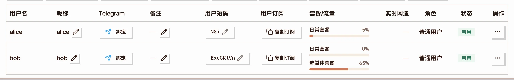

alice 的日常套餐用了 5%;bob 的日常套餐几乎没用,流媒体套餐用了 65%

想看具体数字,打开「管理套餐」,每份套餐实例一张卡片,写着已用 / 额度和到期日:

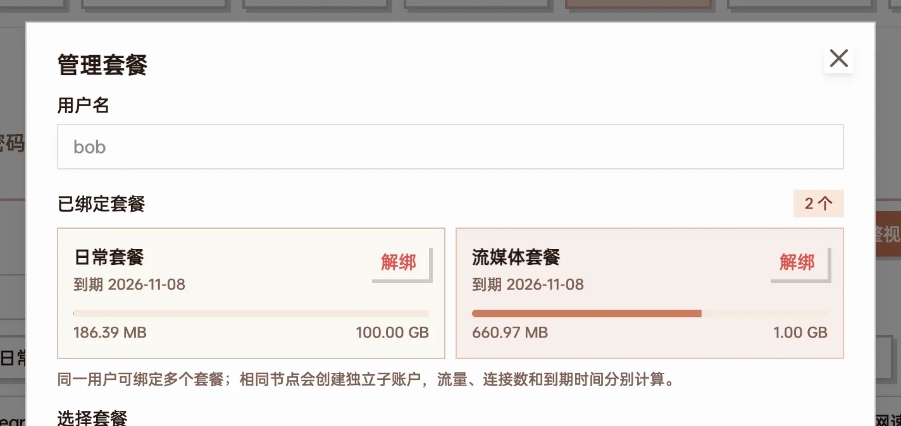

bob 的两份套餐分开记账:日常 186 MB / 100 GB,流媒体 661 MB / 1 GB

用户自己登录面板,在首页也能看到同样的卡片。更细的「谁在哪个节点上用了多少」在「流量明细」里,各页面的口径差别见[流量统计口径](/docs/traffic-accounting)。

### 快用完时

用到 80% 时,面板会给管理员的 Telegram 发一条预警(需要在「系统设置 → 推送」里配置好 Telegram 通知)。用户自己在机器人里发 `/notify on` 后,每天 20:00 会收到当天的流量概况。

### 用超了会怎样

某份套餐的用量达到额度后:

- 面板把**这份套餐**在各节点上的凭据摘掉,用户用这个套餐的节点会连不上。一般在超额后 1–2 分钟内生效
- **只影响这一份套餐。** bob 的流媒体套餐超了,他的日常套餐照常能用;alice 也完全不受影响
- 用户列表里这个套餐标上红色的「超限」

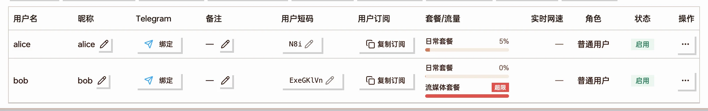

bob 的流媒体套餐用超,标为「超限」;日常套餐和 alice 不受影响

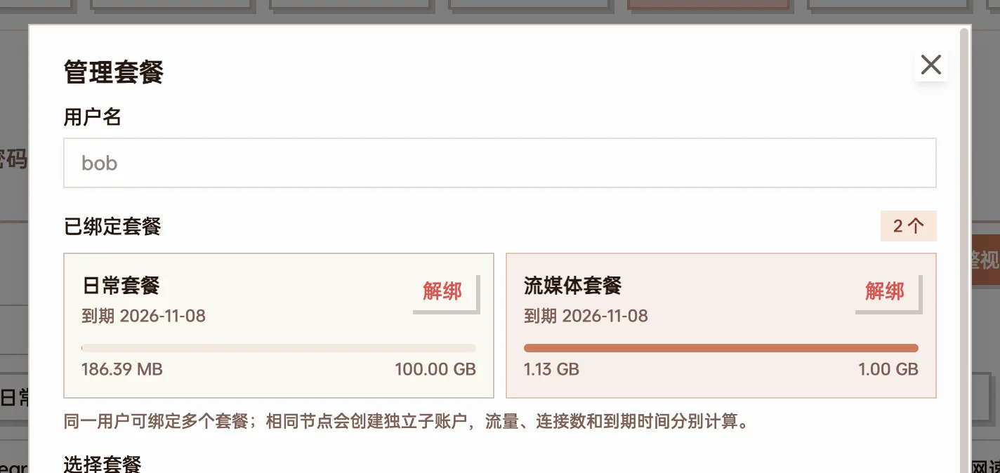

卡片上已用 1.13 GB,超过了 1.00 GB 的额度

管理员账号不受额度限制,用超了也不会被断开。

### 让超额的用户恢复

四种办法,按情况选:

| 办法 | 怎么做 | 效果 |
| --- | --- | --- |
| 等每月重置 | 什么都不用做 | 到重置日用量清零,自动恢复 |
| 给这个人加额度 | 「管理套餐」里点那张套餐卡片,改「流量覆写」,点「保存该套餐」 | 只改这个人的这份套餐,几秒到几十秒内恢复 |
| 给整个套餐加额度 | 「套餐管理」里编辑套餐的流量额度 | 所有绑了这个套餐、且没有单独覆写的人一起生效 |
| 重置流量 | 用户操作菜单「…」→「重置流量」 | 这个用户**所有套餐**的用量一起清零,下一次检查(默认 2 分钟内)后恢复 |

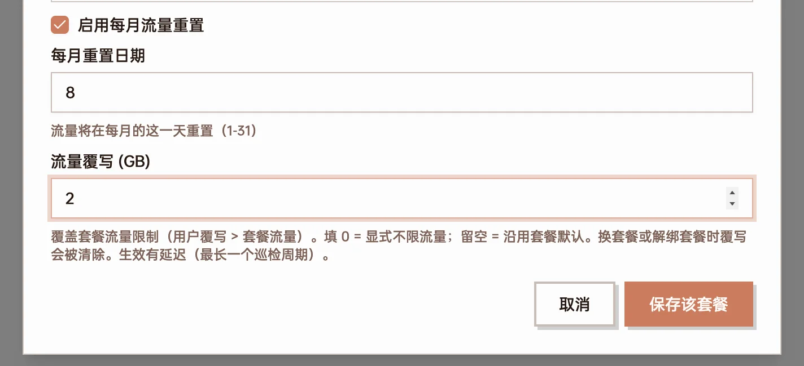

点中超额的套餐卡片,把流量覆写从 1 改成 2,点「保存该套餐」

恢复后用户不用换订阅,原来的节点直接能连上。

## 一个周期结束时

### 每月重置

勾了「启用每月流量重置」的套餐,每月到重置日那天用量清零,超额的随之恢复。每份套餐实例按自己的重置日走:bob 的两个套餐如果不是同一天绑的,就不在同一天清零——想让大家统一,绑定时把重置日期都填成同一天。

### 到期

到了到期时间,这份套餐默认会被**停用**:凭据摘掉、套餐从用户身上解绑。其它没到期的套餐不受影响。

不想一到期就断,可以在套餐里把到期处理改成「到期后降级到另一个套餐」并设宽限期:到期后用户先落到你指定的那个套餐(通常是个限速、节点少的保底套餐),宽限期内续费就自动恢复原套餐,宽限期过了才停用。

到期前会给管理员的 Telegram 发提醒;打开了 `/notify on` 的用户,在到期前 7 / 3 / 1 天也会收到提醒。

### 续费

收到钱以后,切到「用户管理 → 续费视图」,每一行都有 +30 / +60 / +90 / +365 天和「重置流量」按钮,适合月初一口气处理一批人:

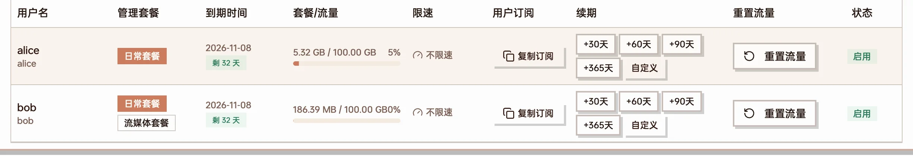

续费视图:到期时间、用量、续期按钮排在同一行

- 续期只改到期时间,**不清零用量**。要让新的一期从 0 开始,再点一次「重置流量」
- 这里的续期按钮续的是用户的第一个套餐(主套餐)。用「新增为独立套餐」加上的套餐,要到「管理套餐」里点它的卡片,改到期时间,再点「保存该套餐」

## 有人退出

| 情况 | 怎么做 | 结果 |
| --- | --- | --- |
| 只退其中一个套餐 | 「管理套餐」里那张卡片上点「解绑」 | 这个套餐的节点立刻连不上,其它套餐照常。注意点了就生效,没有二次确认 |
| 暂时停掉这个人 | 把用户的状态切成「禁用」 | 所有节点连不上、不能登录;套餐绑定都还在,重新启用即恢复 |
| 彻底退出 | 操作菜单「…」→「删除」 | 删除账号和它的全部凭据 |

套餐本身可以留着给下一个人用。删除套餐会把所有还绑着它的用户一起解绑,他们在这个套餐里的节点随即连不上——删之前先确认没人在用。

## 常见问题

### 两个套餐里有同一个节点,流量算谁的?

看用户用的是哪条订阅里的节点。两个套餐在同一个节点上是两套凭据,用哪套就记到哪个套餐上,不会重复计算。

### 用户说节点突然全连不上了

先看用户列表:

- 套餐标着「超限」→ 用超了,见上面[让超额的用户恢复](#让超额的用户恢复)
- 套餐不见了 → 到期被停用了,重新绑定即可
- 状态是「禁用」→ 重新启用

都不是的话,再去「服务管理」看服务器和 Xray 是否在线。

### 列表里的用量和「管理套餐」里的对不上

有多个套餐时,以「管理套餐」里每张卡片上的数字为准——每份套餐按自己的额度和重置日单独记账。

### 能不能几个人合用一份额度?

不能直接这样做:额度是每个人、每份套餐各算各的。几个人合用,只能让他们共用同一个账号。
