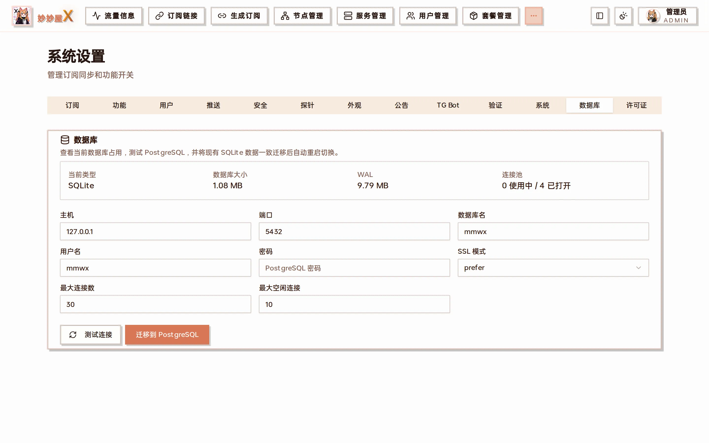

:::note[New backups have no password]
Current exports are regular ZIP files and require no password. Only legacy encrypted .zip.enc backups require their original password. Treat every backup as sensitive data.
:::

## Entry points

- **Manual backup / restore**: avatar menu at the top right → "Backup data" to download the full ZIP or upload one to restore
- **Auto backup**: "System Settings → System → Auto backup" packs data, certificates and subscription files (optionally the database) on a schedule and uploads it remotely, keeping N copies
- **Restore during setup**: the first-run setup wizard has "Restore from backup" at the bottom
- **Database switch**: "System Settings → Database" migrates between SQLite and PostgreSQL


Avatar menu: backup data, migrate from MiaoMiaoWu, check for updates …


System Settings → System: auto backup (enable, target, interval, remote copies to keep, include database)



System Settings → Database: view the current database type, migrate to PostgreSQL or back to SQLite

## Included data

### Database

Users, packages, nodes, servers, and system settings.

### Subscription resources

The subscribes directory and files needed to generate subscriptions.

### Certificates

Issued certificates, self-signed certificates, and private keys.

## Restore workflow

1. Download a fresh backup from the system menu and ensure the ZIP finishes saving.
2. Keep a separate copy of current data; upload the backup and wait for validation and replacement.
3. Sign in again, verify servers, nodes, certificates, and subscriptions, then allow Agents to reconnect.

## PostgreSQL backups

:::caution[ZIP backups apply to SQLite only]
Once the master runs on PostgreSQL it refuses to produce a ZIP without the database. Use pg_dump/pg_restore for the database; the data and subscribes directories still need separate backups. Ticking "Include database" in auto backup packs PostgreSQL as well.
:::

```
# Docker Compose 数据库备份
docker exec miaomiaowux-postgres pg_dump -U mmwx -Fc mmwx > mmwx.dump

# 恢复到空数据库
docker exec -i miaomiaowux-postgres pg_restore -U mmwx -d mmwx --clean --if-exists < mmwx.dump

# 同时备份运行目录
tar czf mmwx-files.tar.gz data subscribes rule_templates
```

## Startup database recovery

The master checks SQLite integrity on startup and may restore a valid mmwx.db.backup if the database cannot open. The hourly database backup task has been removed, so this emergency copy is not a formal backup; regularly download a complete backup from the UI.
