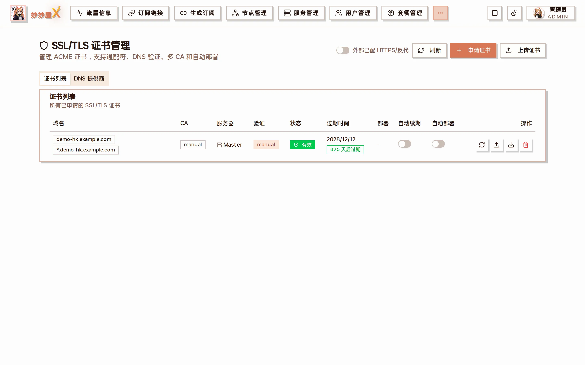
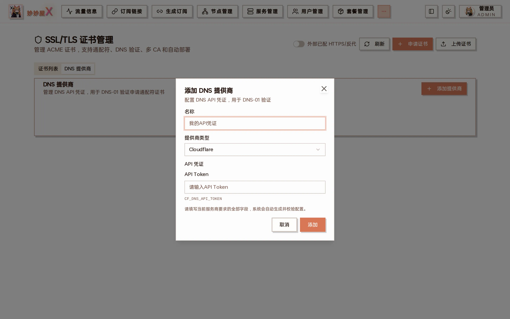
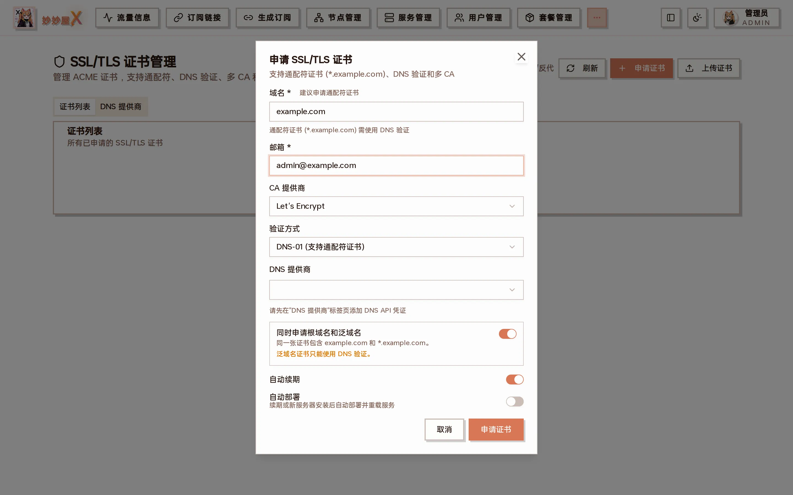
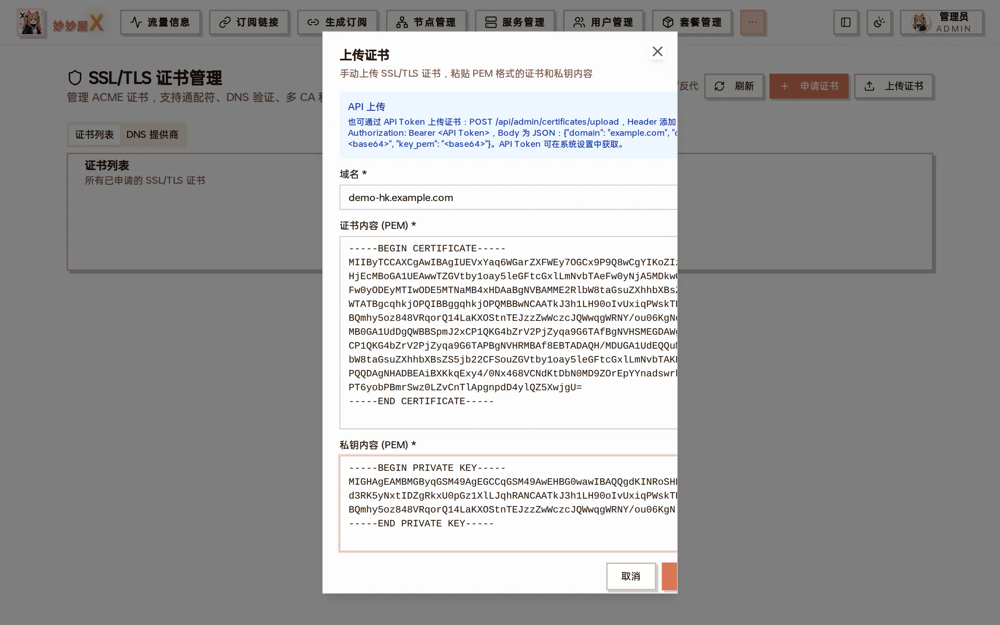

import { DocDemo } from "@/components/docs/islands/certificates";



Certificates — the list: domain / CA / server / validation / status / expiry / deployment / auto-renew / auto-deploy

## Try it: certificate management

4 mock domains; request, renew, download, delete. Entirely local.

<DocDemo lang="en" client:load />

## Overview

The certificate module requests and renews TLS certificates through ACME. Several DNS providers are supported and certificates are synced to remote servers automatically. The page has two tabs, "Certificate List" and "DNS Providers", and three buttons: "Refresh", "Request Certificate", "Upload Certificate".

## Supported DNS providers

| Provider       | Credentials             |
| -------------- | ----------------------- |
| Cloudflare     | API Token               |
| Alibaba Cloud  | AccessKey ID + Secret   |
| Tencent DNSPod | SecretId + SecretKey    |
| Namesilo       | API Key                 |

In the "DNS Providers" tab click "Add DNS Provider", choose the type and enter the credentials; the config is generated and validated automatically:



Add DNS provider: name + type + API credentials

## Request a certificate

1. Open "Certificates" and click "Request Certificate"
2. Enter the domain (wildcards such as \*.example.com are supported)
3. Enter the email and choose the CA (Let's Encrypt by default)
4. Choose DNS-01 (required for wildcards) and the DNS provider you added
5. For wildcards enable "Root + wildcard" to put example.com and \*.example.com in one certificate's SAN
6. Enable "Auto renew" / "Auto deploy" as needed
7. Submit; DNS validation runs and the result is stored in the database and certificate directory



Request SSL/TLS certificate: domain, email, CA, validation, DNS provider, root + wildcard, auto renew, auto deploy

## Upload a certificate

Existing certificates (from Certimate or any other ACME client) can be pasted as PEM:



Upload certificate: domain + certificate PEM + private key PEM; the dialog header also shows the API upload method

Uploaded certificates appear in the list with CA "manual" and can be downloaded and deployed like any other.

## Download and auto deploy

"Download" in the list produces a zip with fullchain.pem and privkey.pem. After renewal, reissue or a webhook update the files are pushed again to every Nginx and Xray directory referencing the certificate; restoring a historical Xray config from the Agent also pushes the referenced certificates first.

## Auto renew

Certificates are renewed before expiry and the new files are updated on every remote server using them.

## Storage

```
Certificate paths (remote server):
  cert: /root/cert/{domain}/fullchain.pem
  key:  /root/cert/{domain}/privkey.pem
```

## Use cases

- VLESS/VMess/Trojan + TLS inbounds need a certificate
- Hysteria2 / AnyTLS inbounds need a certificate
- REALITY inbounds need none (they use the target site's certificate)

When a server's port 443 has no certificate yet, the add-node wizard shows an "SSL configuration" prompt from which the certificate and Nginx 443 can be set up in one click.

## Webhook upload (Certimate integration)

MiaoMiaoWu X accepts certificates pushed by external issuers such as Certimate through a webhook, stores them and deploys them to every remote server marked with the domain.

### Endpoint

Method: POST

URL: https://your-mmwx-host/api/admin/certificates/upload

Auth: Authorization: Bearer `<token>` or MM-Authorization: `<token>` (the global API token from System Settings, or a personal token issued by an admin in "API Tokens")

Content-Type: application/json

### Request fields

- domain — the certificate's primary domain (e.g. \*.example.com or a.example.com)
- cert_pem — certificate PEM, either raw PEM (starting with -----BEGIN) or base64 (legacy UI format)
- key_pem — private key PEM, raw or base64

### Behavior

- Domain exists → updates the record (cert_path / key_path / validity) and triggers auto deploy
- First upload → creates a manual / no-deploy record; the deploy target can be changed in the UI
- Success returns `{success: true, certificate_id: N}`; failure `{success: false, message: "..."}`

### Certimate example

Certimate's webhook deployer substitutes `${CERTIMATE_DEPLOYER_*}` variables with raw PEM. The endpoint detects -----BEGIN and accepts both raw PEM and base64.

```
URL:    https://your-mmwx-host/api/admin/certificates/upload
Method: POST
Headers:
  Authorization: Bearer <your-api-token>
  Content-Type:  application/json
Body:
  {
    "domain":   "${CERTIMATE_DEPLOYER_COMMONNAME}",
    "cert_pem": "${CERTIMATE_DEPLOYER_CERTIFICATE}",
    "key_pem":  "${CERTIMATE_DEPLOYER_PRIVATEKEY}"
  }
```

### curl check (raw PEM)

POST the file contents directly, no base64 needed.

```
curl -X POST https://your-mmwx-host/api/admin/certificates/upload \
  -H "Authorization: Bearer YOUR_API_TOKEN" \
  -H "Content-Type: application/json" \
  -d "$(jq -n --rawfile cert /path/to/fullchain.pem \
                --rawfile key  /path/to/privkey.pem \
                '{domain:"*.example.com", cert_pem:$cert, key_pem:$key}')"
```
