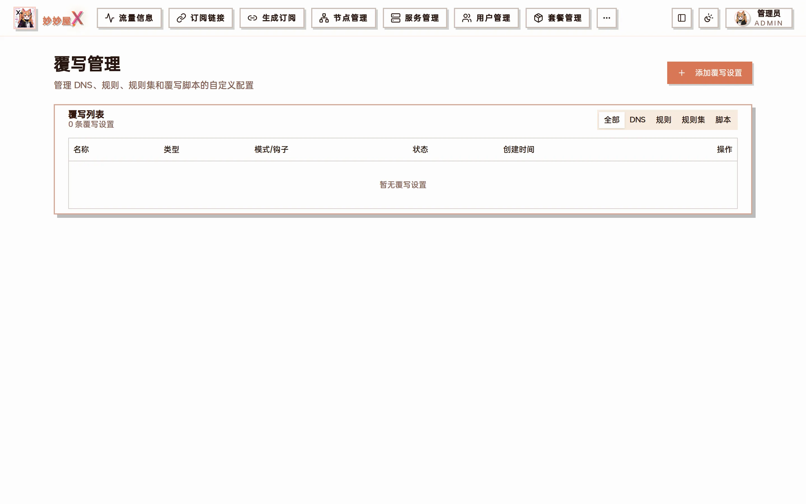
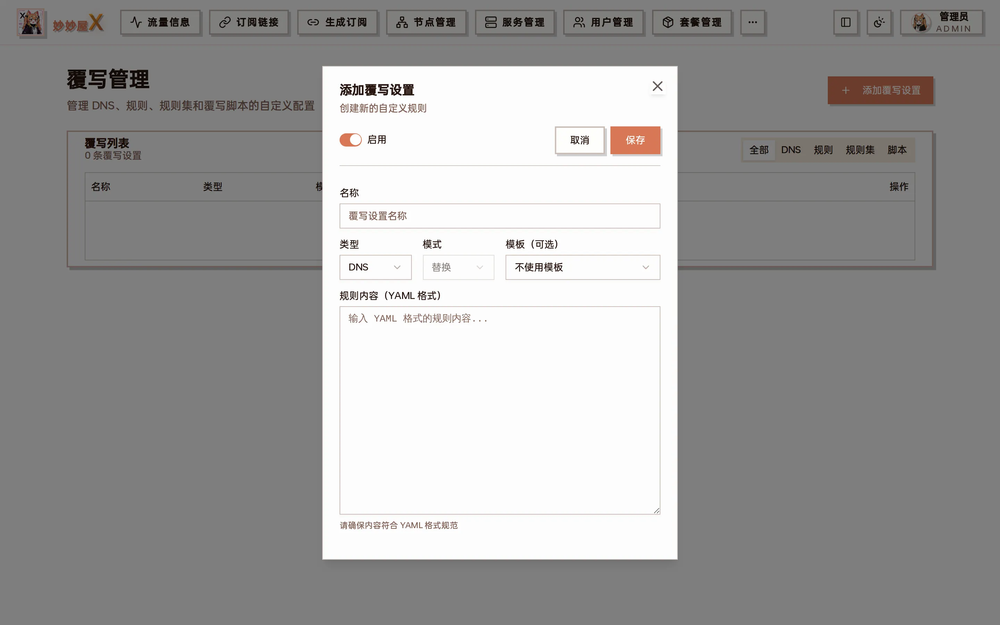

Overrides — list grouped by DNS / Rules / Rule providers / Scripts, with enable / edit / delete

## Overview

Overrides (custom rules) layer extra configuration fragments onto the subscription output to control how specific domains or IPs are proxied. Rules are inserted before template rules and take priority. An override consists of "type + mode + content" and can be bound to one template or apply globally.

## Add an override

Click "Add Override":



Add override: enable switch, name, type, mode, template (optional), YAML content

| Field               | Description                                                                          |
| ------------------- | ------------------------------------------------------------------------------------ |
| Enable              | When off the config is kept but not applied                                          |
| Name                | A recognizable name                                                                  |
| Type                | DNS / Rules / Rule providers / Script — which part of the config is affected          |
| Mode                | Replace: replace the template field entirely; Append / Prepend: insert around it      |
| Template (optional) | Apply to one V3 template only; empty applies to every subscription                   |
| Content             | YAML that follows mihomo syntax                                                      |

## Rule types

| Type           | Match            | Example                        |
| -------------- | ---------------- | ------------------------------ |
| DOMAIN         | Exact domain     | DOMAIN,example.com,PROXY       |
| DOMAIN-SUFFIX  | Domain suffix    | DOMAIN-SUFFIX,google.com,PROXY |
| DOMAIN-KEYWORD | Domain keyword   | DOMAIN-KEYWORD,github,PROXY    |
| IP-CIDR        | IP range         | IP-CIDR,10.0.0.0/8,DIRECT      |
| GEOIP          | GeoIP            | GEOIP,CN,DIRECT                |

## Policies

| Policy | Meaning         |
| ------ | --------------- |
| PROXY  | Through proxy   |
| DIRECT | Direct          |
| REJECT | Block           |

## Examples

### Example 1: AI and GitHub via proxy, LAN and domestic direct

Type "Rules", mode "Prepend", content:

```yaml
rules:
  - DOMAIN-SUFFIX,openai.com,PROXY
  - DOMAIN-SUFFIX,anthropic.com,PROXY
  - DOMAIN-KEYWORD,github,PROXY
  - IP-CIDR,192.168.0.0/16,DIRECT
  - GEOIP,CN,DIRECT
```

### Example 2: replace the DNS section

Type "DNS", mode "Replace", content:

```yaml
dns:
  enable: true
  enhanced-mode: fake-ip
  nameserver:
    - https://dns.alidns.com/dns-query
    - https://doh.pub/dns-query
```

Re-fetch the subscription after saving to see the effect; script overrides (type "Script") require the "Override scripts" switch in "System Settings → Features".
