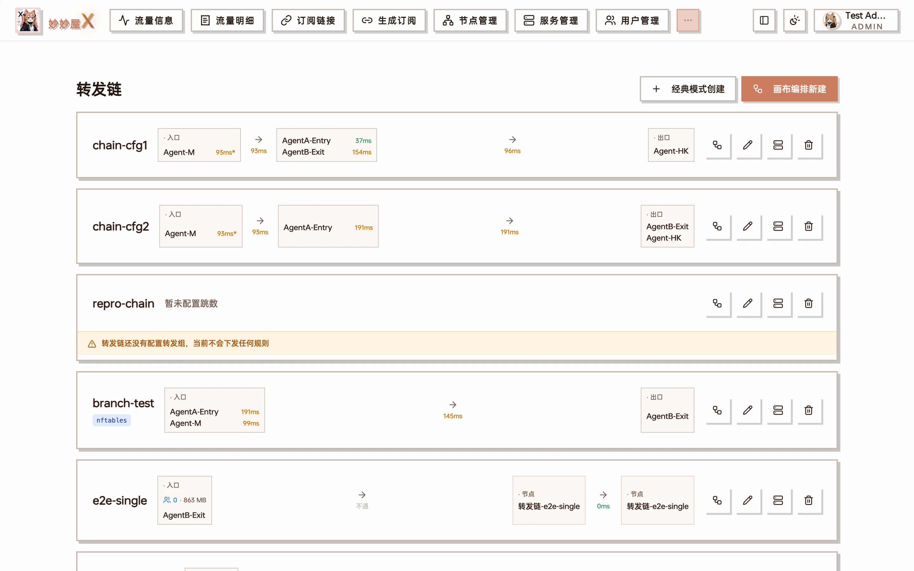
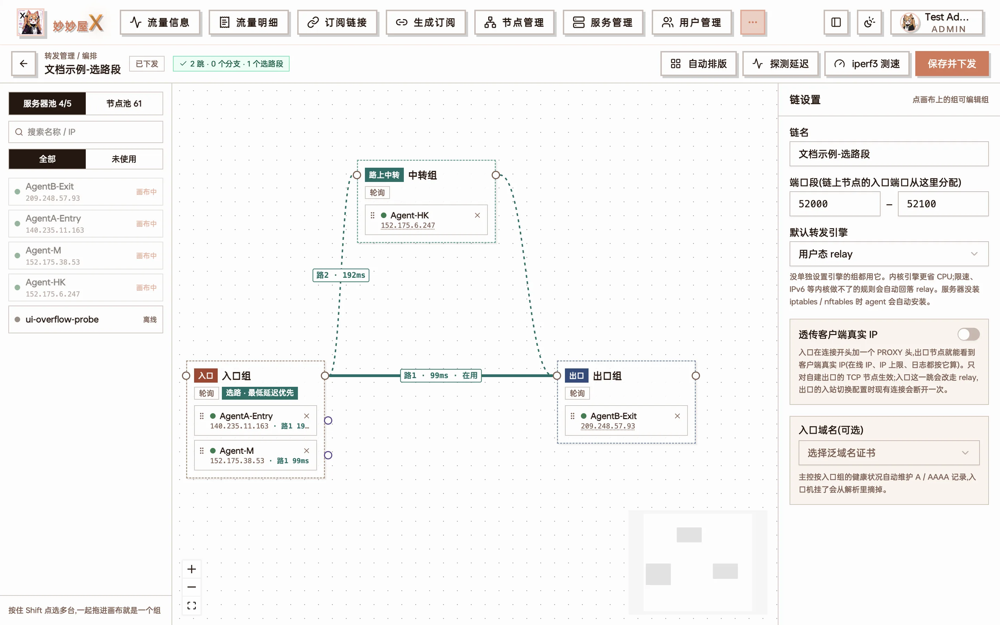
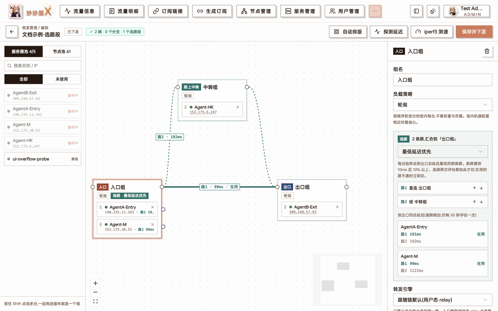
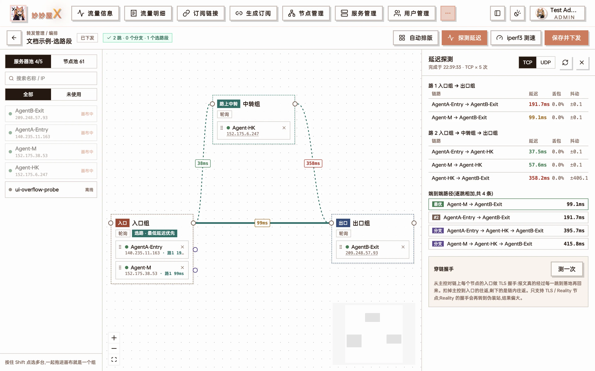
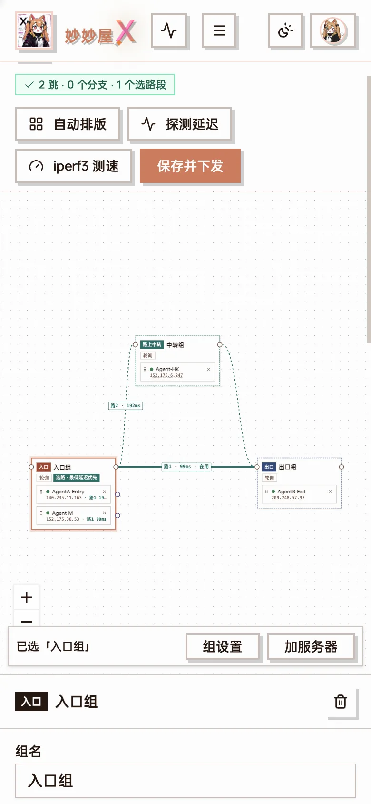

Forwarding (转发管理) links several servers into a forward chain: clients connect to an entry server, traffic is forwarded hop by hop to the exit, and the exit lands on a proxy node. Forwarding is implemented natively by the Agent (not through Xray). Each hop is an independent port forward, and the master orchestrates, pushes and monitors the whole chain.

Typical uses:

- Route optimisation: a client-friendly machine as entry (e.g. a domestic relay), a landing machine as exit, extra relay hops as needed
- A group of entry servers sharing the load, with a failed one taken out automatically
- Several possible routes from a group to the exit, with each server picking its own fastest one

Forwarding is an admin feature. Regular users get "My forwards", see [Opening forwarding to users](#opening-forwarding-to-users).

## Concepts

| Concept | Meaning |
| --- | --- |
| Forward chain | A complete path from entry to exit, made of groups in order |
| Group | The servers of one hop. The previous hop distributes connections among them by the group's load strategy |
| Entry / exit group | The first and last hop. Clients connect to the entry; the exit is either the server hosting a self-built node, or a landing node |
| Relay group | Hops between entry and exit, zero or more |
| Branch | One server of a group detours through its own relay group, then rejoins the next hop |
| Path set | 2–4 routes leaving one group and converging on the same group; each server picks the route with the lowest total latency to the exit |

## Chain list

Open "Forwarding" from the sidebar to see all chains. Two buttons at the top right:

- **Classic create**: drag servers into entry / relay / exit groups in a dialog — good for simple straight chains
- **New on canvas**: opens the canvas editor with everything: branches, path sets, per-group engines and more

Chain list: each card shows group members and latency, with "Edit on canvas / Edit chain / Bind nodes / Delete" at the bottom

The latency next to each server is coloured: green <50ms, orange 50–200ms, red >200ms; "不通" means unreachable, and `*` means only an ICMP result is available. When a chain has a problem (empty group, offline server, branch not rejoined…), an amber strip appears at the bottom of the card; open the canvas to see exactly where.

## Canvas editor

The canvas is the main way to build chains. Server pool and node pool on the left, the chain in the middle, settings of the selected item on the right.

Canvas: entry group (2 servers) → exit group, with two parallel routes — route 1 direct to the exit (in use, 99ms) and route 2 through a relay group; chain settings on the right

### Building a chain

1. Drag servers from the server pool onto the canvas. Hold Shift to multi-select, then click "group the N selected" to make a group at once
2. Drag a line from the dot on a group's right side (the group output) to the next group to form the main line
3. Attach the exit: drag servers with self-built nodes into the exit group, or drag a landing node from the node pool into it
4. Click "Auto layout" to tidy up, then "Save and push"

Three kinds of lines:

| Line | Meaning |
| --- | --- |
| Solid (rust) | Main line |
| Dashed (purple) | Branch: one server detouring on its own |
| Teal | Path set: multiple routes leaving the same group |

Double-click a line to delete it. Badges on the canvas show the state: "Draft · not pushed", "Unsaved changes", "Pushed"; when something is wrong, an issue badge lists each problem.

Saving validates the chain: the main line must be straight, a server may appear only once per chain, branches must rejoin the next hop, and the exit group cannot branch. Actions that affect live connections — removing landing nodes, switching engines — ask for confirmation before saving.

### Group settings

Select a group to edit:

- **Name**
- **Load strategy**: how the previous hop distributes connections among this group — round robin / weighted / least connections / most remaining traffic / by period / sticky / lowest latency (needs a recent Agent). With "weighted", set a weight per member
- **Forwarding engine**: overrides the chain default (see [Forwarding engines](#forwarding-engines))
- **Failover**: temporarily removes a member that is unreachable or slower than a threshold (ms), and adds it back once it recovers

Load strategy and failover describe how the previous hop feeds this group. Which entry server a client reaches is decided by the DNS of the entry domain.

### Chain settings

Click an empty spot on the canvas to see the chain settings:

- **Name**
- **Port range**: ports this chain uses on every server, default 50520–51314; temporary ports for latency probes and iperf3 come from here too
- **Default forwarding engine**: used by groups without their own setting
- **Pass through real client IP**: see [Real client IP passthrough](#real-client-ip-passthrough)
- **Entry domain**: a domain (wildcard certificate required) whose A / AAAA records the master maintains every 17 seconds from entry server health — a failed entry server drops out of DNS automatically

## Branches

Each hop on the main line is a group, and by default every server in it takes the same route to the next hop. If one server needs its own detour (say its direct route to the exit is poor but it is fast through a particular relay), give it a branch:

1. Drag from the small purple dot to the right of that member to a "branch relay" group
2. Connect the branch relay group back to the next hop of the main line

A branch is a single line and must rejoin the next group of the main line — so the chain always has exactly one exit. Until it does, the canvas warns that the server's branch has not rejoined the main line.

## Path sets and lowest-latency selection

A branch says "this server always takes this route"; a path set says "every server picks its own fastest route".

How: from a group's output dot, draw **2–4 lines** through different relays (or direct), all converging on **the same group**. The canvas colours them teal and the group panel gains a route-selection section.

Route selection on the entry group: 2 routes converging on the exit group, route 1 direct and route 2 through a relay group; below, each server's total latency to the exit per route, with the route it currently uses marked

### Each server decides for itself

Routes are chosen **per server**, not by averaging the whole group:

- The master evaluates roughly every 30 seconds. Each server adds up **its own** measured latencies along every route to the exit and takes the lowest total
- Within one group, server A can use route 1 while server B uses route 2
- To avoid flapping, it switches only when the new route is **at least 10ms and 10% faster for two consecutive rounds**; if the current route fails, it switches immediately
- The canvas refreshes route choices every 15 seconds and marks the active route "在用" (in use)

Besides "lowest latency", a path set can also be "primary / backup" (route 2 only when route 1 is down) or "split by weight".

:::tip[Example: two Hong Kong servers, one faster direct, one faster through a relay]
The entry group has "HK A" and "HK B", the exit is "HKT". Draw two routes from the entry group to the exit group: route 1 direct, route 2 via a "Japan JINX" relay.
If A reaches HKT in 20ms direct and 90ms via JINX, A uses route 1. If B's direct path detours to 180ms but via JINX takes only 70ms, B uses route 2. Servers added to the entry group later pick their own routes the same way, with no extra setup.
:::

Limitations:

- All routes of a path set must converge on the same group, and path sets cannot be nested
- The chain needs bound nodes (rules are what get probed); without them there are no route results
- Older Agents receive only the currently chosen route, so a switch waits for the master's next evaluation and push

## Forwarding engines

| Engine | Description |
| --- | --- |
| User-space relay (default) | The Agent forwards in user space; most complete feature set |
| Kernel iptables | The kernel forwards via DNAT, bypassing user space, with low CPU use |
| Kernel nftables | Same, using nftables |

Set a default on the chain and override it per group. If an Agent lacks the iptables / nftables command, it installs it through the system package manager and uses relay in the meantime.

Rules the kernel engines cannot handle **fall back to relay automatically**: rate limits, PROXY headers, IPv6, ports with a client IP whitelist, private upstream addresses and so on. The engine each server actually uses is shown in the forwarding status.

## Real client IP passthrough

By default the exit sees the previous relay's IP as the source. With "Pass through real client IP" on, the entry writes a PROXY protocol v2 header at the start of each connection and the exit restores the real client IP — so node access logs, client IP whitelists and per-IP statistics see the real source.

- Applies to **TCP** and **self-built exit nodes** only (landing nodes don't understand PROXY headers)
- The entry hop is forced to the relay engine (kernel engines can't write PROXY headers)
- Needs a recent Agent. The master first configures the exit to accept an optional PROXY header from chain servers only, then has the entry start sending it, so nothing disconnects during the switch

## Nodes: self-built exit vs landing node

The last hop is attached in one of two ways:

**A. Self-built exit**: the exit group contains your servers and the node lives on them.

- On a chain card, "Bind nodes → New node", choosing "entry split" (subscriptions use the entry server's address) or "exit split"
- Or from "Nodes → Add node", picking "Forward chain" as the node entry in step one

**B. Landing node**: the exit group points at an existing proxy node (which may be someone else's landing machine).

- Drag the landing node from the node pool into the exit group on the canvas, or use "Bind existing node" on the card
- Forwarded protocols: TCP / UDP / TCP+UDP

Exit-group servers and landing nodes are mutually exclusive; WireGuard nodes can't go through a forward chain.

## Latency probes

"Latency probe" in the canvas toolbar opens temporary listeners in the chain's port range and measures every hop:

Latency probe: per-hop latency / loss / jitter, an end-to-end ranking of every entry-to-exit combination, and the through-chain handshake result

- TCP or UDP, 5 samples per server pair, reporting latency, loss and jitter
- The end-to-end ranking lists the total latency of every possible entry-to-exit path, best first
- **Through-chain handshake**: for TLS / Reality nodes, performs a real handshake across the whole chain to confirm the node works through it, not just that ports are open

## iperf3 bandwidth tests

Also in the canvas toolbar:

- **Between servers**: bandwidth between any two servers
- **Through landing node**: real bandwidth across the whole chain to the landing node

iperf3 is installed automatically when missing.

## Mobile

The canvas works on phones too: dragging becomes tapping — after selecting a server or group, a bottom bar offers "Group settings", "Add server" and more, so grouping, editing settings and pushing all work on a phone.

Mobile canvas: with the entry group selected, the bottom bar shows "Group settings / Add server"

## Alerts and monitoring

- **Forward chain node down alert**: under "System settings → Notifications", on by default. Sends a Telegram notification when a node on a chain has been unreachable for 2 minutes
- Latency and active routes on chain cards and the canvas refresh continuously

## Member forwarding address

Which address the previous hop uses to reach each member can be chosen per member: auto / fixed entry IP / public / domain / private network / manual. Servers in the same data centre can use the private network to save traffic and latency.

## Shared servers

[Shared servers](/en/share-server/) you have received can be used in chains too. The owner master merges the forwarding rules and pushes them to the Agent, and remains the Agent's sole controller.

## Opening forwarding to users

Regular users create forwarding rules for their own nodes under "My forwards". The admin configures a forwarding quota in the package:

- Number of rules, rate limit, connection count
- Which forward chains are allowed

Only traffic on the entry hop of a user's bindings is billed; relay and exit hops are not billed again.

## Classic mode vs canvas

Classic mode suits straight entry → relay → exit chains and is quick to learn. Only the canvas supports:

- Branches
- Path sets and lowest-latency selection
- Per-group forwarding engines

Both create the same kind of chain, and a chain made in classic mode can be opened and extended on the canvas at any time.
