Nodes — the "Import external nodes" panel on top, the node list below: filter by protocol / tag, one node per row with inline actions

## Overview

A node is the subscription-side mapping of an inbound. Every inbound automatically creates a node used for subscription distribution. The page has two parts:

- **Import external nodes**: import airport subscriptions or single URIs as "external nodes"
- **Node list**: all nodes (self-hosted + external) with protocol / tag filters, inline actions (edit / landing / routing / copy URI …) and global tools at the top right

## Node sources

| Source                 | Description                              | Sync           |
| ---------------------- | ---------------------------------------- | -------------- |
| Xray inbound           | Inbounds created with the wizard         | Automatic      |
| Remote server inbound  | Inbounds on remote servers               | Automatic      |
| External subscription  | Nodes imported from subscription links   | Manual / timed |

## Add a node (wizard)

Click "Add Node" at the top right. The wizard has two steps.

### Step 1: choose a server

Choose a server: pick IPv4 / IPv6 as the node address, "Xray ready" means nodes can be created immediately; the "Forward chain" tab creates nodes on a forward-chain entry

If the server has a domain but port 443 has no certificate and Nginx yet, an "SSL configuration" prompt appears first. For TLS protocols (Trojan + TLS, Hysteria2, AnyTLS …) click "Configure" to set up the certificate first; for certificate-free protocols (REALITY / Shadowsocks / Snell …) simply close the prompt and continue:

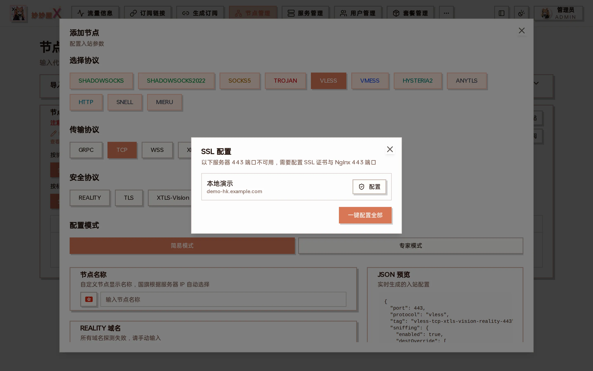

SSL configuration prompt: lists servers whose port 443 is not ready, with one-click setup

### Step 2: configure the inbound

Inbound parameters: protocol → transport → security → mode → node name → protocol-specific settings → users; the JSON preview on the right updates live

| Area              | Description                                                                                                       |
| ----------------- | ----------------------------------------------------------------------------------------------------------------- |
| Protocol          | SHADOWSOCKS / SHADOWSOCKS2022 / SOCKS5 / TROJAN / VLESS / VMESS / HYSTERIA2 / ANYTLS / HTTP / SNELL / MIERU        |
| Transport         | Depends on protocol, e.g. VLESS offers GRPC / TCP / WSS / XHTTP                                                   |
| Security          | REALITY / TLS / XTLS-Vision / XTLS-Vision-REALITY / ENC …, see [Protocol Matrix](/docs/en/protocol-matrix)        |
| Config mode       | Simple: port and UUID / password auto-generated; Expert: edit port, listen address, sniffing, relay address …     |
| Node name         | Shown in the list and subscriptions; the flag is added from the server IP                                         |
| REALITY domain    | The lowest-latency domain from the pool is probed automatically, or enter one and "Probe"; "Prevent REALITY theft" creates a dedicated tunnel that only allows serverNames |
| Users             | Current admin by default, UUID / password / PSK auto-generated, more users can be added                           |
| JSON preview      | The inbound config that will be submitted                                                                         |

Click "Submit" and the master creates the inbound, syncs the node and reports "Created". Screenshots and parameters for every protocol: the pages under [Protocol Reference](/docs/en/protocol-matrix).

## Import external nodes

Expand "Import external nodes" at the top of the page. It has three tabs:

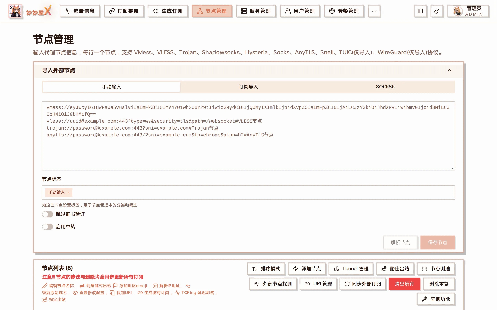

Import external nodes: Manual / Subscription / SOCKS5, plus node tag, skip certificate verification and enable relay

### Manual

Paste `vmess://`, `vless://`, `trojan://`, `ss://`, `anytls://`, `hysteria2://` … URIs one per line, click "Parse" to preview, then "Save nodes":

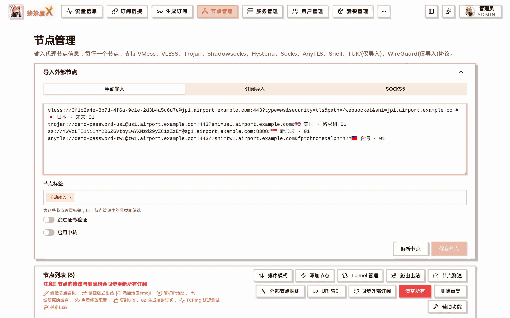

Manual input: one URI per line

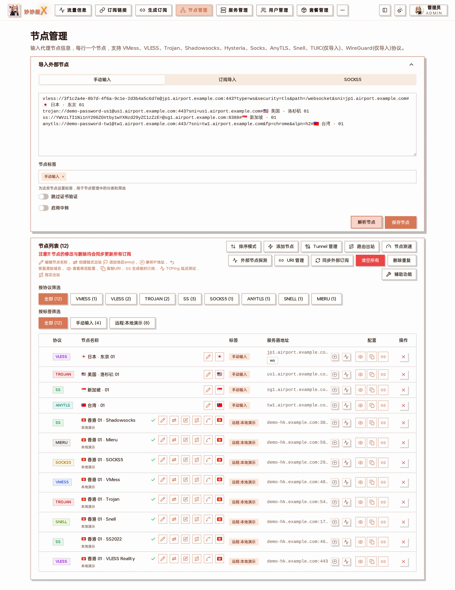

Preview name / protocol / address before saving; saved nodes get the "Manual" tag and are marked external

### Subscription

Enter the airport's Clash subscription URL, pick a User-Agent (default clash.meta), optionally a tag, and click "Import"; every node in the subscription is fetched and parsed. Imported subscriptions appear under "Subscriptions → External subscriptions" and can be refreshed with "Sync external subscriptions".

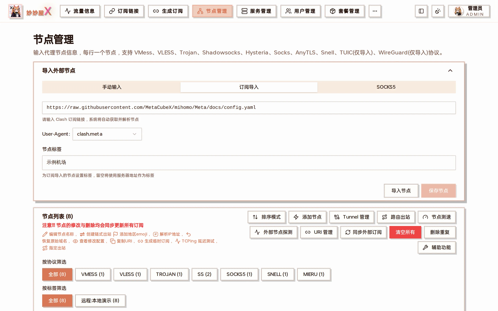

Subscription import: URL + User-Agent + node tag

### SOCKS5

Enter address, port, username and password to import a SOCKS5 exit, commonly used as a landing.

## Auto sync

When an inbound changes, the event bus triggers node sync automatically, converting the inbound config into a mihomo/Clash compatible proxy.

Triggers:

- Creating an inbound
- Editing an inbound
- Deleting an inbound
- Remote server inbound changes

## Inline row actions

The row of icon buttons next to the node name (the legend above the list lists them too), from left to right:

| Icon          | Action                  | Description                                                                                          |
| ------------- | ----------------------- | ---------------------------------------------------------------------------------------------------- |
| Pencil        | Edit node name          | Inline rename, the inbound is unchanged                                                              |
| Double arrow  | Create chained outbound | Opens "Add landing node" to give the node a landing or create a routed child, see [Routed Outbound](/docs/en/routed-outbound) |
| Edit          | View / edit config      | Opens the full inbound wizard (TAG and node ID stay; changing port / domain keeps user credentials)  |
| Routing       | Node routing            | View / manage the inbound's dedicated and global routing rules, see [Xray Routing](/docs/en/xray-routing) |
| Relay         | Create relay group      | Pick several relay nodes to form a url-test group; the landing's dialer-proxy points to it            |
| Flag          | Add region emoji        | Auto-detect or choose a region                                                                       |
| IP            | Resolve IP              | Write the resolved IP into the node address; "Restore original domain" reverts                       |
| Waveform      | TCPing latency          | One TCPing from the master to the node address                                                       |
| Eye           | View Clash config       | View and edit the node's Clash JSON                                                                  |
| Copy          | Copy URI                | Copy the node's share link                                                                           |
| Link          | Temporary subscription  | A one-node subscription link limited by visits and time                                              |
| ×             | Delete                  | Delete the node; self-hosted nodes also delete their inbound                                          |

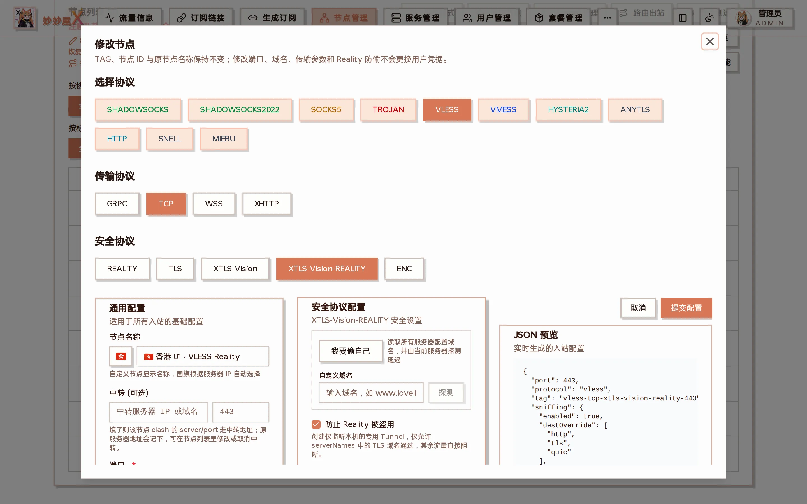

View / edit config: the same form as the wizard; change protocol parameters, port, listen address, relay address, or enable "steal self" here

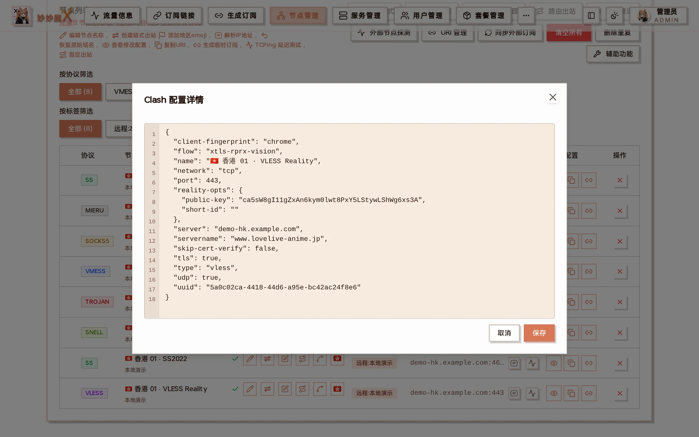

View Clash config: the fields written into subscriptions, editable

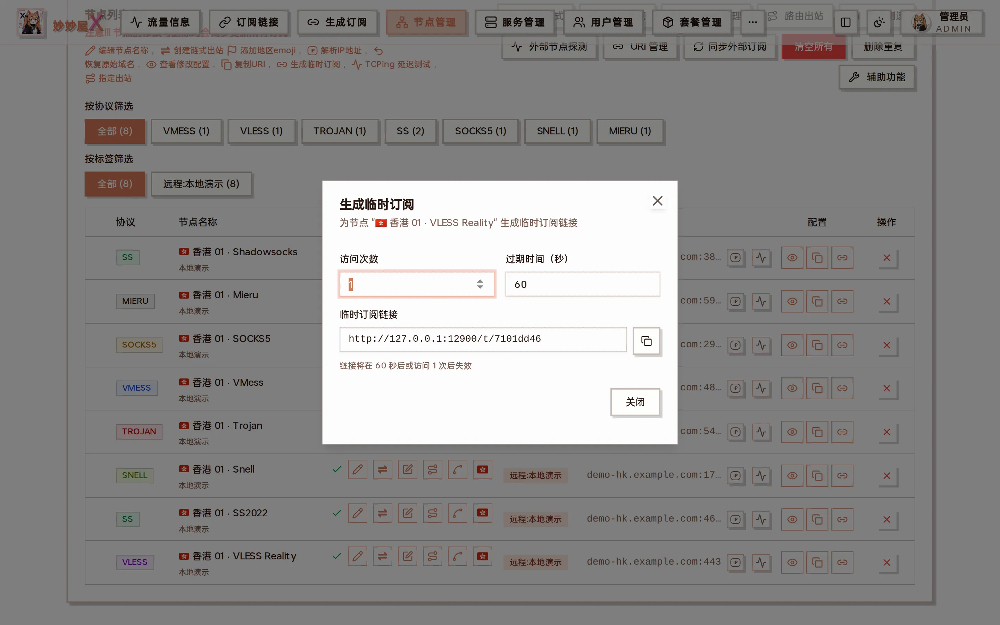

Temporary subscription: set visit count and expiry seconds; the link expires automatically

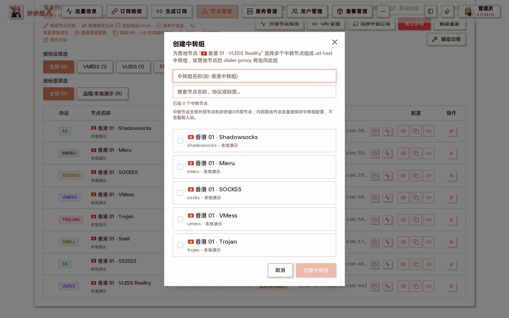

Create relay group: choose relay nodes for a landing to form a url-test group

## Node operations

| Operation        | Description                                                                                                                                          |
| ---------------- | ---------------------------------------------------------------------------------------------------------------------------------------------------- |
| Rename           | Custom display name in subscriptions                                                                                                                 |
| Sort             | Order of nodes in subscriptions                                                                                                                      |
| Group            | Assign nodes to proxy groups                                                                                                                         |
| Multi-tag v0.2.3+ | Since v0.2.3 nodes can carry several tags: the edit dialog adds / removes tags, filters match any tag, package selected_tags match any tag; old nodes are backfilled |

## Toolbar

The buttons at the top right of the list:

| Button                 | Purpose                                                                                                   |
| ---------------------- | --------------------------------------------------------------------------------------------------------- |
| Sort mode              | Drag nodes or use the quick-move buttons; the order is saved when you turn it off                          |
| Add node               | The wizard above                                                                                          |
| Tunnel management      | Tunnel / relay / chain / port-forward configuration, see below                                             |
| Routed outbound        | All routed child nodes, see [Routed Outbound](/docs/en/routed-outbound)                                   |
| Speed test             | Speed test workbench (PRO), see [Node Speed Test](/docs/en/node-speedtest)                                |
| External node probe    | Periodically connects to external nodes with mihomo to measure reachability and real latency; can re-sync subscriptions when nodes go down |
| URI management         | Share URIs per user × node, filter by user / server, copy all                                              |
| Sync external subs     | Re-fetch all external subscriptions now                                                                   |
| Clear all              | Delete every node (dangerous)                                                                             |
| Remove duplicates      | Delete nodes with the same address + port + protocol                                                       |
| Helpers                | Bulk disable skip-cert-verify, Snell parameters, show per-node traffic in names …                           |

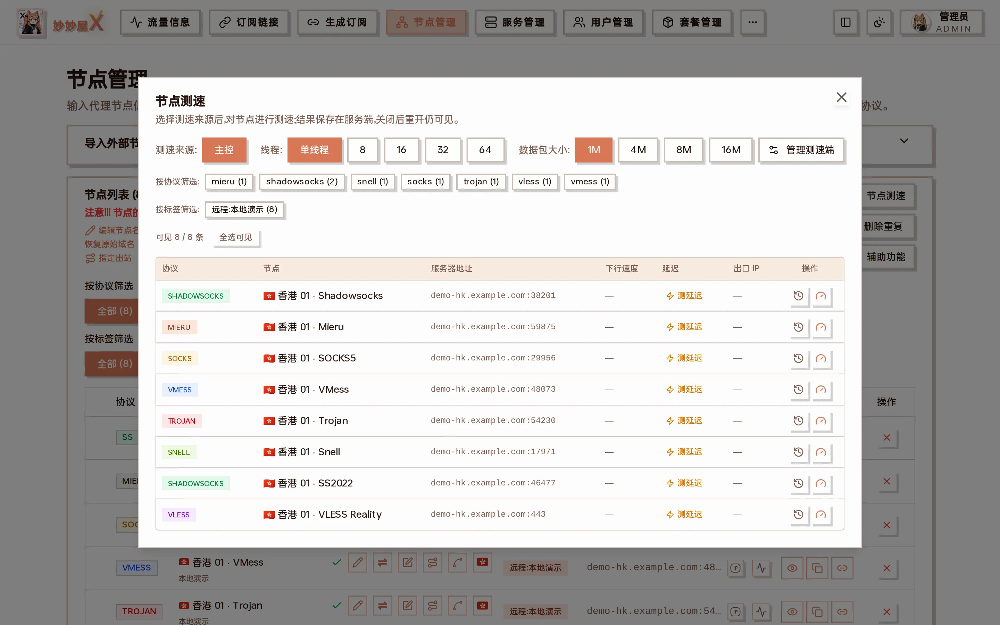

Speed test workbench: choose the source, threads and packet size, test speed or latency per node

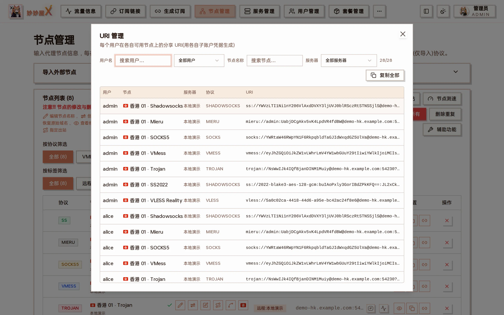

URI management: share URIs per user × node (generated with each user's sub-account credentials)

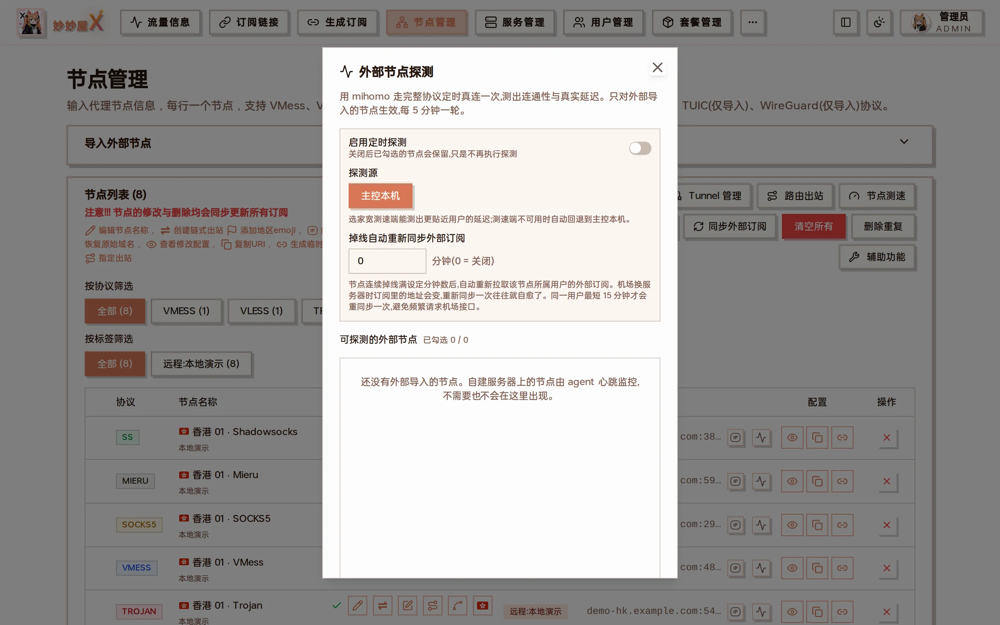

External node probe: external nodes only, every 5 minutes, probe from the master or a home speed-test endpoint

## Port forwarding

### Tunnel configuration

#### Chained tunnel

Forward a chosen landing node through several Agent servers, or enter a target address and port manually.

#### Port forward

Forward a port on one Agent to a chosen landing node or a manual target.

### Relay configuration

Relay configuration does not perform forwarding inside MiaoMiaoWu X. It is meant for scenarios where forwarding is already set up externally and you only want to attach that relay address to nodes.

## URI management

View the protocol:// URIs of every user on every node.

## Node traffic and multipliers

The `×N` in the node list is the billing multiplier the regular user's primary package (`users.package_id`) applies to that node, not the node's own traffic. Raw up/down per node lives in "Traffic · Nodes"; user billing traffic also applies the package direction multiplier. See [Traffic Accounting](/docs/en/traffic-accounting).

## Sort mode

When on, drag nodes or use the quick-move buttons; the order is saved when you turn sort mode off.

## Tunnel (dokodemo-door) management

Tunnel (dokodemo-door) inbounds forward traffic arriving on one port of a server to another target (an existing node or a fixed address), typically for "entry → landing" chains. Tunnel inbounds are not listed as nodes; they are viewed, added and deleted in "Tunnel management" at the top of the Nodes page (aggregated across all remote / shared servers).

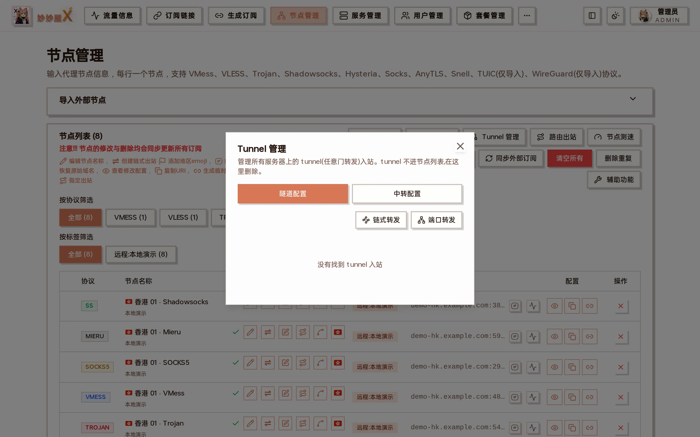

Tunnel management: Tunnel / Relay / Chain / Port forward tabs

### Adding a tunnel (two modes)

Add it in "Tunnel management" or choose the Tunnel protocol when adding an inbound. The target can be given two ways:

### ① Forward an existing node (recommended)

Choose the Tunnel protocol and "Forward existing node"; address / port / network are filled from the chosen node. A companion node is created: name "original name | Tunnel", inbound tag = the tunnel tag, Clash config cloned from the original but with the tunnel server's IP and port — clients connecting to the tunnel server go through the chain.

### ② Port forward (fixed target)

Enter a target address and port directly and forward the tunnel server's listening port to it. Suited to arbitrary landings or self-built links. Tick "Also forward UDP" for games / voice, otherwise UDP is dropped.

### Port-forward reuse mode (split by domain / IP)

In "Tunnel management → Port forward" you can reuse an existing tunnel inbound and only divert specified domains / IPs — implemented as a routing rule + a freedom outbound on that inbound, not a new listening port.

Such rules carry a yellow "Port forward" mark in the routing panel; delete them from the Tunnel management list, not from the routing panel, to avoid orphan outbounds.

### Switching a node's server address (relay)

Every node's "server address" can be switched to a relay entry: the Clash server / port become the tunnel server's entry address and port, and the original landing address is kept as "original server".

After configuring a port forward to a landing node, MiaoMiaoWu X automatically switches that landing node's address to the tunnel entry (entryHost:port); if the automatic switch fails the forward still works and you can switch manually.

Relayed nodes show an extra "original server" line under the address; click it to edit or revert.

### "Forwarded by tunnel" marker

A node currently forwarded by a tunnel shows a "Forwarded by tunnel" tag; hover to see which server and tunnel.

Tunnel management is an admin feature and also works on received shared servers. Deleting a tunnel also removes its companion node.

## Forward chains (Forward management)

Besides Xray dokodemo-door tunnels, MiaoMiaoWu X provides native Agent forwarding: on the "Forwarding" page drag servers into an "entry → relay → exit" chain, optionally ending on a landing proxy node; the first step of the add-node wizard can also pick a "Forward chain" as the node entry.

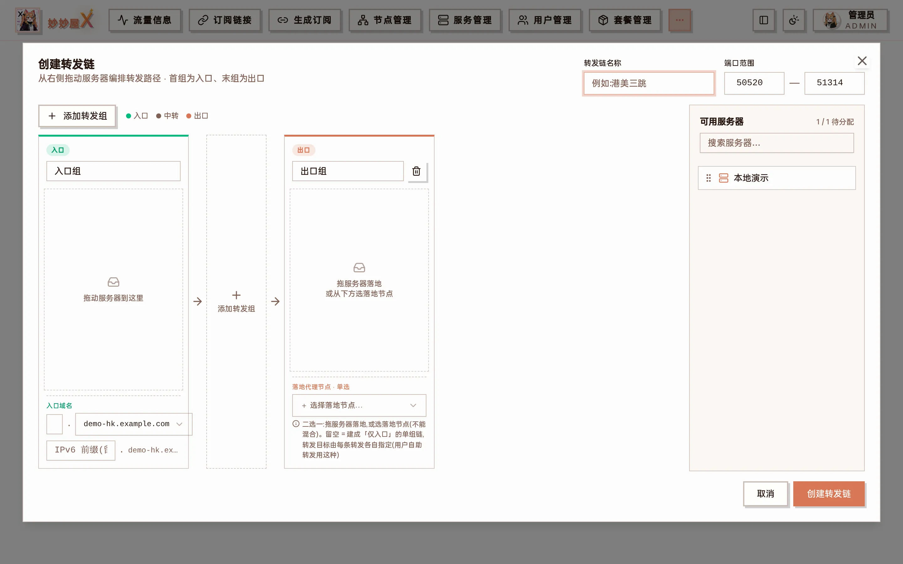

Create forward chain: drag servers into entry / relay / exit groups; the exit is either a server or a landing node

## Notes

- Nodes generated from inbounds update automatically when the inbound changes
- Manually renamed nodes are not overwritten by sync
- Disabled nodes never appear in subscription output
- After resolving a node to an IP, "Restore domain" reverts to the original domain (the server is unchanged)
- New nodes default to the server name as their tag; historical tags such as "Manual" are left alone
