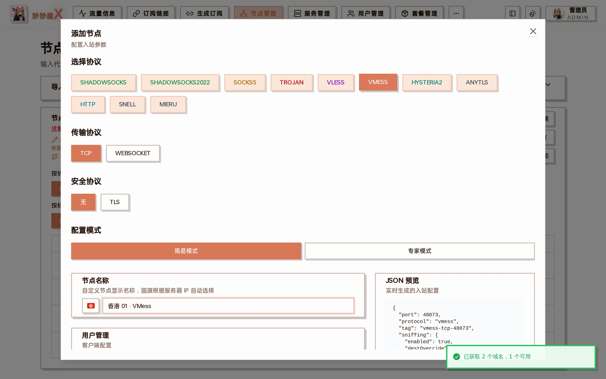

## Overview

VMess is the native V2Ray protocol with built-in encryption. Compared to VLESS, it has additional encryption overhead but wider compatibility.

## Supported Combinations

| Transport | Security | Description            |
| --------- | -------- | ---------------------- |
| TCP       | None     | VMess encryption only  |
| TCP       | TLS      | Double encryption      |
| WebSocket | None     | Suitable for CDN relay |
| WebSocket | TLS      | WSS + VMess            |

## Creating it in the wizard

In "Nodes → Add Node" with VMESS selected, the transport can be TCP / WEBSOCKET and the security none / TLS; simple mode generates the port and UUID:



VMess + TCP (no TLS): the JSON preview shows the generated clients[].id

## Configuration Example

### VMess + WS + TLS

```
{
  "protocol": "vmess",
  "settings": {
    "clients": [{ "id": "uuid", "alterId": 0 }]
  },
  "streamSettings": {
    "network": "ws",
    "security": "tls",
    "wsSettings": { "path": "/vmess" },
    "tlsSettings": {
      "serverName": "example.com",
      "certificates": [{ "certificateFile": "...", "keyFile": "..." }]
    }
  }
}
```
