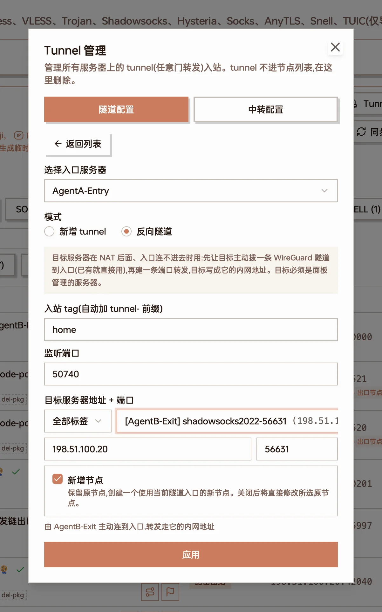
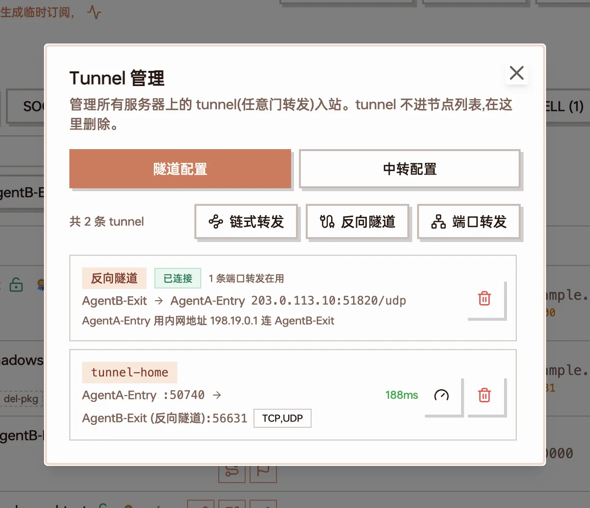
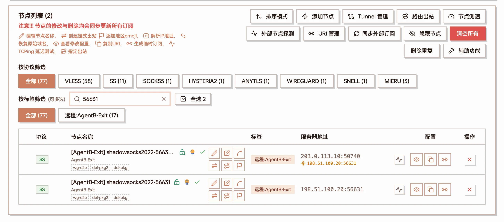
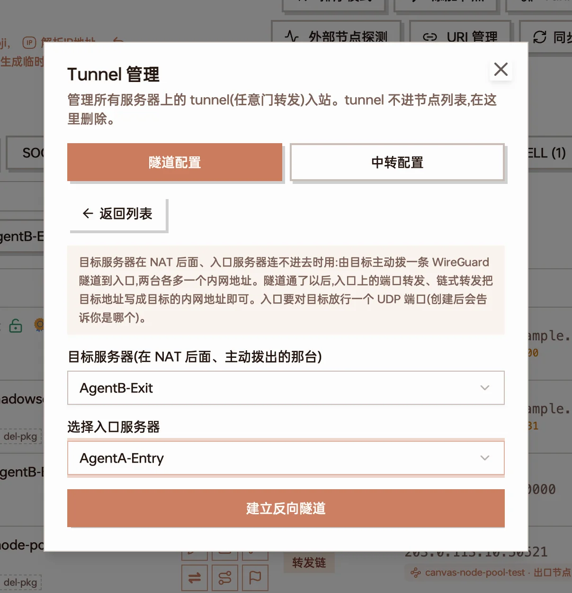

Home broadband lines, NAT VPSes and machines without public inbound access make good landing servers, but a relay cannot connect to them — a port forward needs the entry server to reach the target's port directly. A reverse tunnel flips the direction of the connection: **the target server dials the entry server**, a WireGuard tunnel comes up between the two, and the entry forwards traffic to the target through it.

Typical uses:

- The landing server is behind home / carrier NAT, has no public IP, or cannot do port mapping
- The landing server has a public IP, but you do not want to expose node ports
- The landing server's public IP changes often and you do not want to keep editing forward targets

Reverse tunnels are created and managed in "Nodes → Tunnel management" (节点管理 → Tunnel 管理). It is an admin feature.

## How it works

| Term | Meaning |
| --- | --- |
| Entry server | The one with a public address that clients actually connect to (the relay). It listens on a UDP port for targets to dial in |
| Target server | The one behind NAT that dials out (the landing server). It needs no open inbound ports |
| Private address | Once the tunnel is up, each side gets an address that only exists inside this tunnel: `198.18.x.y` for the entry, `198.19.x.y` for the target |
| Tunnel port | The UDP port on the entry used by the tunnel. A free one is picked automatically starting from 51820; all targets dialing the same entry share it |

The tunnel only "puts the two servers on the same private network". Forwarding itself is still an ordinary [port forward](/docs/en/nodes#tunnel-dokodemo-door-management): a tunnel inbound on the entry whose target address is the target server's **private address**.

```
client ──node credentials──▶ entry server :listen port
                               │ port forward, target = 198.19.x.y:node port
                               ▼
                    WireGuard tunnel (dialed by the target, kept alive)
                               │
                               ▼
                    node on the target server ──▶ internet
```

The node is still the one created on the target server: user credentials, traffic accounting and rate limits work exactly as when connecting to it directly.

## Prerequisites

- Both entry and target are servers in the panel, their Agents are online and support reverse tunnels (creation tells you which one does not)
- The target can reach the entry's tunnel port (UDP). **The entry's firewall / cloud security group must allow this UDP port**; the panel shows the port number after creation
- Both Agents run as root and the system has `/dev/net/tun`. For a Docker-deployed Agent add `--cap-add NET_ADMIN --device /dev/net/tun`
- The target needs neither a public IP nor any open inbound port

## Guide: publish a home landing node through a relay

The example uses entry `AgentA-Entry` (public IP) and target `AgentB-Exit` (behind NAT), and exposes a Shadowsocks node on the target through the entry.

### 1. Create the node on the target server

Create a node on the target server as usual in "Nodes → Add node" (here Shadowsocks 2022 on port 56631). The target is behind NAT, so the node is not reachable from outside yet — that is fine.

### 2. Create a port forward over a reverse tunnel

Open "Nodes → Tunnel management → Port forward" (端口转发):

1. **Entry server**: pick the relay (AgentA-Entry)
2. **Mode**: pick "Reverse tunnel" (反向隧道)
3. **Inbound tag**: any name, e.g. `home` (becomes `tunnel-home`)
4. **Listen port**: the port clients use on the entry, e.g. `50740`
5. **Target**: pick the node from step 1 in the node list; address and port are filled in, and a hint says the target server will dial the entry and the forward uses its private address
6. Keep "Create node" (新增节点) checked and click "Apply" (应用)



Port forward in "Reverse tunnel" mode: entry AgentA-Entry, listen port 50740, target is the Shadowsocks node on AgentB-Exit

After "Apply" the panel does three things in order:

- Has the target server dial a tunnel to the entry (an existing tunnel between the two is reused)
- Creates a port forward on the entry whose target is the target server's private address
- Copies the node with its address changed to "entry address : listen port", same credentials as the original

The first time a tunnel is created for an entry, a notice in the corner tells you which UDP port to allow.

### 3. Allow the tunnel port on the entry

In the entry server's firewall / cloud security group, allow the UDP port from the notice (51820 by default). Only this one port is needed; other targets dialing the same entry reuse it.

### 4. Check that the tunnel is connected

Back in the "Tunnel management" list, reverse tunnels are at the top and the new port forward below:



The reverse tunnel shows "Connected" (已连接) with 1 port forward using it; tunnel-home below targets "AgentB-Exit (反向隧道)" with 188 ms latency

- **Connected** on the reverse tunnel row means the target has dialed in. This normally takes a few seconds
- Click the gauge icon on the port forward to run a **latency probe**: it measures entry → target node port through the tunnel; a number means the whole path works

### 5. Use the new node

The node list has a new node whose name ends in `-tunnel-home`: its server address is the entry's address and listen port, with the original address in small print below.



Top: the generated node (entry address :50740, original address below). Bottom: the original node on the target server

Add the new node to a subscription or package. The original node (the target's public address) is unreachable behind NAT anyway, so hide it or leave it out of subscriptions.

## Tunnel only

You can also bring the tunnel up first and add forwards later: "Tunnel management → Reverse tunnel" (反向隧道), pick the target server and the entry server, click "Create reverse tunnel" (建立反向隧道).



Tunnel only: the target is the server behind NAT, the entry is the relay

Once the tunnel exists, the list shows the target's private address (e.g. `198.19.0.1`). On that entry you can then:

- Use "Port forward → New tunnel" (新增 tunnel) and type this private address as the target — same result as reverse tunnel mode
- Use the private address as the final target of a "Chain forward" (链式转发), so a multi-hop chain ends on the machine behind NAT

There is one tunnel per pair of servers and it can carry any number of port forwards. An entry can serve several targets, and a target can dial several entries.

## Status in the list

| Shown | Meaning |
| --- | --- |
| Connected (已连接) | A handshake happened within the last 3 minutes; the tunnel is usable |
| Not connected (未连接) | The target has not dialed in yet, or has been gone for more than 3 minutes |
| Status unknown (状态未知) | The entry server's status cannot be read (entry offline, etc.); the reason is shown below |
| N port forwards in use | Number of port forwards on the entry targeting this tunnel's private address |

Both Agents maintain the tunnel: the target sends a keepalive every 25 seconds; it reconnects automatically after a restart or an IP change; after an Agent restart the tunnel comes back on its own without waiting for the master.

## Deleting

- **Delete a port forward**: click delete on its row. The tunnel stays and other forwards are unaffected
- **Delete a tunnel**: click delete on the reverse tunnel row. Both ends tear the tunnel down, and every port forward on the entry targeting that private address stops working (they are not removed automatically; clean them up yourself)
- Nodes generated with "Create node" are not removed with the forward; delete them from the node list when no longer needed

## Notes

- **The tunnel is UDP** (WireGuard). It is not suitable for routes where UDP between entry and target is blocked or heavily throttled
- **The entry can reach other services on the target**: once the tunnel is up, the entry server can use the private address to reach every port on the target that listens on `0.0.0.0`, not just the node port. Other devices on the target's LAN are not reachable. Only use entry servers you trust
- **Source address**: the target node sees the entry's private address as the client address, not the user's real IP. Limits based on source IP (such as device count) are not accurate for these nodes
- **Only the port forward is allowed through**: servers block proxy traffic to private addresses by default, and the panel only exempts port forwards that target a tunnel's private address. Users of ordinary nodes on the entry cannot reach the other end of the tunnel
- Received shared servers do not support reverse tunnels yet

## FAQ

### It stays "Not connected"

Check in order:

1. The entry's firewall / security group allows the UDP port shown in the list
2. The target server is online (see Server management)
3. The target can reach the entry's address: the address after "target → entry" in the list is what it dials. If the entry uses a domain, make sure it resolves to the entry's public IP

### "The agent of X does not support reverse tunnels"

That server's Agent is offline or too old. Check it is online in Server management and upgrade the Agent.

### "The tunnel did not start: failed to create the tunnel interface"

The Agent lacks permission to create a network interface, typically in a container: add `--cap-add NET_ADMIN --device /dev/net/tun` and restart; for LXC, enable TUN for the container on the host.

### Connected, but the node does not work

- Use the latency probe in the list to check "entry → target node port": if it fails, the node on the target is most likely not running or the port is wrong
- Make sure the client uses the generated node (entry address + listen port), not the original one
- Make sure the entry's listen port (e.g. 50740) is allowed in the entry's firewall / security group — clients connect to it, so allow both TCP and UDP
