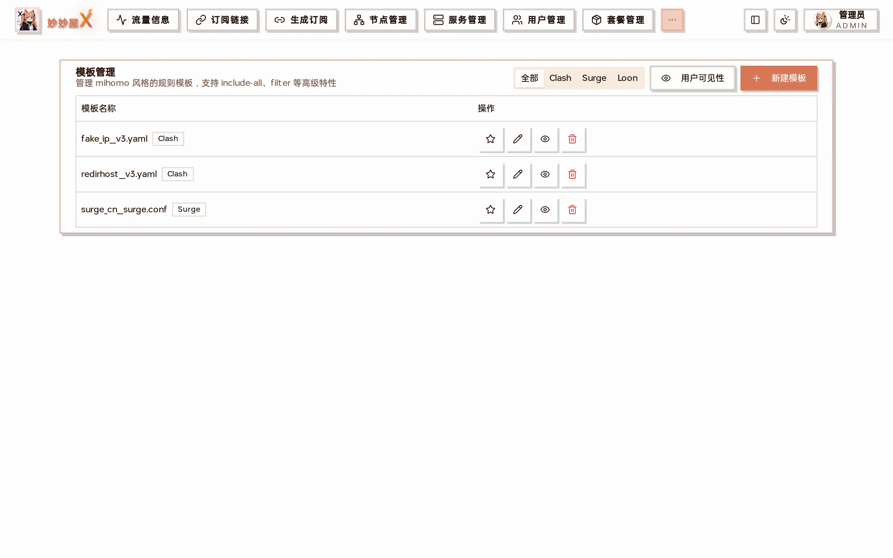
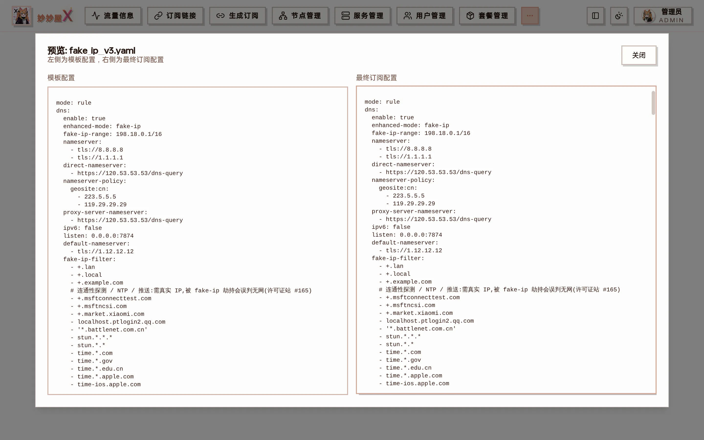
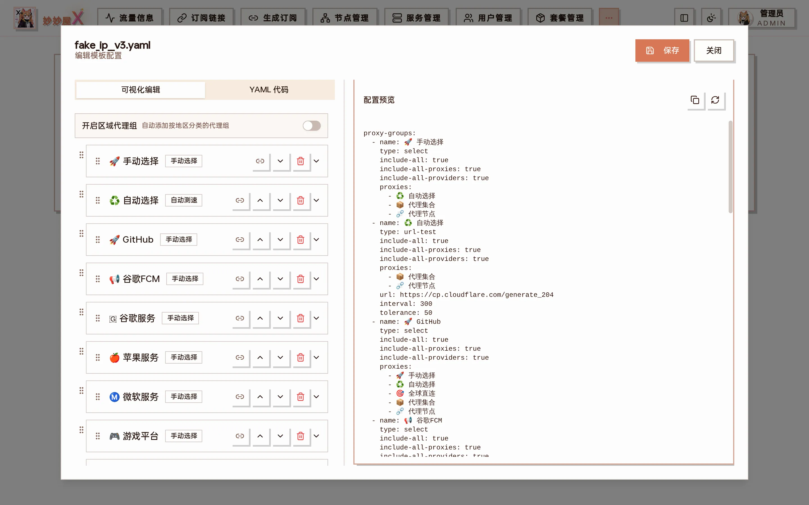
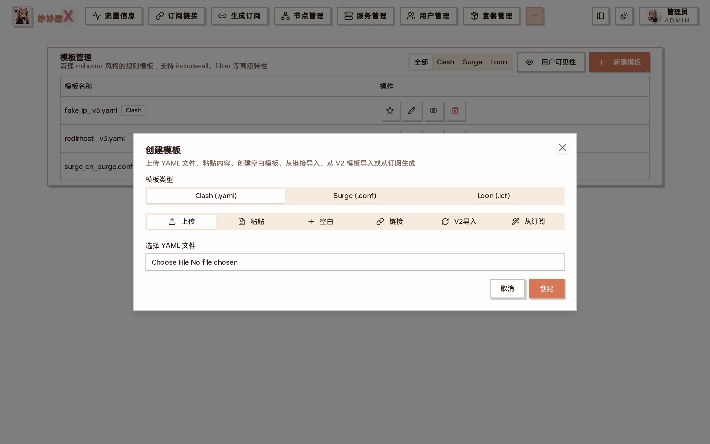

Templates — all templates grouped by Clash / Surge / Loon, with edit / preview / delete and user visibility control

:::note[Prerequisite]
Enable "Use new template system" and choose "V3 templates" in [System Settings → Features](/docs/en/system-settings) for the Templates menu to appear.
:::

Template Management V3 is MiaoMiaoWu X's template system. It uses mihomo-style proxy-group syntax with include-all, filter and other advanced features, so you no longer have to edit subscriptions by hand when adding nodes: new nodes are added to subscriptions automatically according to the template.

**Admin feature · mihomo compatible · visual editor**

## Page features

| Feature          | Description                                                                                       |
| ---------------- | ------------------------------------------------------------------------------------------------- |
| Category filter  | All / Clash / Surge / Loon; built-in defaults include fake ip, redirhost (Clash) and surge cn      |
| User visibility  | Controls which templates regular users can pick on their subscription page                        |
| New template     | See "Ways to create a template" below                                                             |
| Edit             | Visual editor + YAML code, two modes                                                              |
| Preview          | Template on the left, the final subscription rendered with current nodes on the right             |



Preview: template YAML on the left, the final subscription rendered from the current node table on the right

## Core concepts

V3 templates use mihomo proxy-group syntax and assign nodes declaratively:

#### Node inclusion

- `include-all` - include all nodes and proxy providers
- `include-all-proxies` - include proxy nodes only
- `include-all-providers` - include proxy providers only
- `include-type` - include by node type

#### Node filtering

- `filter` - keep nodes matching a keyword
- `exclude-filter` - drop nodes matching a keyword
- `exclude-type` - drop by node type

## Proxy-group attributes — each with an example

All available proxy-group attributes. Every YAML snippet is taken from the production template redirhost\_\_v3.yaml and can be copied as is.

### `name`

The group name shown in the client UI; emoji can be written directly into the name (👌 🚀 ♻️ …).

```yaml
proxy-groups:
  - name: 🚀 Manual          # shown as-is in the client UI
    type: select
```

### `type`

Group type: select (manual), url-test (fastest), fallback (primary/backup), load-balance, relay (chain via dialer-proxy-group).

```yaml
# 5 types
proxy-groups:
  - name: 🚀 Manual
    type: select              # user picks from the list

  - name: ♻️ Auto
    type: url-test            # picks the lowest-latency node
    url: https://cp.cloudflare.com/generate_204
    interval: 300

  - name: 🛡️ Fallback
    type: fallback            # ordered, switches when the primary dies

  - name: ⚖️ Balance
    type: load-balance        # spreads traffic across nodes
    strategy: round-robin

  - name: 🌌 Relay entry
    type: select              # relay chains use dialer-proxy-group
```

### `proxies`

Proxies in the group: other group names, node names, DIRECT/REJECT, or the placeholders \_\_PROXY_NODES\_\_ / \_\_PROXY_PROVIDERS\_\_ (expanded to all nodes / providers at generation time).

```yaml
proxy-groups:
  - name: 🚀 Manual
    type: select
    include-all: true
    proxies:
      - ♻️ Auto                # reference another group
      - __PROXY_PROVIDERS__   # placeholder: all proxy-providers
      - __PROXY_NODES__       # placeholder: all nodes in the node table
      - 🌄 Landing
      - DIRECT                # system outbound: direct
      - REJECT                # system outbound: block
```

### `include-all`

Include all outbound proxies + all proxy providers (same as enabling both include-all-proxies and include-all-providers). The most common option and the core of "new nodes sync automatically".

```yaml
proxy-groups:
  - name: 🚀 Manual
    type: select
    include-all: true         # all nodes + all providers
    proxies:
      - __PROXY_NODES__
      - __PROXY_PROVIDERS__
```

### `include-all-proxies`

Only nodes from the node table, no external proxy-providers. For "my own nodes only".

```yaml
proxy-groups:
  - name: 🚀 Nodes only
    type: select
    include-all-proxies: true # node table only, no external providers
    proxies:
      - __PROXY_NODES__
```

### `include-all-providers`

Only external proxy-providers, no node-table nodes. For mixed subscriptions.

```yaml
proxy-groups:
  - name: 🚀 Providers only
    type: select
    include-all-providers: true   # external providers only
    proxies:
      - __PROXY_PROVIDERS__
```

### `include-type`

Include nodes by protocol type, separated by |. Common values: vless / vmess / trojan / ss / hysteria / hysteria2 / tuic … Case-insensitive.

```yaml
proxy-groups:
  - name: 🚀 VLESS only
    type: select
    include-all: true
    include-type: 'vless|vmess'   # only VLESS and VMess nodes
    proxies:
      - __PROXY_NODES__
```

### `exclude-type`

Exclude by protocol type. Same syntax as include-type; can be combined with include-\* for layered filtering.

```yaml
proxy-groups:
  - name: 🚀 No SS
    type: select
    include-all: true
    exclude-type: 'ss|hysteria'   # drop SS and Hysteria
    proxies:
      - __PROXY_NODES__
```

### `filter`

Regex on node names; matches are included. Separate keywords with |, e.g. filter: 'HK|香港|Hong Kong'.

```yaml
proxy-groups:
  - name: 🌠 Relay
    type: select
    include-all: true
    filter: 中转|CO|co            # names containing any keyword
    proxies:
      - __PROXY_PROVIDERS__
      - __PROXY_NODES__

  - name: 🌄 Landing
    type: select
    include-all: true
    filter: LD|落地|Bage|bage|jinx|ctc   # multi-keyword regex
```

### `exclude-filter`

Regex on node names; matches are excluded. Typically "test", "TEST", "dead" … Can be combined with filter — filter selects first, exclude-filter removes.

```yaml
proxy-groups:
  - name: 🚀 Usable
    type: select
    include-all: true
    exclude-filter: 测试|TEST|故障|失效|DEAD    # skip these
    proxies:
      - __PROXY_NODES__
```

### `url`

Test URL for url-test / fallback / load-balance. Default https://cp.cloudflare.com/generate\_204 (empty body, fast).

```yaml
proxy-groups:
  - name: ♻️ Auto
    type: url-test
    include-all: true
    url: https://cp.cloudflare.com/generate_204  # default
    interval: 300
    tolerance: 50
```

### `interval`

Test interval in seconds for url-test / fallback / load-balance, default 300. Smaller = more responsive, more bandwidth.

```yaml
proxy-groups:
  - name: ♻️ Auto
    type: url-test
    include-all: true
    url: https://cp.cloudflare.com/generate_204
    interval: 300                                # seconds, default 300
```

### `tolerance`

url-test tolerance in ms, default 50. The current node is kept while its latency is below "fastest + tolerance", avoiding flapping between close nodes.

```yaml
proxy-groups:
  - name: ♻️ Auto
    type: url-test
    include-all: true
    url: https://cp.cloudflare.com/generate_204
    interval: 300
    tolerance: 50                                # switch only if >50ms faster
```

### `dialer-proxy-group`

Relay group name. Traffic of this group first goes through the node selected in the relay group: client → relay → this group's node → target. The visual editor sets it via the link icon on the right of a group.

```yaml
proxy-groups:
  - name: 🌠 Relay
    type: select
    include-all: true
    filter: 中转|CO|co

  - name: 🌄 Landing
    type: select
    include-all: true
    filter: LD|落地|Bage|bage
    proxies:
      - __PROXY_PROVIDERS__
      - __PROXY_NODES__
    dialer-proxy-group: 🌠 Relay           # chain: via the relay group's selected node
```

### `hidden`

Default false. When true the group is hidden in the client UI but can still be referenced by rules. Useful for internal bridge groups.

```yaml
proxy-groups:
  - name: 🔒 Bridge
    type: select
    hidden: true                                 # hidden from the client list
    proxies:
      - DIRECT
```

### `icon`

Group icon: an image URL, or simply an emoji in the name.

```yaml
proxy-groups:
  - name: 🚀 Manual
    type: select
    icon: https://example.com/icons/proxy.png   # icon URL (or emoji in the name)
    proxies:
      - __PROXY_NODES__
```

### YAML variables

V3 templates allow custom top-level variables to avoid repeating complex regexes across groups:

- Any non-Clash top-level string field acts as a variable
- filter and exclude-filter can reference the variable name
- Variables are removed from the generated config

```yaml
hkFilter: 'HK|香港|Hong Kong'

proxy-groups:
  - name: 🇭🇰 Hong Kong
    type: url-test
    include-all: true
    filter: hkFilter          # reference the variable
  - name: 🇭🇰 HK manual
    type: select
    include-all: true
    filter: hkFilter          # reuse; edit once
```

## Supported node types

include-type and exclude-type accept (case-insensitive):

`vless` `vmess` `trojan` `ss` `shadowsocks` `hysteria` `hysteria2` `tuic` `wireguard` `anytls` `socks5` `http`

## Region groups

V3 templates can generate region groups automatically: turn on the "Region groups" switch when editing a template. Nodes are matched to regions by name and grouped accordingly.



Edit template: "Enable region groups" at the top left, visual editing of each group (manual / auto test) below, switchable to YAML mode

- With the switch on, all region groups can be included
- Groups match region keywords in node names
- "Other regions" collects nodes that match no specific region
- Region groups with no matching nodes are removed from the subscription automatically

## Ways to create a template

Click "New Template", choose the type (Clash .yaml / Surge .conf / Loon .lcf) and the source:



Create template: Upload / Paste / Blank / Link / V2 import / From subscription

#### Upload a file

Upload a local YAML template; the filename becomes the template name.

#### Paste text

Paste YAML content and give it a name.

#### Blank template

Start from a basic skeleton and add groups in the visual editor.

#### From a link

Enter a remote YAML URL; it is fetched and saved as a template.

#### Convert from V2

Convert an existing V2 (subconverter INI) template; custom_proxy_group entries become proxy groups.

#### From an existing subscription

Analyze the proxy groups of an existing subscription and generate filter regexes and include-all settings automatically to reproduce its structure.

## Visual editor

Configure groups without writing YAML:

- **Filter keywords**: generates the filter regex
- **Exclude keywords**: generates the exclude-filter regex
- **Node types**: multi-select types to include / exclude
- **Include options**: one-click include-all, include-all-proxies …
- **Icon & hidden**: set the group icon or hide the group
- **Group references**: pick and drag-sort other groups
- **Relay group**: the link icon sets dialer-proxy-group for chaining
- **Live preview**: generated YAML on the right

Visual and YAML modes can be switched at any time; data stays in sync.

## Subscription binding

A V3 template can be bound to a subscription; the subscription is then generated entirely from the template:

#### Binding flow

1. Find the subscription file in [Subscriptions](/docs/en/subscribe-files)
2. Pick the template in the "V3 template" column
3. The subscription is regenerated from the template rules

Packages can also set Clash / Surge / Loon templates individually, see [Packages](/docs/en/packages).

#### Behavior after binding

- The subscription is generated from the template; its previous rules are ignored
- Group filters match against every node in the node table
- Matched nodes are added to the group's proxies and the top-level proxies
- include-\*, filter and exclude-\* attributes are stripped at generation time
- One subscription binds one template

#### Auto-update triggers

- Adding a node that matches a group updates bound subscriptions automatically
- Deleting a node removes it from bound subscriptions
- Editing the template regenerates every bound subscription

## Common scenarios

Copy these into your template as-is or combine them.

#### Scenario 1: new nodes sync into subscriptions automatically (most common)

- **Goal**: every new node appears in all subscriptions bound to the template without editing files. The core V3 capability.
- **Config**: declare include-all (all proxies + providers) or include-all-proxies (nodes only) on a group.
- **Effect**: each new node is synced to every bound subscription immediately; deletions likewise.

#### Scenario 2: group by region (HK / JP / US … detected automatically)

- **Goal**: subscriptions get "HK nodes", "JP nodes", "US nodes" groups and new nodes land in the right one.
- **Config**: turn on "Region groups" in the edit dialog, or write filters such as `filter: 'HK|香港|Hong'` per group.
- **Effect**: a new node named "HK-04" joins the "HK nodes" group; "Other regions" catches the rest and empty region groups are dropped automatically.

#### Scenario 3: exclude test / dead nodes

- **Goal**: nodes marked "TEST", "测试", "DEAD" … never reach users.
- **Config**: declare exclude-filter on the group; filter and exclude-filter combine — filter pulls in, exclude-filter pushes out.
- **Effect**: any node containing a keyword is excluded, new nodes included.

#### Scenario 4: filter by protocol (VLESS only / exclude Shadowsocks)

- **Goal**: a group containing only VLESS, or excluding SS.
- **Config**: include-type to pull by protocol (| separated); exclude-type to drop. Case-insensitive.
- **Effect**: `include-type: vless|vmess` shows only VLESS and VMess; `exclude-type: ss|hysteria` drops SS and Hysteria.

#### Scenario 5: relay chain (client → relay → landing → target)

- **Goal**: chained routing, e.g. HK landing via JP relay.
- **Config**: set `dialer-proxy-group: <relay group>` on the landing group, or use the link icon in the visual editor.
- **Effect**: picking a node in "HK landing" routes client → JP relay → HK landing → target.

#### Useful combinations

- include-all + filter: include everything, then regex-select (e.g. only nodes containing IPLC)
- include-all + exclude-filter + exclude-type: include all → drop keywords → drop protocols
- Top-level variables (e.g. hkFilter: 'HK|香港') reused across groups so you edit once
- url-test/fallback groups + include-all + filter: auto-pick the fastest node in a region

## Full template example

Taken from the built-in rule_templates/redirhost\_\_v3.yaml — a good starting point.

```yaml
mode: rule
dns:
  enable: true
  enhanced-mode: redir-host
  nameserver:
    - https://8.8.8.8/dns-query/dns-query#🚀 节点选择
  direct-nameserver:
    - https://120.53.53.53/dns-query
  proxy-server-nameserver:
    - https://120.53.53.53/dns-query
  ipv6: false

proxies: null

proxy-groups:
  - name: 🚀 手动选择
    type: select
    include-all: true
    include-all-proxies: true
    include-all-providers: true
    proxies:
      - ♻️ 自动选择
      - __PROXY_PROVIDERS__
      - __PROXY_NODES__
      - 🌄 落地节点
  - name: ♻️ 自动选择
    type: url-test
    include-all: true
    proxies:
      - __PROXY_PROVIDERS__
      - __PROXY_NODES__
    url: https://cp.cloudflare.com/generate_204
    interval: 300
    tolerance: 50
  - name: 🌠 中转节点
    type: select
    include-all: true
    filter: 中转|CO|co
    proxies:
      - __PROXY_PROVIDERS__
      - __PROXY_NODES__
  - name: 🌄 落地节点
    type: select
    include-all: true
    filter: LD|落地|Bage|bage|jinx|ctc|Jinx|JINX|CTC|Luodi|luodi|LUODI
    proxies:
      - __PROXY_PROVIDERS__
      - __PROXY_NODES__
    dialer-proxy-group: 🌠 中转节点
  - name: 🚀 GitHub
    type: select
    include-all: true
    proxies:
      - 🚀 手动选择
      - ♻️ 自动选择
      - 🎯 全球直连
  - name: 🎯 全球直连
    type: select
    proxies:
      - DIRECT
  - name: 🐟 漏网之鱼
    type: select
    include-all: true
    proxies:
      - 🚀 手动选择
      - ♻️ 自动选择
      - 🎯 全球直连

rules:
  - GEOSITE,private,🎯 全球直连
  - GEOIP,private,🎯 全球直连,no-resolve
  - GEOSITE,github,🚀 GitHub
  - GEOSITE,cn,🎯 全球直连
  - GEOIP,cn,🎯 全球直连,no-resolve
  - MATCH,🐟 漏网之鱼
```

## Notes

- **Template format**: V3 templates are YAML and incompatible with V2 (INI), but can be migrated with the conversion feature
- **Node filter rules (filter)**: by default all nodes are matched; this equals explicitly enabling providers + nodes (include-all)
- **Regular expressions**: filter and exclude-filter use regex syntax; escape special characters
- **Group order**: order affects the final config; put frequently used groups first
- **Empty groups**: a group whose filter matches no nodes is removed automatically
- **Binding impact**: after binding, the subscription's own rules are completely overridden by the template
