This tutorial follows the real order of operations in 12 steps: preparation → DNS → install the master → initialization → HTTPS → add a server → install the Agent → add a node → create a package → bind the package → traffic info → tools. Every step comes with a screenshot of the master UI. Following it once gives you the minimal loop of "one master + one node server + one user".

:::caution[Do not deploy the master with "steal self"]
Sharing port 443 between the master and REALITY steal-self adds complexity and makes troubleshooting harder. Let Nginx reverse-proxy the master directly and use a separate domain for subscriptions; steal-self is better suited to ordinary Agent nodes.
:::

## 1 Preparation

Before you start, make sure you have:

| Item   | Quantity                                         |
| ------ | ------------------------------------------------ |
| Domain | 1 (master domain) (required for REALITY steal-self) |
| Server | 1                                                |

If you want to use REALITY steal-self, you must prepare a domain for the steal-self target site; that site can be MiaoMiaoWu X itself.

## 2 Add DNS Records

### Master domain (required)

Add a DNS record for the MiaoMiaoWu X master, e.g. mmwx.example.com, replacing example.com with your real domain.

### Server domains (recommended)

Give each server its own domain, e.g. jp.example.com, us.example.com.

## 3 Install MiaoMiaoWu X

Run the one-click installer on the server:

```
curl -sL https://raw.githubusercontent.com/iluobei/miaomiaowuX/main/install.sh | sudo bash
```

For other methods see [Docker Install](/docs/en/install-docker) or [Direct Install](/docs/en/install-direct).

## 4 Initialization

Open the master panel in a browser:

```
http://mmwx.example.com:12889
```

The first launch goes straight to the setup wizard. Enter a username and password; the domain field takes the master domain from step 2 (e.g. mmwx.example.com). Nickname, email and avatar are optional.

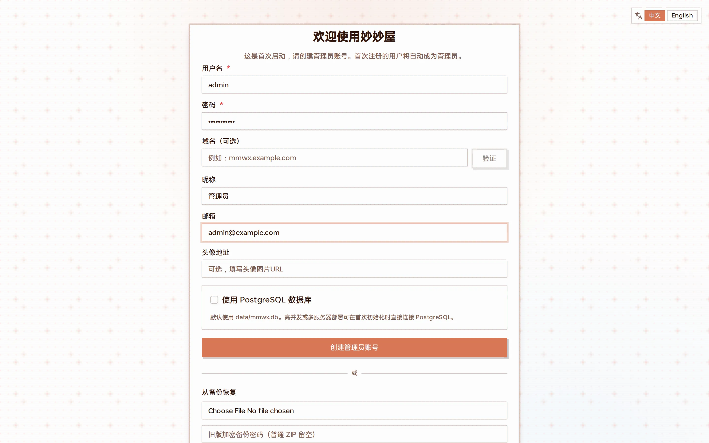

The first-run setup wizard: fill in the admin credentials; the first registered user automatically becomes the administrator

Two optional items sit at the bottom of the wizard:

- **Use PostgreSQL**: the default is `data/mmwx.db` (SQLite). High-concurrency or multi-server deployments can enter PostgreSQL connection details here and skip a later migration.
- **Restore from backup**: if you have a backup ZIP exported from an old master, upload it here to skip rebuilding by hand.

After initialization you are redirected to the login page. Sign in with the account you just created to land on the "Traffic" home page.

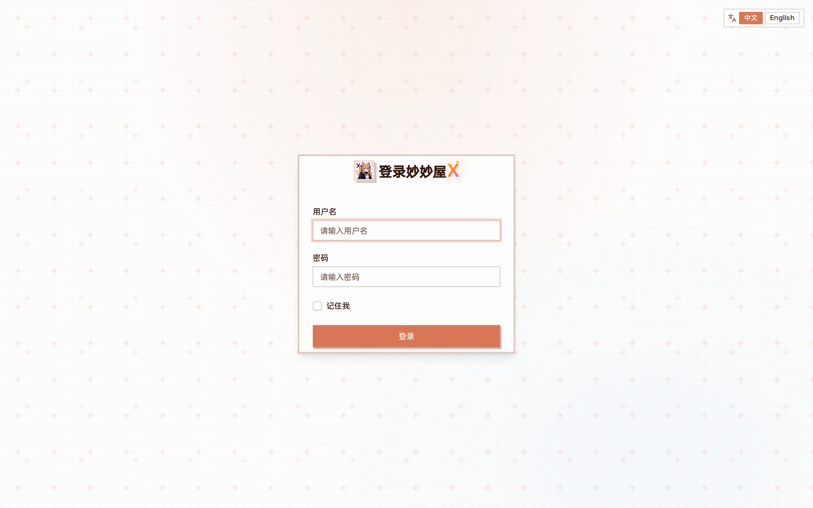

Login page: switch between 中文 / English at the top right

## 5 Enable HTTPS

### 5.1 Configure a DNS provider

1. Click "Certificates" → "DNS Providers" → "Add DNS Provider"
2. Enter a name and choose the provider type
3. Fill in the API key / secret (fields differ per provider)


Add DNS provider: for Cloudflare only an API Token is needed

### 5.2 Request a certificate

Click "Certificate List" → "Request Certificate" and fill in:


Certificates page listing issued certificates with CA, validation method, expiry, auto-renew and deployment status


Request certificate dialog: domain, email, CA, validation method and DNS provider

| Field                       | Value                       | Notes                                                  |
| --------------------------- | --------------------------- | ------------------------------------------------------ |
| Domain                      | `example.com`               | A wildcard certificate is recommended                  |
| Email                       | Your email                  | Used for certificate notifications                     |
| CA provider                 | Let's Encrypt               | Default                                                |
| Validation                  | DNS-01                      | Required for wildcard certificates                     |
| DNS provider                | The provider you added      |                                                        |
| Root + wildcard             | On                          | Entering example.com also issues \*.example.com        |
| Auto renew                  | On                          | Default on                                             |
| Auto deploy                 | Off                         | When on, renewals are redeployed to referencing servers |

Click "Request Certificate" and wait for success.

:::tip[Already have a certificate?]
If your certificate is issued by an external system such as Certimate, paste the PEM via "Upload Certificate" or push it through the webhook, see [Certificates](/docs/en/certificates).
:::

### 5.3 Deploy the certificate

Only one-click installs can configure HTTPS automatically. For Docker installs, manage master HTTPS yourself with Nginx or similar, skip this step and read 5.4.

After the request succeeds a banner appears at the top; click "Deploy certificate to master" to enable HTTPS. You can also click deploy from the certificate list.

Deployment installs Nginx, which may take a while depending on server performance and network.

### 5.4 Recommended: reverse-proxy the master with Nginx

Configure HTTPS separately for the master domain and the subscription domain: the master domain proxies the whole panel, the subscription domain only allows subscription paths and returns 404 for everything else. Make sure both domains resolve to the master server and certificates are ready.

#### Install Nginx

```
curl -fsSL https://raw.githubusercontent.com/iluobei/miaomiaowuX/main/install-nginx.sh | bash
```

Uses the one-click script from the MiaoMiaoWu X repository. The default install directory is /usr/local/nginx; extra server configs go in /usr/local/nginx/servers/.

#### Download the certificate from the master and place it

Open "Certificates" on the master, find the domain and click download. Unzip to get two files:

- `fullchain.pem`: the domain certificate with the full chain.
- `privkey.pem`: the private key, never publish or share it.

Use one directory per domain. The example uploads both files to the master server and moves them into /usr/local/nginx/cert/{domain}/; replace {server_ip} and {domain}. Repeat for the subscription domain.

```
# Run locally: upload the extracted certificate to the master server
scp fullchain.pem privkey.pem root@{server_ip}:/tmp/

# Then on the master server; replace {domain}
sudo mkdir -p /usr/local/nginx/cert/{domain}
sudo cp /tmp/fullchain.pem /usr/local/nginx/cert/{domain}/fullchain.pem
sudo cp /tmp/privkey.pem /usr/local/nginx/cert/{domain}/privkey.pem
sudo chmod 644 /usr/local/nginx/cert/{domain}/fullchain.pem
sudo chmod 600 /usr/local/nginx/cert/{domain}/privkey.pem
```

#### Master domain config

Replace {domain} with the master domain and confirm fullchain.pem and privkey.pem exist. Save as e.g. /usr/local/nginx/servers/master.conf.

```
server {
    listen 443;
    #listen 443 quic;
    listen [::]:443;
    #listen [::]:443 quic;
    http2 on;
    server_name {domain};

    ssl_certificate /usr/local/nginx/cert/{domain}/fullchain.pem;
    ssl_certificate_key /usr/local/nginx/cert/{domain}/privkey.pem;
    ssl_ciphers ECDHE-RSA-AES128-GCM-SHA256:ECDHE:ECDH:AES:HIGH:!NULL:!aNULL:!MD5:!ADH:!RC4;
    ssl_prefer_server_ciphers on;
    error_page 497 https://$host:443$1;
    #add_header Alt-Svc 'h3=":443"; ma=2592000,h3-29=":443"; ma=2592000';
    ssl_protocols TLSv1 TLSv1.1 TLSv1.2;

    location / {
        proxy_ssl_server_name on;
        proxy_set_header Host $host;
        client_max_body_size 512M;
        proxy_set_header Connection $http_connection;
        proxy_set_header Upgrade $http_upgrade;
        proxy_set_header X-Real-IP $remote_addr;
        proxy_set_header X-Forwarded-For $proxy_add_x_forwarded_for;
        proxy_set_header X-Forwarded-Proto $scheme;
        proxy_pass http://127.0.0.1:12889;
    }

    proxy_read_timeout 600s;
    proxy_connect_timeout 600s;
}
```

#### Dedicated subscription domain config

Replace {domain} with the subscription domain and place its certificate accordingly. This config only exposes short links and subscription APIs, never the admin panel.

```
server {
    listen 443 ssl;
    listen [::]:443 ssl;
    http2 on;

    server_name {domain};

    ssl_certificate /usr/local/nginx/cert/{domain}/fullchain.pem;
    ssl_certificate_key /usr/local/nginx/cert/{domain}/privkey.pem;
    ssl_protocols TLSv1.2 TLSv1.3;

    # Allowed endpoints:
    #   /x/{code}                    short links and package subscription links
    #   /api/clash/subscribe         direct Clash/Mihomo subscriptions
    #   /api/user/package-subscribe  direct package subscriptions
    #   /api/subscribe               compatibility endpoint
    location ~ ^(?:/x/|/api/(?:clash/subscribe|user/package-subscribe|subscribe)$) {
        proxy_pass http://127.0.0.1:12889;
        proxy_http_version 1.1;
        proxy_set_header Host $host;
        proxy_set_header X-Real-IP $remote_addr;
        proxy_set_header X-Forwarded-For $proxy_add_x_forwarded_for;
        proxy_set_header X-Forwarded-Proto https;
        proxy_set_header X-Forwarded-Host $host;
        proxy_set_header X-Forwarded-Port $server_port;
        proxy_buffering off;
        proxy_connect_timeout 60s;
        proxy_send_timeout 60s;
        proxy_read_timeout 60s;
    }

    location / {
        return 404;
    }
}
```

Afterwards you must go to [System Settings](/docs/en/system-settings) → "System" tab and enter the full subscription domain (e.g. https://sub.example.com) in the "Master address / Subscription domain" area, otherwise generated subscription links keep using the master domain.

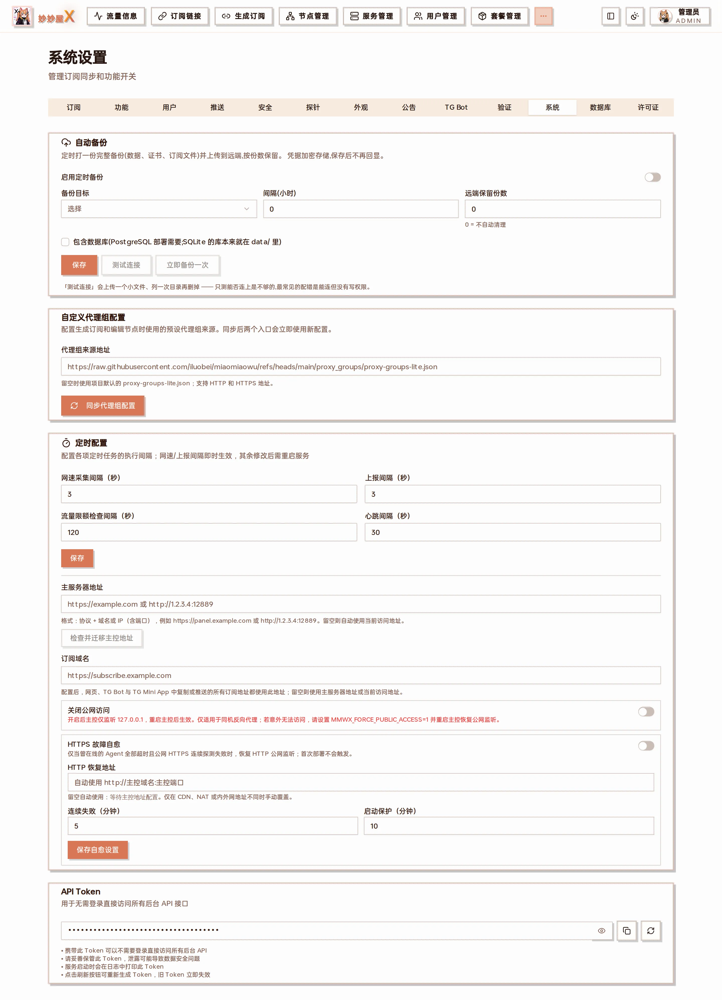

System Settings → System: master address, subscription domain, disable public access and HTTPS self-healing all live here

Finally run /usr/local/nginx/sbin/nginx -t to check the config, then systemctl reload nginx.

### 5.5 Optional: reverse-proxy the master with Caddy

Caddy requests and renews HTTPS certificates automatically and handles WebSocket and the usual forwarding headers. Make sure both domains resolve to the master and ports 80/443 are reachable.

#### Install Caddy

The commands below use Caddy's official Debian/Ubuntu stable repository; the install creates and starts the caddy systemd service.

```
sudo apt install -y debian-keyring debian-archive-keyring apt-transport-https curl
curl -1sLf 'https://dl.cloudsmith.io/public/caddy/stable/gpg.key' | sudo gpg --dearmor -o /usr/share/keyrings/caddy-stable-archive-keyring.gpg
curl -1sLf 'https://dl.cloudsmith.io/public/caddy/stable/debian.deb.txt' | sudo tee /etc/apt/sources.list.d/caddy-stable.list
sudo chmod o+r /usr/share/keyrings/caddy-stable-archive-keyring.gpg
sudo chmod o+r /etc/apt/sources.list.d/caddy-stable.list
sudo apt update
sudo apt install caddy
```

#### Configure /etc/caddy/Caddyfile

Replace {master_domain} and {subscription_domain}. The master domain exposes the full panel; the subscription domain only allows short links and subscription APIs.

```
{master_domain} {
    reverse_proxy 127.0.0.1:12889
}

{subscription_domain} {
    @subscriptions {
        path /x/* /api/clash/subscribe /api/user/package-subscribe /api/subscribe
    }

    handle @subscriptions {
        reverse_proxy 127.0.0.1:12889
    }

    handle {
        respond 404
    }
}
```

No certificate paths are needed by default; Caddy requests and renews them. To use existing certificates add tls /abs/path/cert.pem /abs/path/key.pem to the site block.

With a dedicated subscription domain you must likewise enter it in [System Settings](/docs/en/system-settings).

Validate and reload after saving:

```
sudo caddy validate --config /etc/caddy/Caddyfile
sudo systemctl reload caddy
```

We recommend enabling "Disable public access" in the "System" tab so the master listens on 127.0.0.1 only.

### 5.6 Optional: publish over Cloudflare Tunnel

If the domain is on Cloudflare, publish the master through a Tunnel without Nginx/Caddy, certificates or open 80/443 ports. Use separate panel and subscription domains and restrict the subscription domain to subscription paths on the Cloudflare side.

Full steps, Docker notes and verification commands: [Publish the master with Cloudflare Tunnel](/docs/en/cloudflare-tunnel).

## 6 Add a Server

In this example the master server doubles as an Agent server.

Click "Servers" → "Add Server", enter a name, adjust the options as needed and click "Generate Token":


Add remote server dialog: name, server address, Xray mode, traffic counting rule and more

| Field                  | Value                                     | Notes                                                                                   |
| ---------------------- | ----------------------------------------- | --------------------------------------------------------------------------------------- |
| Server name            | Any name                                  | e.g. "Tokyo 01"                                                                         |
| Server address         | Domain or IP                              | With a domain, nodes use the domain; DDNS can keep the record updated                   |
| Agent port             | 23889                                     | Local Agent listening port, keep the default                                            |
| Agent auth token       | Empty                                     | Auto-generated when empty                                                               |
| Traffic limit / used   | Monthly quota / already used              | For matching the provider's meter, empty = unlimited                                    |
| Reset day              | 1–31                                      | Monthly traffic reset day                                                               |
| Enable IPv6            | As needed                                 | When off, v6 is hidden and cannot be chosen when adding nodes                           |
| Xray mode              | External Xray / Embedded Xray (PRO)       | Embedded ships xray-core inside the Agent; supports rate limits, device limits, Snell, AnyTLS |
| Traffic counting rule  | Up + Down / Up only / Down only / Max     | Direction used for this server's node traffic                                           |
| Traffic data source    | Xray protocol traffic / System NIC traffic | The latter is closer to VPS billing                                                     |
| Steal self             | Enable REALITY steal-self                 | Off by default, needs a domain, see 6.1                                                 |

Field details: [Remote Servers](/docs/en/remote-servers).

### 6.1 Agent steal-self

Note: once the master has HTTPS it occupies port 443, so do not enable "steal self" for an Agent installed on the master server.

Turning on "Steal self" reveals another group of fields:


With "Steal self" on: front-end xray, Tunnel / Fallback mode, port 443, domain and site type

| Field           | Value                    | Notes                                                                              |
| --------------- | ------------------------ | ---------------------------------------------------------------------------------- |
| Front end       | xray                     | Only Xray for now; Xray + Nginx are installed automatically after the Agent installs |
| Deploy mode     | Tunnel / Fallback        | Default Tunnel: Xray listens on 443 and tunnels to Nginx                           |
| Deploy on 443   | 443                      | Fixed                                                                              |
| Domain          | Steal-self site domain   | e.g. steal.example.com, must resolve to this server                                |
| Site type       | Static / Reverse proxy   | Static takes a directory path, reverse proxy takes an upstream such as 127.0.0.1:8080 |

Make sure port 443 is free on the server. You can still host other services: after the Agent connects, "Agent" → "Websites" → "Add website" reuses port 443.

Continue to the next step to install the Agent.

## 7 Install the Agent

After "Generate Token" the dialog shows the one-click install command and the Docker environment variables:


After generating the token: the install command on top, Docker environment variables (including the master public key) below

1. Copy the install command
2. SSH into the target server and run it as root; wait for it to finish
3. Back on the Servers page, the dot on the card turns green and the status reads "Online"


Servers page: once the Agent connects the card shows Online, Xray mode, connection (WS), Xray / Nginx status and the Agent version

Details: [Agent Deployment](/docs/en/install-agent).

Servers with steal-self enabled automatically get a tunnel-in inbound after the Agent installs and route to the deployed site domain; https://your-site-domain then serves the deployed site.

## 8 Add a Node

Click "Nodes" → "Add Node". The wizard has two steps: pick a server, then configure the inbound.

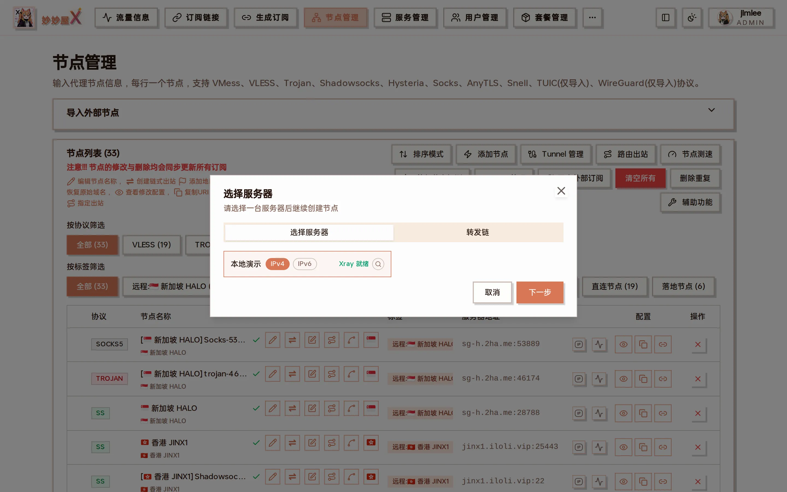

Step 1: choose the server and IPv4 / IPv6; green "Xray ready" means you can create nodes right away

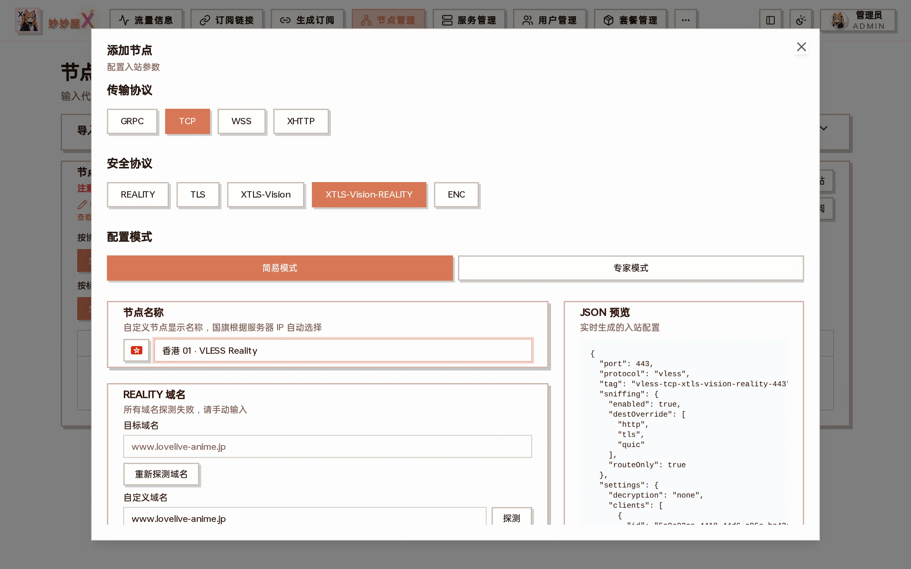

Step 2: choose protocol / transport / security, enter the node name and REALITY domain; the generated inbound JSON is previewed on the right

For steal-self add a VLESS + TCP + XTLS-Vision-REALITY node:

| Field          | Value                        | Notes                                                        |
| -------------- | ---------------------------- | ------------------------------------------------------------ |
| Protocol       | VLESS                        | Transport TCP, security XTLS-Vision-REALITY                  |
| Config mode    | Simple                       | Expert mode exposes port, listen address, sniffing and more  |
| Node name      | Name shown in the list       | The flag is added automatically from the server IP           |
| REALITY domain | Defaults to the steal-self domain | Any domain works; the wizard probes latency automatically |
| User           | Current admin by default     | UUID auto-generated                                          |

### The first REALITY node with steal-self

The first REALITY node is forced onto port 443 and automatically uses the deployed site as dest.

The port shown while creating may not be 443 because steal-self uses the tunnel-in inbound's settings.port (default 46174); ignore it and check the node afterwards.

Click "Submit" and the wizard creates the inbound on the server and syncs it as a node:

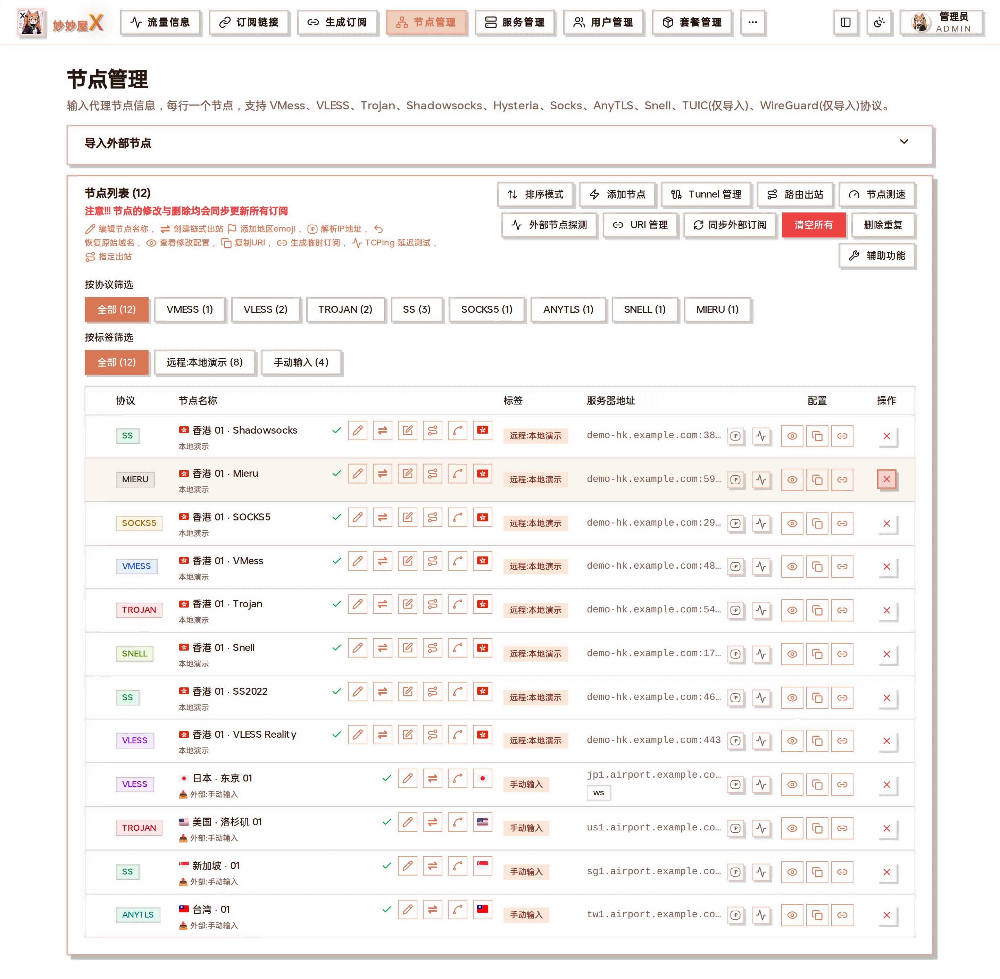

Nodes page: new nodes carry a "Remote:server name" tag and the address column shows domain and port

### Check the node

Confirm the node's port is 443 in Nodes, then open https://your-site-domain in a browser; if the deployed site loads, the setup works.

## 9 Create a Package

Open "Packages" and click "Create Package Template" to set the traffic quota, billing cycle, counting mode (one-way / two-way), speed limit and connection limit, then tick the nodes included in the package and set node multipliers on the right.

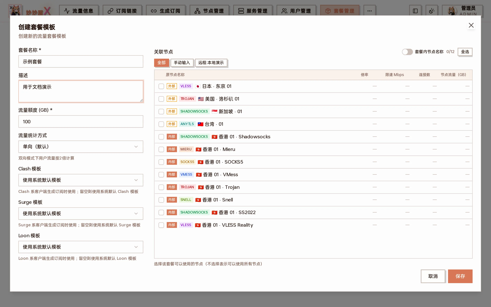

Create package template: parameters on the left, associated nodes on the right

If no node is ticked, a confirmation reminds you that "empty = all nodes":

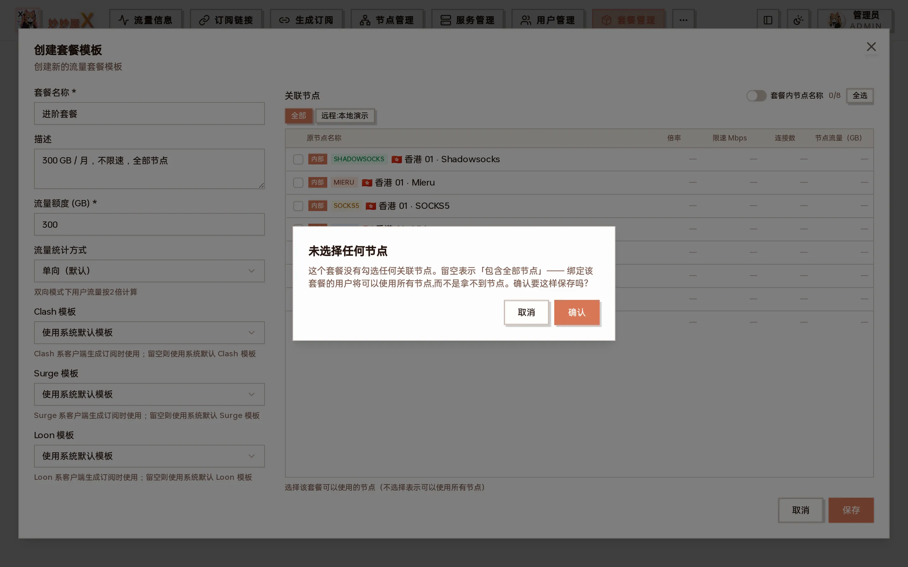

Confirmation when no associated node is selected: empty means the package can use all nodes

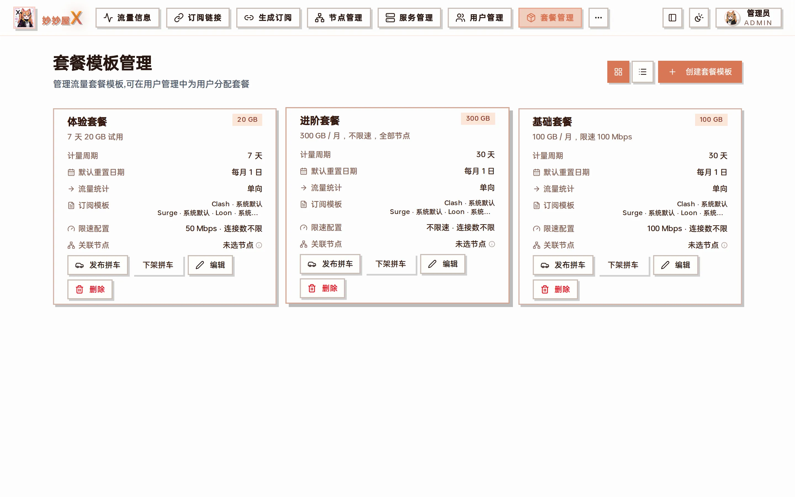

Packages page: each package is a card with edit / delete / publish carpool

## 10 Bind the Package

Open "Users" and click "Add User" (the initial password is random by default and can be changed before creating):

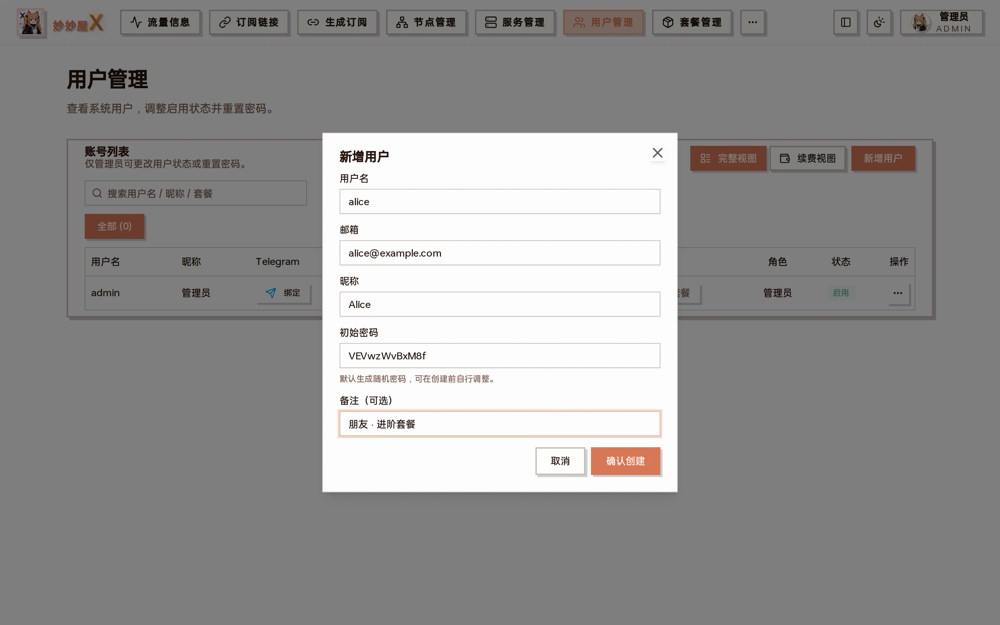

Add user: username, email, nickname, initial password, remark

Then click "Bind Package" on the user's row (for already bound users open the "…" menu and click the package name to reach "Manage Packages"), choose a package, set the expiry and save. The user then has access to the package's nodes.

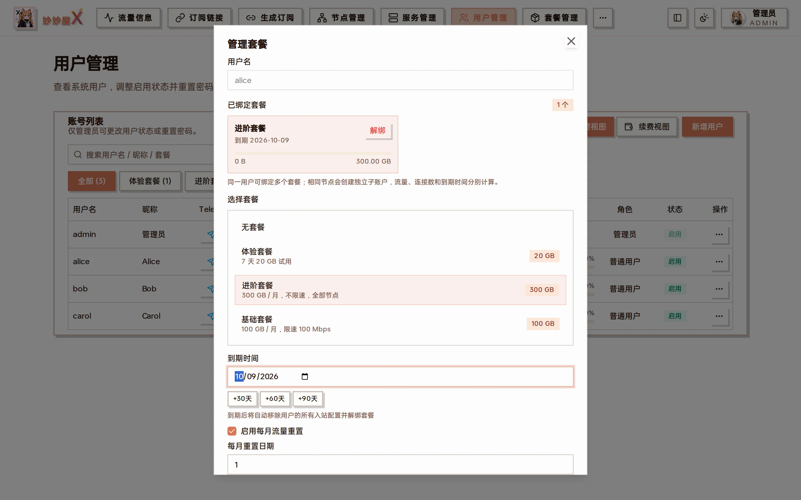

Manage packages: choose a package + expiry (+30 / +60 / +90 days) + monthly reset + traffic override

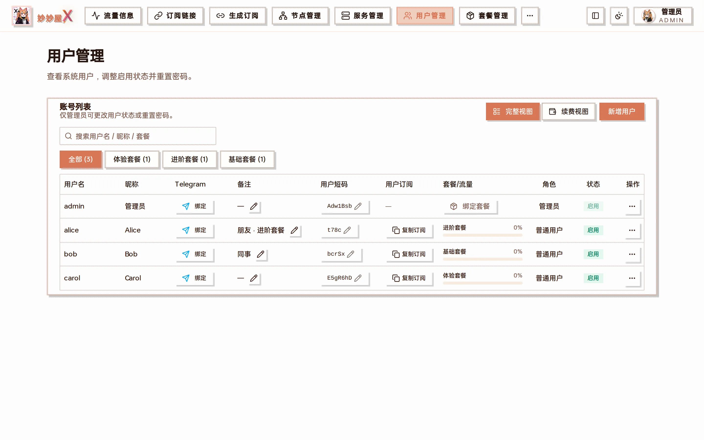

Users page: one row per user with Telegram binding, user short code, copy subscription and package usage bar

## 11 Traffic

The "Traffic" page shows usage from three angles: users, nodes and servers.

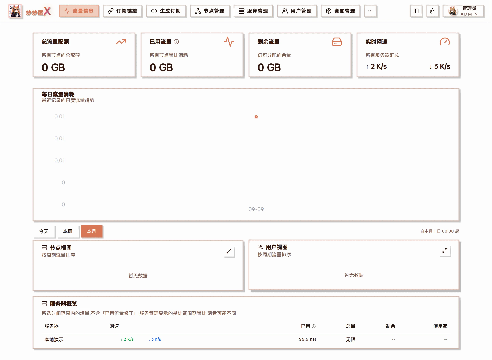

Traffic home: four KPI cards (quota / used / remaining / live speed), the daily trend, node view, user view and server overview

### User view

Usage per user; click the expand icon for full screen and click a username to break it down by node.

### Node view

Usage per node; click a node name to break it down by user.

### Server overview

Live speed, used, total, remaining and utilization per server. "Today / This week / This month" at the top left switches the range. See [Traffic Accounting](/docs/en/traffic-accounting) for how the views differ.

## 12 Tools (TG Bot & MiniApp)

Manage users and package bindings inside a Telegram bot with commands, daily notifications and a login-free Mini App.

Configure it under "System Settings" → "TG Bot", see [Telegram Bot](/docs/en/tool-mmwx-tgbot).

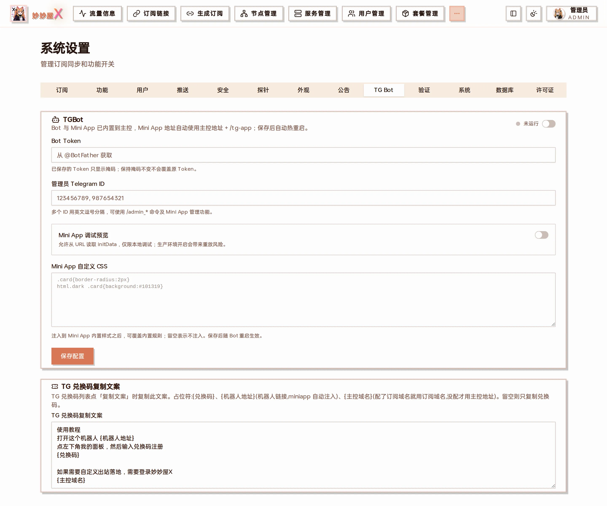

System Settings → TG Bot: enter the Bot Token and admin Telegram IDs, enable and save

### Admin view (Mini App)

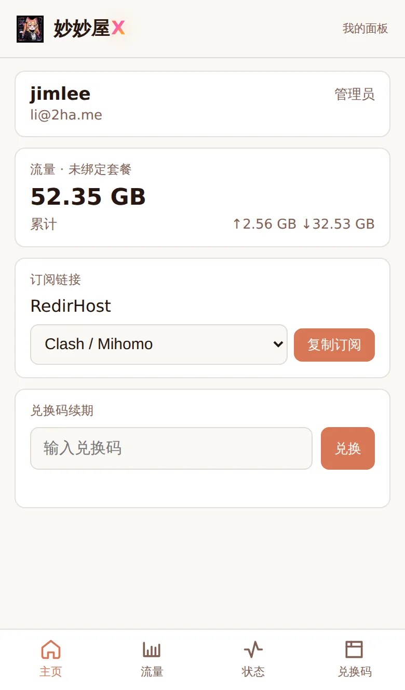

Admin view: account / traffic / subscription / redeem codes (phone resolution)

### User view (Mini App)

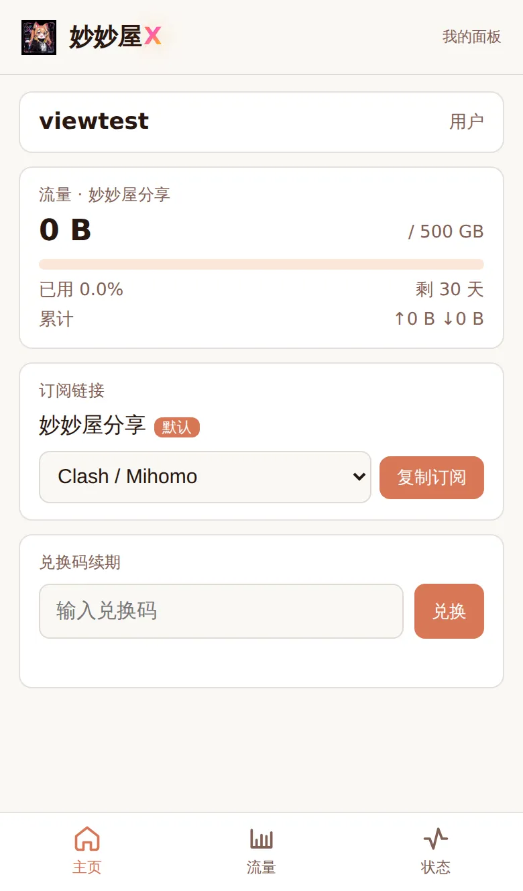

Regular user view: only the user's own account / traffic / subscription
