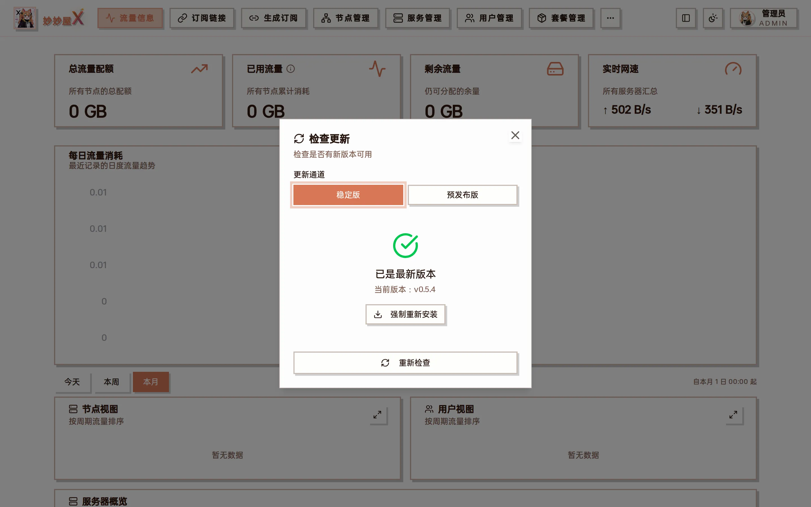
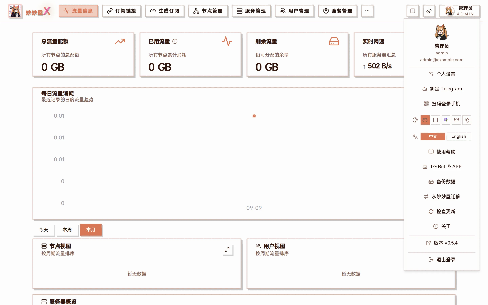

Check Update dialog — shows the current version, lets you pick the stable / pre-release channel, upgrades in one click when a new version exists, and can "Force reinstall"

## In-panel update (recommended)

Masters installed with the one-click script or the binary can upgrade from the panel: avatar menu at the top right → "Check for updates", pick a channel and click upgrade; the master downloads the release, verifies the signature and restarts. Docker deployments use the image methods below.



"Check for updates" and the current version in the avatar menu

## Docker Update

Docker Compose is recommended because it preserves the existing ports, environment variables, and persistent mounts. If you recreate the container with docker run, use exactly the same mappings as the installation command.

### Docker Compose (recommended)

```
# 在 docker-compose.yml 所在目录执行
docker compose pull
docker compose up -d
```

### docker run

```
# 拉取最新镜像
docker pull ghcr.io/iluobei/miaomiaowux:latest

# 确保持久化目录存在
mkdir -p data subscribes rule_templates

# 停止并删除旧容器
docker stop miaomiaowux && docker rm miaomiaowux

# 重新运行
docker run -d \
  --name miaomiaowux \
  --restart unless-stopped \
  --network host \
  -v $(pwd)/data:/app/data \
  -v $(pwd)/subscribes:/app/subscribes \
  -v $(pwd)/rule_templates:/app/rule_templates \
  ghcr.io/iluobei/miaomiaowux:latest
```

When recreating the container, keep host networking and the data, subscribes, and rule_templates mounts; otherwise dynamic ports may become unreachable or persistent data may be lost.

## Binary Update

Download the new version binary to replace the old file and restart the service. The database will auto-migrate.

```
# 停止服务
systemctl stop miaomiaowux

# 替换二进制
cp mmwx-linux-amd64-new /opt/mmwx/mmwx-linux-amd64

# 重启
systemctl start miaomiaowux
```

## Agent Update

No SSH needed: in "Servers", cards with a newer Agent show a red dot on the version badge — click it to upgrade that server, or use "Upgrade Agents" at the top to upgrade every upgradable server at once. The Agent restarts briefly. Keep Agent and master versions consistent.


Upgrade one Agent


Upgrade all Agents
