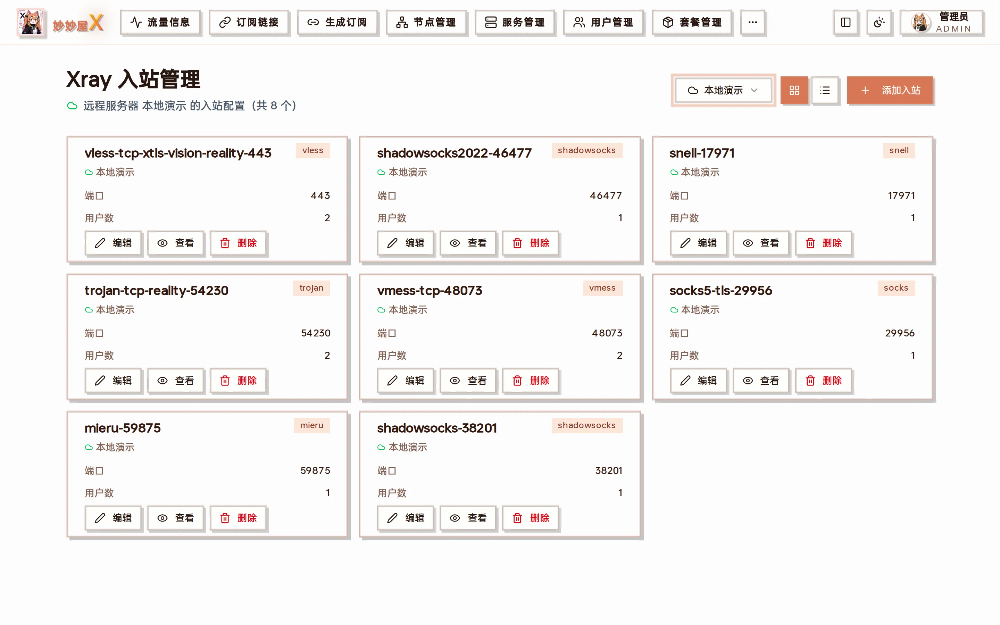
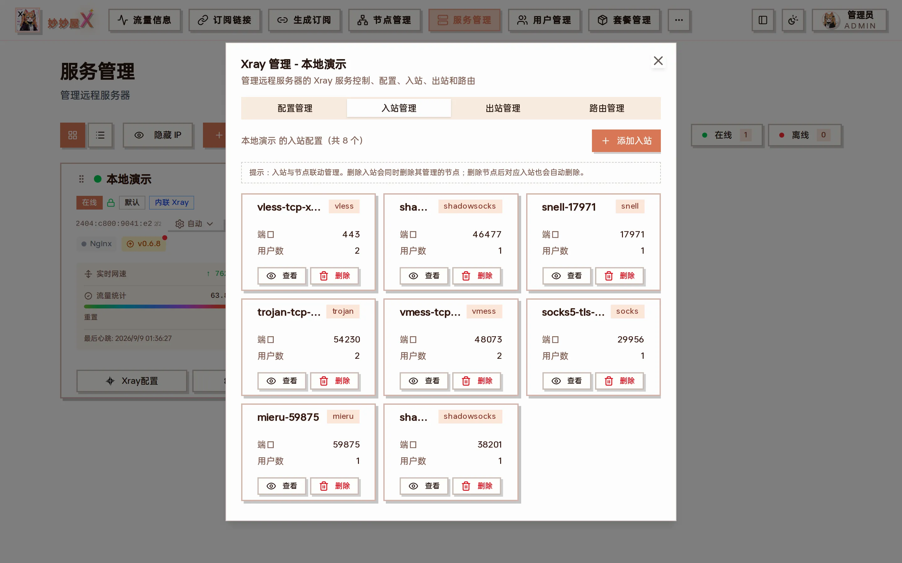
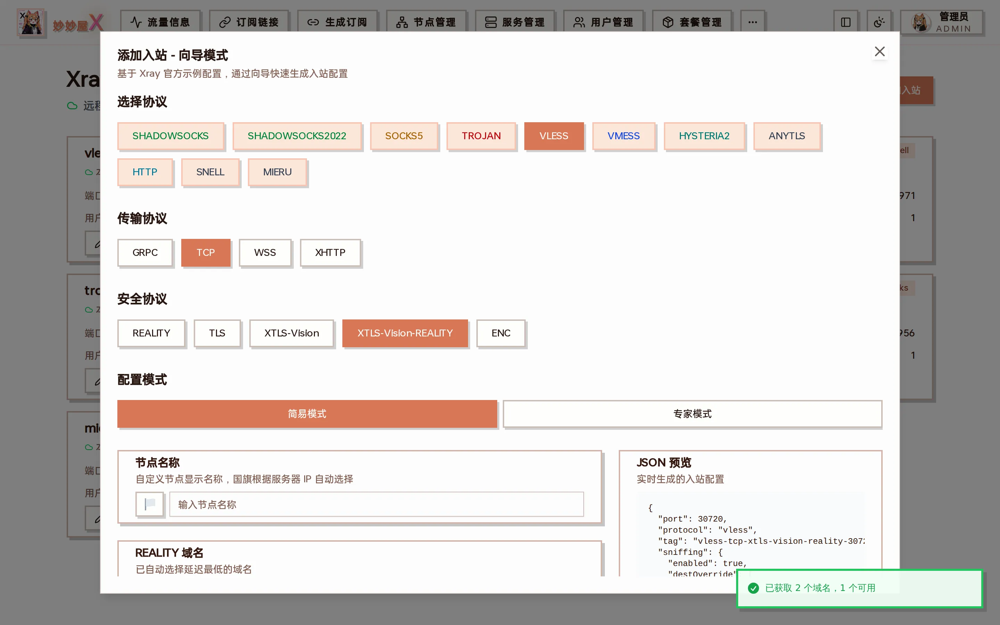

Xray Inbounds — after choosing a server, every inbound is listed with tag / protocol / port / user count, with view JSON, edit and delete

:::note[This page manages Xray inbounds only, not nodes]
Adding / enabling / disabling / deleting / renaming nodes happens in [Node Management](/docs/en/nodes). Inbounds and nodes are linked: deleting an inbound deletes its nodes, deleting a node removes its inbound.
:::

## Where to find it

The same inbound list is available in two places:

- Sidebar "Xray Inbounds": the "Select server" dropdown switches servers; card / list view toggles and "Add Inbound" sit on the right
- Servers → server card "Xray Config" → "Inbounds" tab

The Inbounds tab inside the server card, identical to the standalone page

## Inbound wizard

The wizard walks through protocol, transport, security and parameters and generates the complete Xray inbound. It is the same wizard as step 2 of "Nodes → Add Node".

Add inbound - wizard mode: based on official Xray examples, with a live JSON preview on the right

1. Protocol: Shadowsocks / Shadowsocks2022 / SOCKS5 / Trojan / VLESS / VMess / Hysteria2 / AnyTLS / HTTP / Snell / Mieru
2. Transport: TCP / WebSocket / gRPC / XHTTP (depends on the protocol)
3. Security: REALITY / TLS / XTLS-Vision / XTLS-Vision-REALITY / ENC / none
4. Mode: simple assigns a port and generates credentials; expert exposes port, listen address, sniffing, relay …
5. Node name; REALITY protocols pick or probe a target domain, optionally "Prevent REALITY theft"
6. Users (UUID / password / PSK auto-generated, more can be added)
7. Preview the JSON and "Submit"

### Example: add a Shadowsocks 2022 inbound

1. Pick the server in "Select server" and click "Add Inbound"
2. Protocol "SHADOWSOCKS2022", everything else default (simple mode)
3. Node name "HK 01 · SS2022"
4. The JSON preview shows method `2022-blake3-aes-128-gcm`, a random port and the generated PSK
5. "Submit" → the list gains `shadowsocks2022-<port>` and a node of the same name appears in Nodes

## Supported combinations

Protocols support different transport and security combinations. See the [Protocol Matrix](/docs/en/protocol-matrix).

| Protocol    | Transport            | Security                  |
| ----------- | -------------------- | ------------------------- |
| VLESS       | TCP, WS, gRPC, XHTTP | TLS, REALITY, XTLS-Vision |
| VMess       | TCP, WS              | TLS, None                 |
| Trojan      | TCP, gRPC            | TLS, REALITY              |
| Shadowsocks | TCP                  | None                      |
| Hysteria2   | UDP                  | TLS                       |
| AnyTLS      | TCP                  | TLS, REALITY              |
| Snell       | TCP                  | None (optional obfs)      |
| Mieru       | TCP / UDP            | None                      |

## Inbound operations

- Creating an inbound syncs a node automatically (visible in Nodes)
- Deleting an inbound deletes its node
- "View" shows the full JSON; "Edit" opens the same wizard
- Filtering: API inbounds and runtime inbounds with empty tags are hidden

## Auto sync

Inbound creation / deletion is synced to the node table through the event bus, converting the Xray inbound into a mihomo/Clash compatible proxy config.
