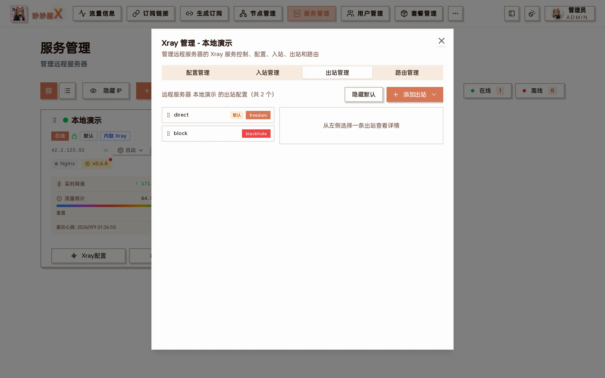
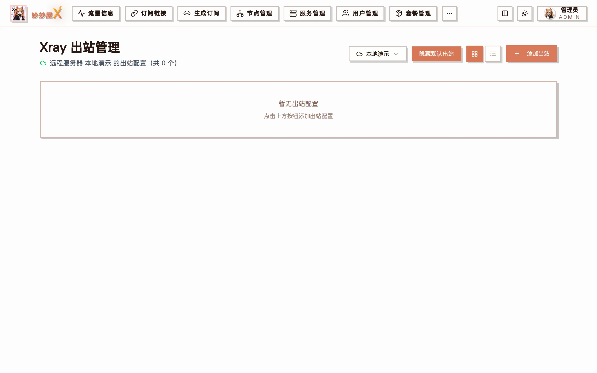

Xray management → Outbounds: outbound list on the left (default direct / block can be hidden with "Hide defaults"), details of the selected outbound on the right

## Outbounds

Outbounds define how traffic leaves Xray. freedom (direct) and blackhole (block) exist by default.

| Type                  | Description                                                                                                         |
| --------------------- | ------------------------------------------------------------------------------------------------------------------- |
| Freedom               | Direct outbound                                                                                                     |
| Blackhole             | Drops all traffic                                                                                                   |
| VLESS/VMess/Trojan/SS | Proxy outbound through another proxy server                                                                        |
| Tunnel                | Tunnel outbound                                                                                                     |
| WARP v0.2.3+          | Cloudflare WARP exit (WireGuard); "Add Outbound → Cloudflare WARP" installs it, one account per agent, isolated traffic |

## Where to find it

- Sidebar "Xray Outbounds": choose a server to list its outbounds; "Hide default outbounds" and "Add Outbound" at the top right
- Servers → server card "Xray Config" → "Outbounds" tab (two-pane, drag to reorder)

The standalone Xray Outbounds page

In practice most outbounds need not be added by hand: in [Nodes](/docs/en/nodes) click a node's "Create chained outbound" button, pick a landing node or server, and the proxy outbound plus routing rule are created on the source server automatically, see [Routed Outbound](/docs/en/routed-outbound).

## Routing rules

Routing rules decide which outbound handles inbound traffic, by domain, IP, protocol and more.

- Domain matching (domain, full, regexp)
- IP matching (CIDR, GeoIP)
- Protocol matching
- Port matching
- Inbound tag matching

Rules are maintained in the "Routing" tab, see [Xray Routing](/docs/en/xray-routing).

## Operations

Manage outbounds and routing rules in the server's "Outbounds" and "Routing" tabs: add, edit, delete. Xray must restart for changes to apply (routing changes restart automatically).

## Cloudflare WARP outbound

Since v0.2.3 Cloudflare WARP is built in. Each agent registers its own account with Cloudflare (no wgcf binary) and gains warp-v4 / warp-v6 WireGuard outbounds that routing can target.

1. In the Outbounds tab click "Add Outbound" → "Cloudflare WARP" to open the WARP panel.
2. Click "Install WARP"; the agent registers, writes warp.json and adds warp-v4 + warp-v6; the server card shows an orange W badge.
3. For WARP+ paste the license key and "Upgrade WARP+"; "Refresh config" re-fetches and re-injects the outbounds (idempotent by tag).

### Quick rule — avoid China redirection

For servers with WARP installed, the routing panel's quick rules gain "Avoid China redirection": route geosite:google + geosite:meta through warp-v4 so Google / Meta traffic is not steered to mainland nodes.

### Notes

- Default MTU 1420 (WireGuard standard); noKernelTun=false forces userspace gVisor TUN, no host tun module or CAP_NET_ADMIN needed.
- Uninstalling deregisters the Cloudflare account, deletes warp.json and removes warp-v4 / warp-v6 from xray.
