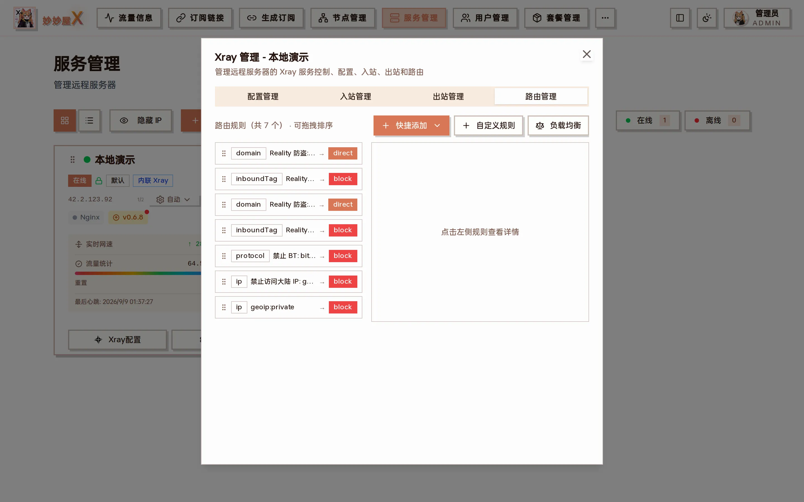
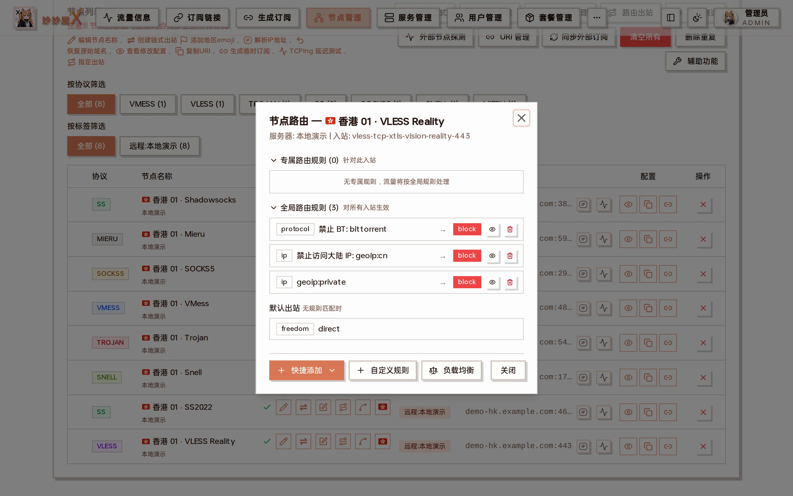

Xray management → Routing: drag-sortable rule list with "Quick add / Custom rule / Load balancer" at the top

## Overview

Xray routing is first-match: rules are evaluated top to bottom, the first hit wins, and unmatched traffic goes to the default outbound (outbounds\[0\]). MiaoMiaoWu X offers two entry points:

| Entry           | Location                                             | Description                                              |
| --------------- | ---------------------------------------------------- | -------------------------------------------------------- |
| Node routing    | Nodes → the "Node routing" button on a node row      | View and manage rules for a single node (inbound)        |
| Routing panel   | Servers → Xray Config → Routing tab                  | Manage all rules of a server, drag to reorder            |

## Matching semantics

- Rules match top to bottom; the first hit stops evaluation (first-match)
- Conditions inside one rule are AND (e.g. domain + protocol must both match)
- A rule with only inboundTag + outboundTag is a catch-all matching 100 % of that inbound
- Global rules after a catch-all no longer apply to that inbound
- Unmatched traffic uses outbounds\[0\] (default outbound)

Order therefore matters: specific rules first, catch-all last.

## Node routing

Every remote server node in Nodes has a routing button opening the node routing dialog.

Node routing: dedicated rules for this inbound on top, global rules and the default outbound below

### Dedicated vs global rules

- Dedicated: rules containing the node's inboundTag, effective for this inbound only
- Global: rules without inboundTag, effective for all inbounds

### Catch-all detection

If a dedicated catch-all exists (inboundTag + outboundTag only), the global rules and default outbound are hidden with a notice:

⚠ All traffic is routed to \[outboundTag\]; later global rules and the default outbound no longer apply

### Outbound name resolution

outboundTag values are resolved to node names by matching the outbound's server:port with node clash_config addresses.

## Routing panel

Open a server card's "Xray Config" and switch to "Routing" to manage all rules. The screenshot shows rules added automatically by the system:

- **REALITY anti-theft**: inbounds with "Prevent REALITY theft" get two rules — allow the serverNames domain to direct, block everything else coming through the anti-theft tunnel
- **Block BT / Block mainland IPs / geoip:private → block**: default safety rules, removable

### Two-pane layout

- Left (40 %): rule list, drag to sort, click to select
- Right (60 %): fields of the selected rule + JSON preview + delete

### Drag to sort

Because routing is first-match, order changes results. Drag the handle on the left of a rule card; the order is saved and Xray restarts on drop.

Sorting uses action: 'set' to replace the whole rule list; API rules (outboundTag api) stay at the top automatically.

## Quick rules

Built-in quick rules, added with one click from "Quick add":

| Rule                     | Condition              | Outbound  | Description                                  |
| ------------------------ | ---------------------- | --------- | -------------------------------------------- |
| Block BT                 | protocol: bittorrent   | block     | Block BitTorrent                             |
| Block mainland IPs       | ip: geoip:cn           | block     | Block mainland China IPs                     |
| OpenAI direct            | domain: geosite:openai | direct    | OpenAI domains direct                        |
| Block private networks   | ip: geoip:private      | block     | Block private addresses                      |
| RFC EMBY                 | domain: rfc.uhdnow.com | choose    | EMBY unlock, needs an outbound               |
| TikTok unlock            | domain: geosite:tiktok | choose    | TikTok unlock, needs an outbound             |
| Avoid China redirection  | geosite:google + meta  | warp-v4   | Only on servers with WARP installed          |

## Outbound load balancing

Create a balancer to spread traffic matching a rule across a group of outbounds for multi-landing splitting / failover. Available from the Servers routing panel and the Nodes routing dialog.

### Steps

1. Click "Load balancer" in the routing panel.
2. Use an outbound prefix (selector) to choose the participating outbounds (matched by tag prefix).
3. Choose a strategy (table below).
4. Add a routing rule whose balancerTag points at the balancer instead of a single outboundTag.
5. When created from the node routing dialog, the default rule's inboundTag is the node's tag; it can be widened to all nodes.

| Strategy   | Description                                                     |
| ---------- | --------------------------------------------------------------- |
| random     | Pick a random outbound                                          |
| roundRobin | Rotate through the outbounds                                    |
| leastPing  | Lowest latency (needs observation; observatory is enabled automatically) |
| leastLoad  | Lowest load (needs observation)                                 |

leastPing / leastLoad automatically configure observatory / burstObservatory to probe candidates; random / roundRobin need none.

## Custom rules

Custom rules support every Xray routing field; empty fields are omitted. Separate multiple values with commas.

| Field      | Type   | Example                     | Description                                                     |
| ---------- | ------ | --------------------------- | --------------------------------------------------------------- |
| domain     | array  | geosite:openai, example.com | Domain match, supports geosite:, domain:, full:, regexp:        |
| ip         | array  | geoip:cn, 10.0.0.0/8        | IP match, supports geoip:, CIDR, plain IP                       |
| protocol   | array  | bittorrent, http, tls       | Protocol match                                                  |
| port       | string | 80, 443, 1000-2000          | Target port, ranges allowed                                     |
| sourcePort | string | 1234                        | Source port                                                     |
| network    | string | tcp / udp / tcp,udp         | Network type                                                    |
| source     | array  | 10.0.0.1                    | Source IP                                                       |
| user       | array  | user@example.com            | User identifier                                                 |
| inboundTag | array  | inbound-tag-1               | Inbound tag limiting the rule's scope                           |
| attrs      | string | attrs\[':method'\] == 'GET' | Attribute expression                                            |

### Example: send only one inbound's Netflix traffic to a US landing

1. In Nodes, "Create chained outbound" on the node and pick the US landing node; a proxy outbound tagged `landing-<inbound tag>-<timestamp>` is created
2. Open the node's "Node routing" → "Custom rule"
3. domain `geosite:netflix`, inboundTag = this inbound, outboundTag = the landing outbound just created
4. Save; Xray restarts and the rule appears under "Dedicated rules"; other traffic still follows global rules and the default outbound

## Auto restart

Adding, deleting or reordering rules on a remote server restarts Xray automatically and shows a toast when done.

## API reference

| Endpoint                                       | Method | Description                                   |
| ---------------------------------------------- | ------ | --------------------------------------------- |
| /api/admin/remote/routing?server_id=N          | GET    | Get the server's routing config               |
| /api/admin/remote/routing?server_id=N          | POST   | Modify routing: add_rule / remove_rule / set  |
| /api/admin/remote/outbounds?server_id=N        | GET    | List the server's outbounds                   |
| /api/admin/remote/services/control?server_id=N | POST   | Service control (restart Xray)                |
