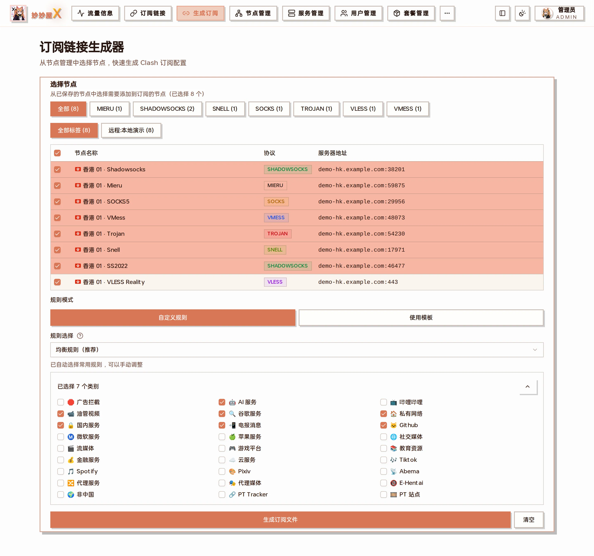
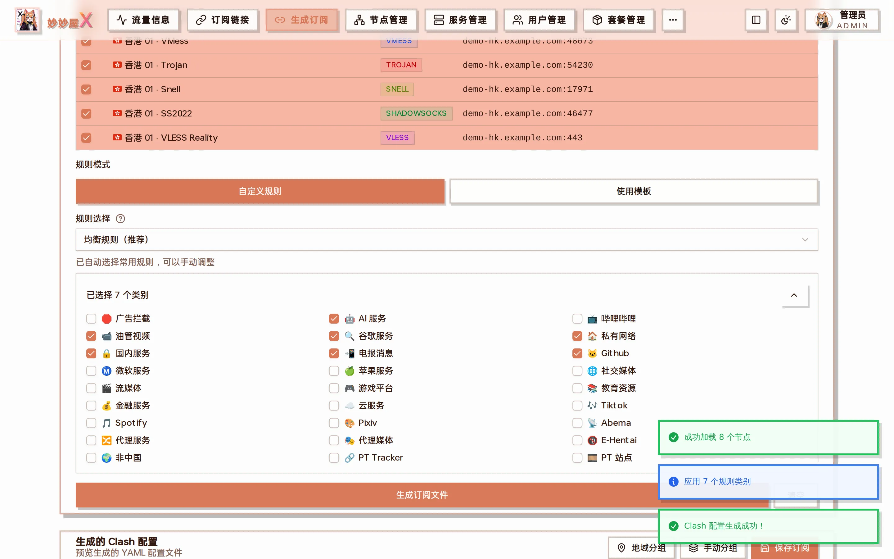
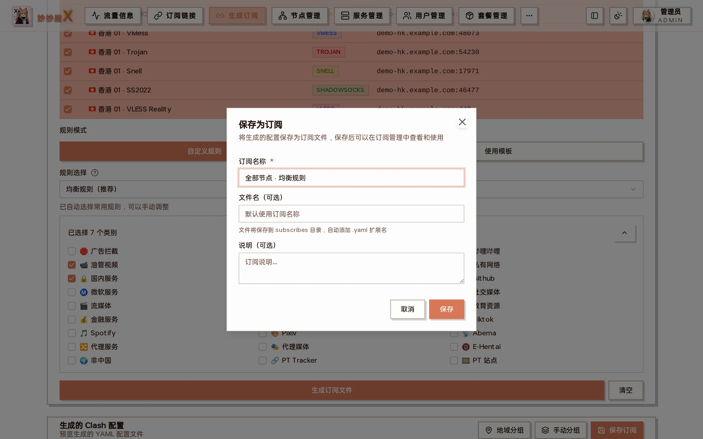

生成订阅 — 上半部分勾选节点，下半部分选择规则模式与规则类别，点「生成订阅文件」

## 概述

订阅系统将节点转换为各客户端支持的格式，通过唯一链接分发给用户。「生成订阅」页面是管理员手工生成一份订阅文件的入口：先从节点管理中挑选节点，再选择分流规则，生成后可以预览完整 YAML，并保存到「订阅管理」供用户订阅。

## 使用步骤

1. **选择节点**：按协议 / 标签筛选后勾选需要加入订阅的节点（表格支持全选）
2. **规则模式**：「自定义规则」按类别勾选；「使用模板」直接套用一份 V3 模板
3. **规则选择**：默认「均衡规则（推荐）」已勾选常用类别（AI 服务、油管、谷歌、私有网络、国内服务、电报、GitHub 等），可手动增删
4. 点「生成订阅文件」，页面下方展开生成的 Clash YAML，并可切换「地域分组 / 手动分组」
5. 点「保存订阅」，填订阅名称 / 文件名 / 说明后保存，文件写入 subscribes 目录



生成结果：完整的 Clash 配置预览，底部「保存订阅」



保存为订阅：订阅名称、文件名（自动加 .yaml）、说明

保存后到 [订阅管理](/docs/subscribe-files) 查看，或在「订阅链接」页面取订阅地址。

### 示例：给全部节点生成一份「均衡规则」订阅

1. 标签筛选点「远程:本地演示」，表头复选框全选 8 个节点
2. 规则模式保持「自定义规则」，规则选择保持「均衡规则（推荐）」
3. 「生成订阅文件」→ 提示「成功加载 8 个节点」「应用 7 个规则类别」
4. 「保存订阅」→ 名称填「全部节点 · 均衡规则」→ 保存
5. 打开「订阅管理」，新文件出现在订阅列表，点自定义链接旁的短码即可复制订阅地址

## 支持的客户端格式

| 格式            | 客户端              | 平台              |
| --------------- | ------------------- | ----------------- |
| Clash/ClashMeta | mihomo, Clash Verge | 全平台            |
| Surge           | Surge               | macOS / iOS       |
| Loon            | Loon                | iOS               |
| Quantumult X    | Quantumult X        | iOS               |
| Shadowrocket    | Shadowrocket        | iOS               |
| SingBox         | sing-box            | 全平台            |
| Stash           | Stash               | macOS / iOS       |
| Surfboard       | Surfboard           | Android           |
| V2Ray           | V2RayN, V2RayNG     | Windows / Android |
| Egern           | Egern               | iOS               |

## 订阅链接

```
https://your-domain.com/api/clash/subscribe?token=<用户Token>&format=<格式>
```

`token` — 用户的订阅令牌（在用户管理中生成）

`format` — 输出格式（clash, surge, loon, qx, shadowrocket, singbox, stash, surfboard, v2ray, egern）

用户在「用户管理」列表点「复制订阅」得到的就是带自己 token 的链接；开启短链接后会是 `/x/<短码>` 形式。

## 转换流程

1. 用户通过订阅链接请求订阅
2. 系统验证 Token 并获取用户可用节点
3. 根据 format 参数选择对应的格式转换器
4. 应用订阅模板（如有配置）
5. 输出最终订阅内容
