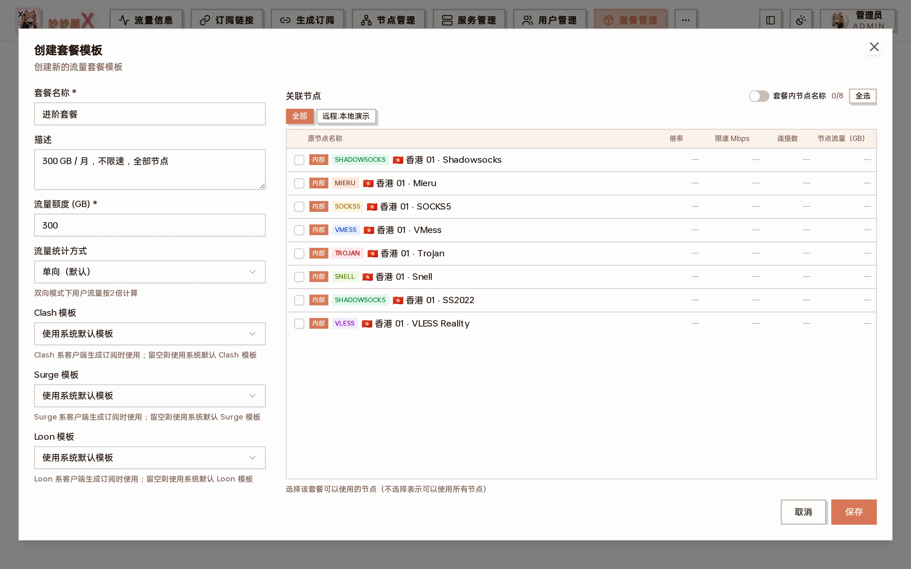
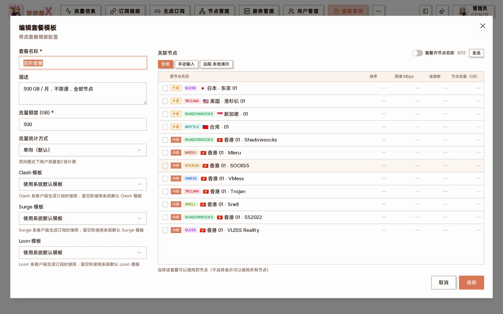

import { DocDemo } from "@/components/docs/islands/packages";

套餐管理 — 每个套餐模板一张卡片：流量额度、周期、限速、关联节点数，以及编辑 / 删除 / 发布拼车

## 在线演示:套餐管理

4 个 mock 套餐,可以创建、编辑、删除;每个套餐选关联节点 / 流量额度 / 计费周期 / 单/双向计量。

<DocDemo lang="zh" client:load />

## 概述

套餐定义用户可使用的流量配额、有效期和可访问的节点范围。一个用户可以绑定多个套餐实例；每个实例使用独立凭据、周期基线、额度和到期时间。

## 套餐属性

| 属性         | 说明                                                       |
| ------------ | ---------------------------------------------------------- |
| 名称 / 描述  | 套餐显示名称与说明                                         |
| 流量额度     | 每周期可用流量（GB），0 表示不限                           |
| 流量统计方式 | 单向（×1，默认）或双向（×2）                               |
| Clash / Surge / Loon 模板 | 各客户端生成订阅时使用的模板，留空用系统默认      |
| 计量周期     | 天数，默认 30；可开启按月重置并指定重置日期                |
| 限速 (Mbps)  | 每用户最大下载速度，0 表示不限（PRO，内联 Xray 生效）       |
| 连接数限制   | 每用户最大并发连接数，0 表示不限（PRO）                    |
| 转发配额     | 开启后套餐用户可自助创建转发，并可勾选可用的入口链         |
| 关联节点     | 套餐可用的节点范围，不选表示全部节点；可开启「套餐内节点名称」为节点单独命名 |

## 创建套餐

1. 进入「套餐管理」页面
2. 点击「创建套餐模板」
3. 填写套餐名称、描述、流量额度，按需选择统计方式与模板
4. 设置计量周期 / 重置日期、限速与连接数
5. 在右侧勾选可访问的节点（不勾 = 全部节点）
6. 点「保存」

创建套餐模板：左侧基础参数，右侧关联节点

向下滚动：计量周期、按月重置、限速与连接数限制（PRO）

如果右侧一个节点都没勾，保存时会弹出确认：留空表示「包含全部节点」，绑定该套餐的用户将可以使用所有节点。

未选择任何节点时的二次确认

### 示例：三档常见套餐

| 套餐     | 流量   | 周期     | 限速     | 关联节点         | 适合谁           |
| -------- | ------ | -------- | -------- | ---------------- | ---------------- |
| 体验套餐 | 20 GB  | 7 天     | 50 Mbps  | 只勾 1–2 个节点  | 试用             |
| 基础套餐 | 100 GB | 30 天    | 100 Mbps | 常规节点         | 轻度使用         |
| 进阶套餐 | 300 GB | 30 天    | 不限     | 全部节点（不勾） | 重度 / 家庭共享 |

创建后到「用户管理」为用户绑定即可，见 [用户管理 → 绑定与管理套餐](/docs/users#绑定与管理套餐)。

## 编辑套餐

卡片上的「编辑」打开与创建相同的表单；节点多了以后，右侧关联节点区域可用「全选」或按标签快速勾选：

编辑套餐模板：右侧按「全部 / 手动输入 / 远程:服务器名」标签筛选节点

修改流量额度立即生效；修改倍率 / 统计方式只影响之后的增量。

## 发布拼车

卡片上的「发布拼车 / 下架拼车」可以把套餐挂到拼车市场，让其他用户通过邀请码加入，详见 [拼车常见问题](/docs/faq-carpool)。

## 限速与设备数

套餐可设置限速(Mbps)与连接数上限;也可在用户管理里对单个用户单独设置(用户级覆盖套餐级)。

### 限速

以 Mbps 为单位设置上限,0 表示不限。设置后由 Agent 侧的限速层对该用户连接生效;界面会给出单位换算提示（8 Mbps ≈ 1 MB/s，100 Mbps ≈ 12.5 MB/s）。

### 连接数

限制每用户最大并发连接数。注意这是「连接数」而不是「设备数」——一台设备正常上网就会同时开几十条连接，建议值与推荐配置见 [节点限速](/docs/node-ratelimit)。

### 自动限速 / 解除

可开启超额自动限速:用户流量超额时自动降速(而非直接断订阅),次月流量重置或额度恢复后自动解除限速。

## 流量统计与计费倍率

系统通过 Xray 流量采集器实时统计每个用户的流量。当用户计费流量超出套餐配额时,订阅将自动停止返回节点(或按上面的自动限速降速)。

- 底层按 Xray user/email 保存原始上行和下行，再在采集时写入计费权重
- 套餐可选单向(`oneway`, `×1`)或双向(`twoway`, `×2`)
- 计费流量 = (原始上行 + 原始下行) × 套餐方向倍率 × 套餐内节点倍率
- 倍率修改只影响后续增量；每个套餐实例按自己的重置设置推进基线，也可由管理员手动重置

管理员首页展示服务器计费口径；普通用户首页和用户管理列表展示用户 Xray 计费流量。多套餐时，用户管理列表的用量会聚合用户全部凭据，但列表限额仍来自主套餐；请打开“管理套餐”逐实例核对。

各页面的统计范围与对账方式见[流量统计口径](/docs/traffic-accounting)。
