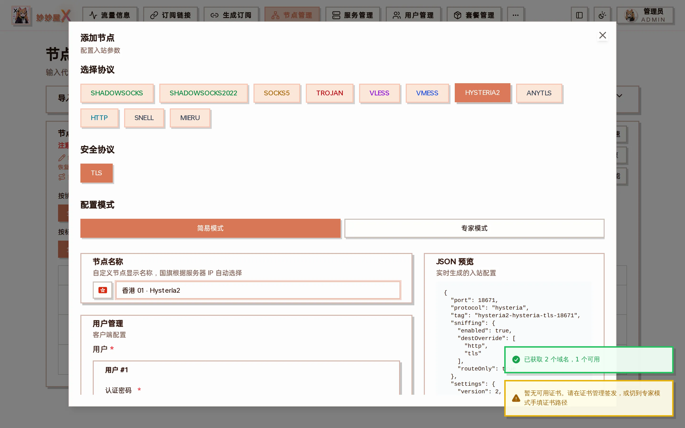

## 概述

Hysteria2 基于 QUIC（UDP），专为高延迟、高丢包网络优化。需要 TLS 证书。

## 前置要求

- 需要 TLS 证书（可通过证书管理自动申请）
- 需要开放 UDP 端口
- 客户端需支持 Hysteria2（mihomo/Clash.Meta 支持）

## Xray 配置说明

在 Xray-core 中，Hysteria2 使用 protocol: "hysteria" 配合 version: 2。认证使用 auth 字段（非 password）。

## 在向导中创建

「节点管理 → 添加节点」选择 HYSTERIA2，安全协议固定为 TLS，因此服务器必须先有覆盖其域名的证书（第一步会弹出「SSL 配置」提示）。简易模式自动生成端口与认证密码：



Hysteria2：认证密码自动生成，JSON 预览里 protocol 为 hysteria、version 为 2

## 配置示例

```
{
  "protocol": "hysteria",
  "settings": {
    "version": 2,
    "clients": [{ "auth": "your-password" }]
  },
  "streamSettings": {
    "network": "hysteria",
    "security": "tls",
    "tlsSettings": {
      "serverName": "example.com",
      "alpn": ["h3"],
      "certificates": [{
        "certificateFile": "/path/to/cert.pem",
        "keyFile": "/path/to/key.pem"
      }]
    }
  }
}
```
