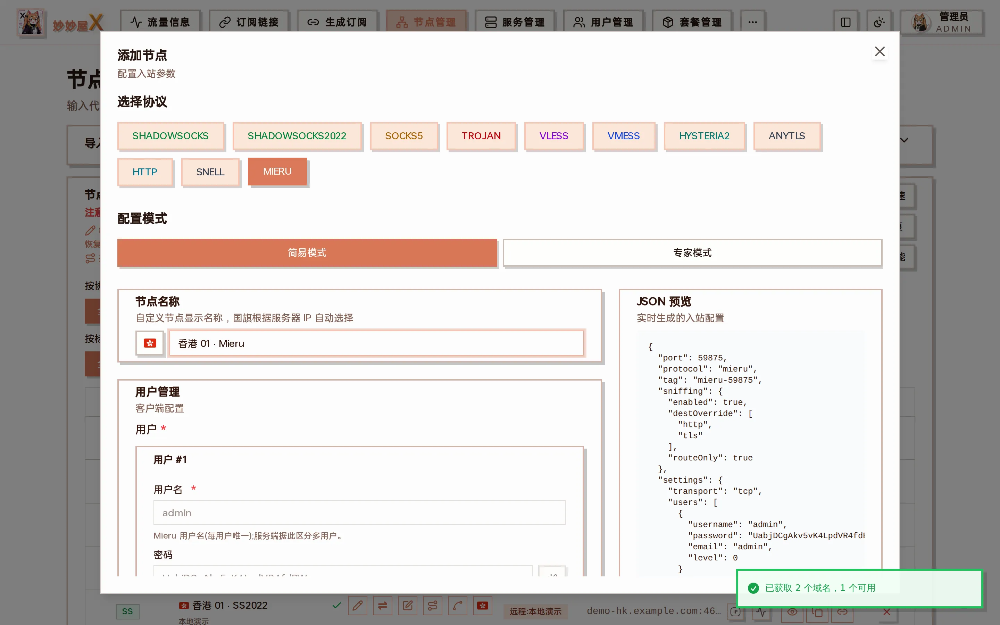

## 概述

Mieru 是一款不依赖 TLS 的加密代理协议：用户名 + 密码派生密钥，XChaCha20-Poly1305 加密，数据包带随机填充，没有可识别的握手特征。妙妙屋X 在嵌入式 xray 内核（fork）中实现了 Mieru 服务端，支持 TCP 与 UDP 两种传输、多用户，per-user 流量统计 / 限速 / 设备数限制走 xray dispatcher 现有通路，与 VLESS / Trojan 共享同一套多用户能力，并已与官方 mieru 客户端、mihomo 双向互通验证。

| 项目 | 说明 |
| --- | --- |
| 鉴权 | 每个用户一组用户名 + 密码，服务端按用户名区分用户 |
| 传输 | TCP / UDP，服务端在同一端口**同时监听两者** |
| 安全层 | 无（协议自身加密，不需要证书，不支持 TLS / REALITY） |
| 内核要求 | 只有 [嵌入式 xray](/docs/embedded-xray) 的服务器支持，外置（官方）xray 没有这个协议 |

## 添加节点（向导）

在「节点管理 → 添加节点」选择 MIERU，传输与安全层都只有一项，无需选择。



### 简易模式

只需确认服务器与端口，用户名和密码自动生成，直接提交即可。

### 专家模式

可额外设置：

- **传输层**：TCP（默认，推荐）或 UDP。服务端两种都监听，这一项只决定**订阅下发给客户端用哪一种**。TCP 更快更稳；UDP 抗封锁更强，但吞吐低于 TCP。
- **用户**：每个用户一组用户名 + 密码。从面板用户添加时，用户名取该用户的登录名，密码随机生成；用户名在同一个入站内必须唯一。

绑定套餐时，套餐内每个用户会获得这个入站上自己的一组用户名 + 密码，订阅里下发的是各自的凭据，流量与限速按用户分别统计。

## 客户端兼容性

| 客户端 | 支持情况 |
| --- | --- |
| mihomo / Clash.Meta 系（Clash Verge Rev、FlClash、Mihomo Party 等） | 支持 TCP / UDP |
| MeowX Android / Windows | 支持 TCP / UDP（mihomo 内核） |
| MeowX Mac / iOS | **只支持 TCP**，传输层选 UDP 的节点在这两端用不了 |
| Stash | 支持 |
| 官方 mieru 客户端 | 支持，可用 `mieru://` 链接导入 |
| sing-box、Shadowrocket、Surge、Loon、Quantumult X | 不支持，订阅转换时自动跳过 Mieru 节点 |

:::tip
用户里有 Mac / iOS 客户端时，传输层保持 TCP。
:::

## 注意事项

- **防火墙要同时放行 TCP 和 UDP**：服务端在同一端口监听两种传输，即使传输层选 TCP，也建议两个都放行，方便以后切换。
- **服务器时间必须准确**：密钥的派生带时间因子（2 分钟一档，服务端容忍前后各一档），服务器或客户端时钟偏差超过几分钟就会连不上。服务器请开启 NTP 时间同步。
- 订阅导入支持 `mieru://` 和 `mierus://` 两种链接写法。
- 服务器从内嵌 xray 切换到外置 xray 前，必须先删掉上面的 Mieru 入站，否则面板会拒绝切换（外置 xray 加载不了这个协议）。
- 鉴权字段为 `settings.users[]`（不是 `clients[]`），身份主键是 `username`。

## 配置示例

```json
{
  "tag": "mieru-in",
  "listen": "0.0.0.0",
  "port": 2999,
  "protocol": "mieru",
  "settings": {
    "transport": "tcp",
    "users": [
      {
        "username": "alice",
        "password": "your-password",
        "email": "alice@example.com"
      }
    ]
  }
}
```

订阅中生成的 mihomo 节点：

```yaml
- name: 东京 Mieru
  type: mieru
  server: 203.0.113.10
  port: 2999
  transport: TCP
  username: alice
  password: your-password
```
