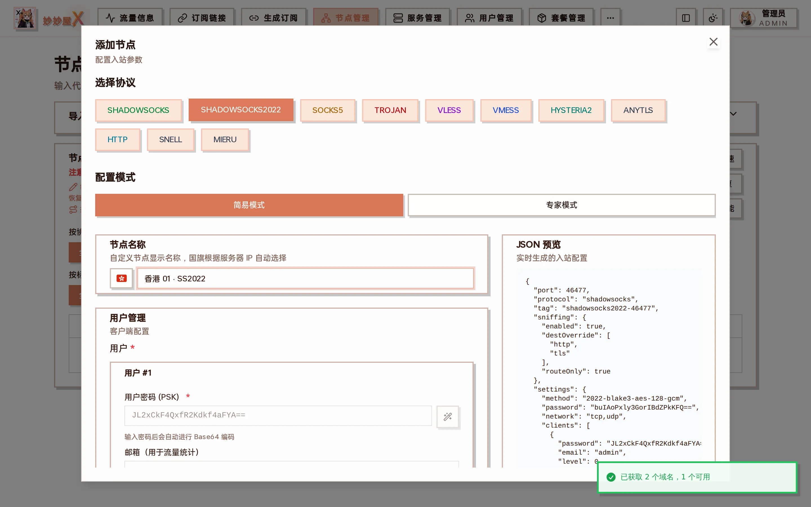
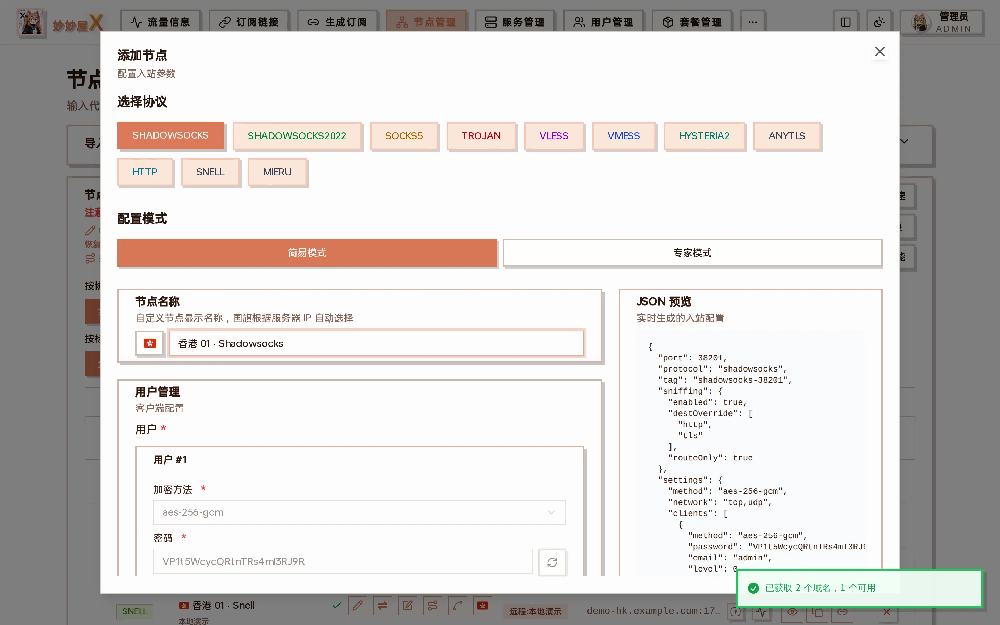

## 概述

Shadowsocks 是经典的代理协议，支持 AEAD 和 SS2022 两种加密方式。配置简单，兼容性好。

## 加密方式

| 类型   | 加密算法                | 说明               |
| ------ | ----------------------- | ------------------ |
| AEAD   | aes-256-gcm             | 经典 AEAD 加密     |
| AEAD   | chacha20-ietf-poly1305  | 适合 ARM 设备      |
| SS2022 | 2022-blake3-aes-256-gcm | 新一代协议，更安全 |

## SS2022 密码格式

SS2022 使用服务器密码 + 客户端密码的组合格式。在 mihomo/Clash 中，密码格式为 serverPassword:clientPassword。

## 在向导中创建

向导里 Shadowsocks 分成两个协议按钮：「SHADOWSOCKS」（AEAD，如 aes-256-gcm）和「SHADOWSOCKS2022」（2022-blake3-aes-128-gcm，服务端密码 + 每用户 PSK）。两者都不需要证书，简易模式自动生成端口与密码：



Shadowsocks 2022：用户密码（PSK）输入后会自动 Base64 编码，JSON 预览里 method 为 2022-blake3-aes-128-gcm、network 为 tcp,udp



经典 Shadowsocks（AEAD）

## 配置示例

### SS2022

```
{
  "protocol": "shadowsocks",
  "settings": {
    "method": "2022-blake3-aes-256-gcm",
    "password": "server-base64-key",
    "network": "tcp,udp",
    "clients": [{ "password": "client-base64-key" }]
  }
}
```
