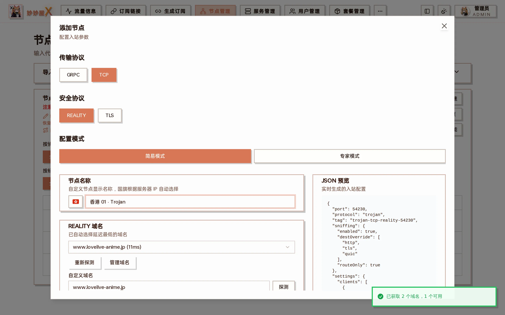

## 概述

Trojan 协议模拟 HTTPS 流量，使用密码认证。在 Xray-core 中支持 TLS 和 REALITY 安全层。

## 支持的组合

| 传输 | 安全层  | 说明           |
| ---- | ------- | -------------- |
| TCP  | TLS     | 经典 Trojan    |
| TCP  | REALITY | 无需域名和证书 |
| gRPC | REALITY | gRPC 传输      |

## 注意事项

- Xray-core 已移除 Trojan 的 flow（XTLS-Vision）支持
- mihomo 中 Trojan 使用 sni 字段，而非 servername

## 在向导中创建

「节点管理 → 添加节点」选择 TROJAN 后，传输可选 GRPC / TCP，安全协议可选 REALITY / TLS。REALITY 组合不需要证书，向导会像 VLESS 一样探测 REALITY 域名并自动生成密钥对；TLS 组合需要服务器已配置证书：



Trojan + TCP + REALITY：密码自动生成，REALITY 域名自动探测

## 配置示例

### Trojan + TCP + REALITY

```
{
  "protocol": "trojan",
  "settings": {
    "clients": [{ "password": "your-password" }]
  },
  "streamSettings": {
    "network": "tcp",
    "security": "reality",
    "realitySettings": {
      "dest": "dl.google.com:443",
      "serverNames": ["dl.google.com"],
      "privateKey": "...",
      "shortIds": [""]
    }
  }
}
```
