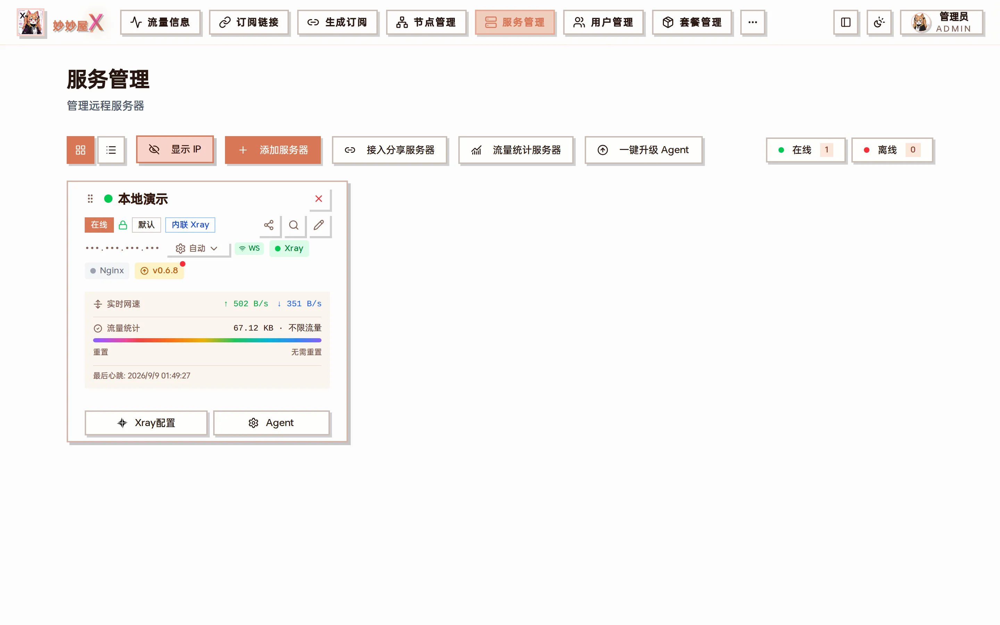

服务管理 — 服务器以卡片形式展示，含状态 / 连接方式 / Xray 与 Nginx 状态 / 实时网速 / 流量 / 一键操作

## 概述

妙妙屋X 采用 Master-Agent 架构。主控端通过网络与远程服务器上的 Agent 通信，实现 Xray/Nginx 的远程安装、配置和管理。「服务管理」页面就是所有 Agent 服务器的总览，页面顶部一行按钮分别是：卡片 / 列表视图切换、隐藏 IP、添加服务器、接入分享服务器、流量统计服务器、一键升级 Agent，右侧显示在线 / 离线台数。

## 读懂服务器卡片

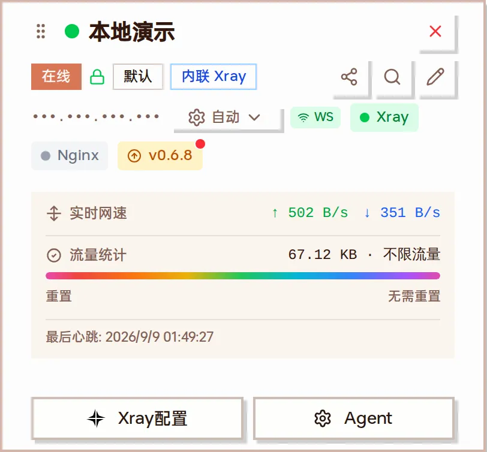

一台在线的内联 Xray 服务器卡片（已开启「隐藏 IP」）

| 区域                 | 含义                                                                                                                                   |
| -------------------- | -------------------------------------------------------------------------------------------------------------------------------------- |
| 标题行               | 左侧圆点绿 = 在线、红 = 离线；拖动手柄可调整卡片顺序；右上角 × 删除服务器                                                             |
| 状态徽标             | 「在线」、锁图标（主控与 Agent 已加密通信）、偷自己模式（默认 / Tunnel / 回落）、Xray 模式（内联 Xray / 外置 Xray）                    |
| 三个图标按钮         | 分享服务器（PRO）、扫描远程服务（重新扫描 Xray / Nginx 状态并同步入站）、编辑服务器                                                     |
| 地址行               | 公网 IPv4 / IPv6（点数字切换），「自动」下拉可切换连接模式，WS 徽标表示当前走 WebSocket，Xray / Nginx 徽标显示运行状态（点 Nginx 可启动 / 重启） |
| 版本徽标             | Agent 版本，带红点表示有新版本，点击可升级该台 Agent                                                                                   |
| 实时网速 / 流量统计  | 系统网卡的实时上下行；当前计费周期已用 / 限额，进度条按用量着色；「重置」可手动重置计费周期                                            |
| 最后心跳             | Agent 最近一次上报时间，用于判断离线                                                                                                   |
| Xray配置 / Agent     | 打开 Xray 管理对话框（配置 / 入站 / 出站 / 路由 / 服务控制）；Agent 菜单见下文                                                          |

## 添加服务器

1. 进入「服务管理」页面，点击「添加服务器」
2. 填写服务器名称（用于标识）和服务器地址（域名或 IP；填域名后节点会用域名作为服务器地址）
3. 按需调整 Agent 端口、流量限制、重置日期、IPv6、Xray 模式、流量统计规则、流量数据源
4. 需要 REALITY 偷自己时打开「我要偷自己」并填域名与网站类型
5. 点「生成 Token」，系统自动生成 Server Token，并给出一键安装命令与 Docker 环境变量
6. 使用该命令在远程服务器上部署 Agent

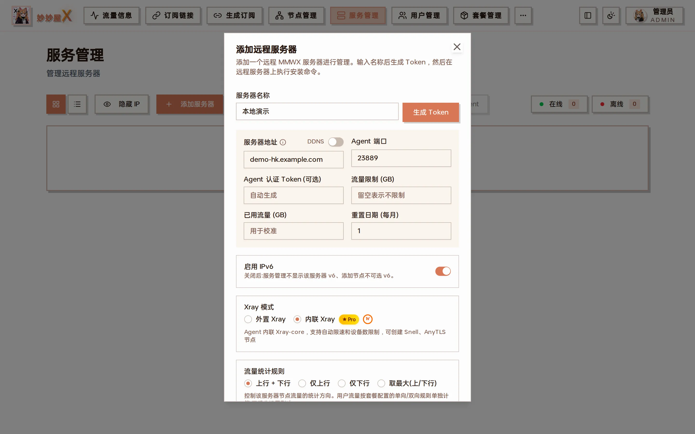

添加远程服务器对话框

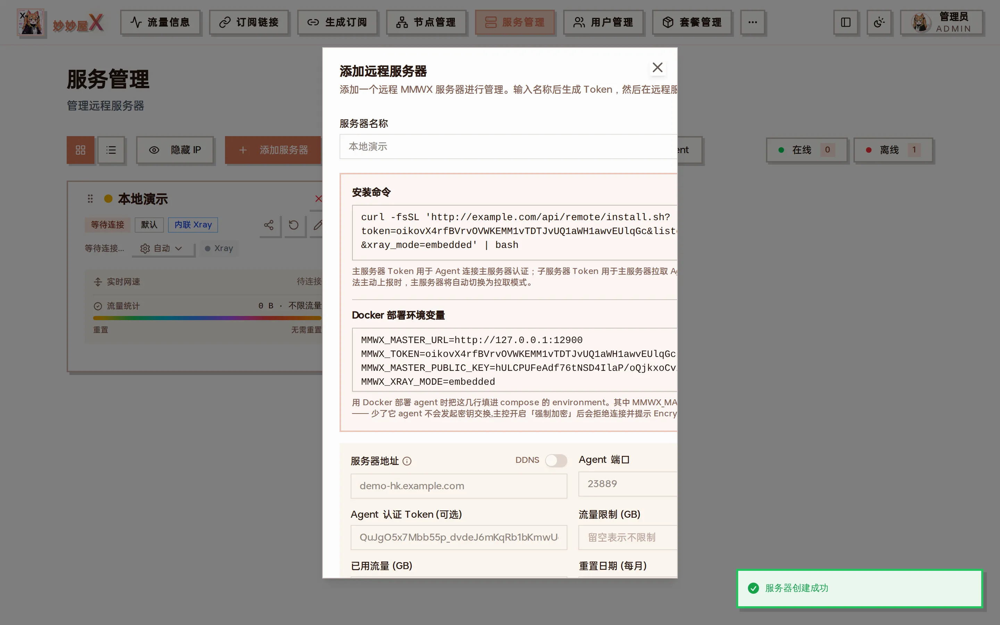

生成 Token 后：一键安装命令（含 token / listen_port / xray_mode 参数）与 Docker 环境变量

### 字段说明

| 字段               | 说明                                                                                                                         |
| ------------------ | ---------------------------------------------------------------------------------------------------------------------------- |
| 服务器地址 / DDNS  | 域名或 IP。填了域名，节点的服务器地址就用域名；开启 DDNS 后由主控定时把该域名解析更新为 Agent 上报的 IP                         |
| Agent 端口         | Agent 本地管理 API 端口，默认 23889；WebSocket 连接期间会自动关闭该监听（隐藏端口）                                           |
| Agent 认证 Token   | 主控调用 Agent API 的凭证，留空自动生成                                                                                      |
| 流量限制 / 已用流量 / 重置日期 | 服务器月流量配额、用于校准的已用流量、每月重置日；限额留空表示不限                                                |
| 启用 IPv6          | 关闭后服务管理不显示该服务器的 v6 地址，添加节点时也不可选 v6                                                                |
| Xray 模式          | 外置 Xray：独立安装的 Xray 进程，Agent 通过 gRPC 控制；内联 Xray（PRO）：Agent 内嵌 xray-core，支持限速、设备数、Snell、AnyTLS |
| 流量统计规则       | 上行 + 下行 / 仅上行 / 仅下行 / 取最大（上/下行）。只影响该服务器的节点流量方向，用户流量按套餐规则单独计算                     |
| 服务器流量数据源   | Xray 协议流量（默认）或系统网卡流量，见下文「服务器流量统计维度」                                                             |
| 我要偷自己         | 开启后 Agent 安装完成会自动安装 Xray + Nginx，并按 Tunnel / 回落模式接管 443；需要填域名与网站类型                              |

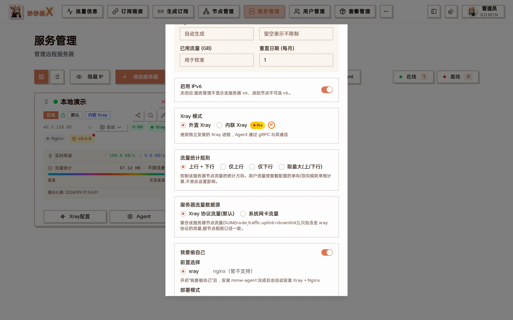

开启「我要偷自己」后展开的字段：前置选择、部署模式、443 端口、域名、网站类型

**两种部署方式:** 一键脚本(裸机 + systemd) 或 Docker 镜像 (内置 embedded xray + nginx,必须 host 网络)。详细命令和注意事项见 [安装 Agent 文档](/docs/install-agent)。

## 编辑服务器

点卡片上的铅笔图标可以修改服务器。除了添加时的字段外，编辑对话框还多出几项：

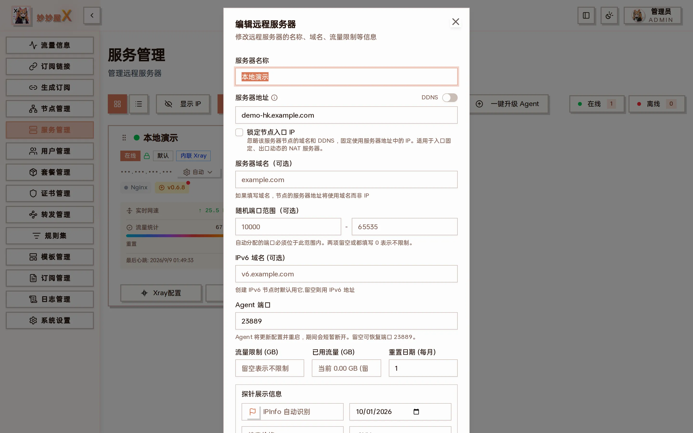

编辑远程服务器：锁定节点入口 IP、服务器域名、随机端口范围、IPv6 域名、探针展示信息

| 字段               | 说明                                                                                               |
| ------------------ | -------------------------------------------------------------------------------------------------- |
| 锁定节点入口 IP    | 忽略域名和 DDNS，固定用服务器地址里的 IP 作为节点入口。适合入口固定、出口动态的 NAT 服务器         |
| 服务器域名（可选） | 填写后节点的服务器地址使用域名而非 IP                                                              |
| 随机端口范围       | 自动分配的入站端口必须落在此范围内；两项留空或都填 0 表示不限                                       |
| IPv6 域名          | 创建 IPv6 节点时默认使用它，留空则用 IPv6 地址                                                     |
| Agent 端口         | 修改后 Agent 会更新配置并重启，期间短暂断开；留空恢复 23889                                        |
| 探针展示信息       | 供公开探针页展示：地区（IPInfo 自动识别）、续费价格与周期、服务商名称与链接、到期时间等              |

## 连接模式

点卡片上的「自动」下拉可以切换连接模式：

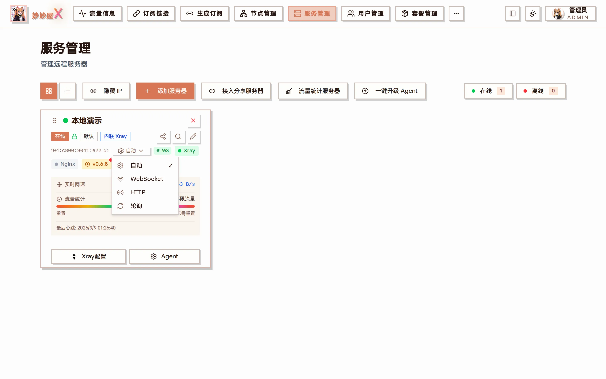

连接模式：自动 / WebSocket / HTTP / 轮询

### WebSocket（推荐）

Agent 主动连接主控端，保持长连接。实时双向通信，支持扫描结果推送；连接期间 Agent 的本地监听端口会关闭（隐藏端口）。

### HTTP

主控端直接调用 Agent HTTP API。需要 Agent 端口（默认 23889）对主控端可达。

### 轮询（Pull）

Agent 定期从主控端拉取指令。适合 NAT 或防火墙受限环境。

### 自动

自动尝试 WebSocket → HTTP → 轮询回退链，选择最优连接方式。

## Agent 菜单

卡片底部的「Agent」按钮汇集了对 Agent 的运维操作：

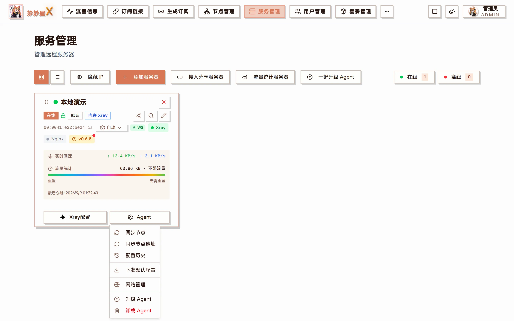

Agent 菜单：同步节点、同步节点地址、配置历史、下发默认配置、网站管理、升级 Agent、卸载 Agent

| 菜单项       | 作用                                                                                                       |
| ------------ | ---------------------------------------------------------------------------------------------------------- |
| 同步节点     | 重新扫描该服务器的 Xray 入站并同步到节点表（新增的入站会自动生成节点）                                       |
| 同步节点地址 | 把该服务器所有节点的服务器地址统一改成当前的域名 / IP，换域名后一键刷新                                     |
| 配置历史     | 查看主控保存的所有 Xray 配置快照，可预览任意版本，也可一键下发回 Agent（下发前自动跑 xray test 验证）        |
| 下发默认配置 | 用主控生成的默认 Xray 配置覆盖 Agent 上的配置，用于修复被改坏的配置                                          |
| 网站管理     | 管理该服务器上由妙妙屋X部署的 Nginx 站点，见 [Nginx 网站管理](/docs/website-management)                       |
| 升级 Agent   | 升级这一台 Agent 到最新版本                                                                                |
| 卸载 Agent   | 从服务器上卸载 Agent                                                                                       |

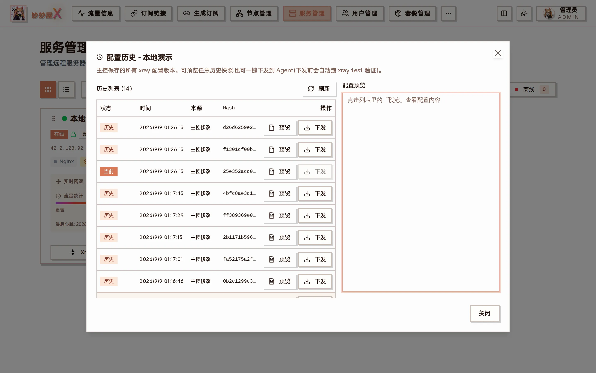

配置历史：每次主控修改或 Agent 上报都会留一份快照，带 Hash 与来源，可预览 / 下发

## Xray 管理

卡片底部的「Xray配置」按钮打开 Xray 管理对话框，四个选项卡分别对应配置文件、入站、出站和路由，顶部还有启动 / 停止 / 重启按钮与运行状态：

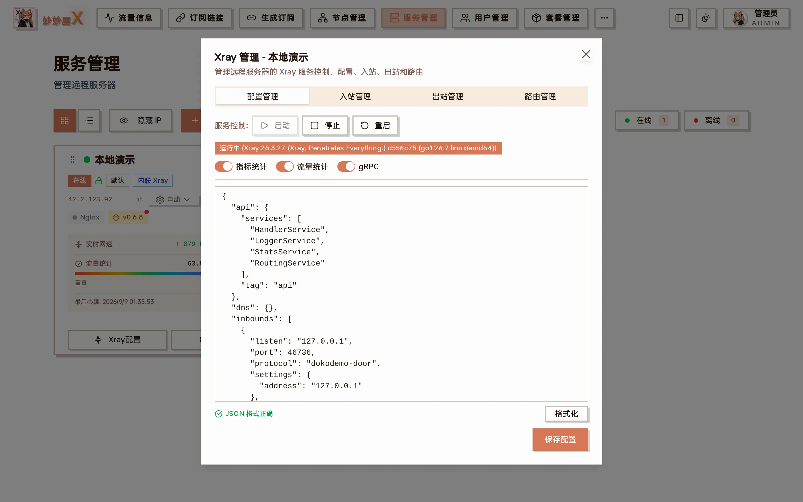

Xray 管理 → 配置管理：服务控制、指标统计 / 流量统计 / gRPC 状态、可直接编辑并保存的完整配置

四个选项卡的用法分别见 [Xray 服务管理](/docs/xray-service)、[Xray 入站管理](/docs/xray-inbounds)、[Xray 出站管理](/docs/xray-outbounds)、[Xray 路由管理](/docs/xray-routing)。

## Token 管理

每台服务器有两个 Token：

- Server Token：Agent 用于连接主控端的凭证
- Agent Token：主控端用于调用 Agent API 的凭证

可在编辑服务器对话框里重置 Token。重置后 Agent 会通过 WebSocket 自动接收新 Token。

## 服务器状态

| 状态         | 说明                     |
| ------------ | ------------------------ |
| connected    | Agent 已连接，可正常管理 |
| disconnected | Agent 断开连接           |
| pending      | 等待 Agent 首次连接      |

## 列表视图与隐藏 IP

服务器较多时可以切换到列表视图，一行一台；「隐藏 IP」会把所有卡片上的 IP 打码，方便截图或公开演示（本页截图即开启了隐藏 IP）。

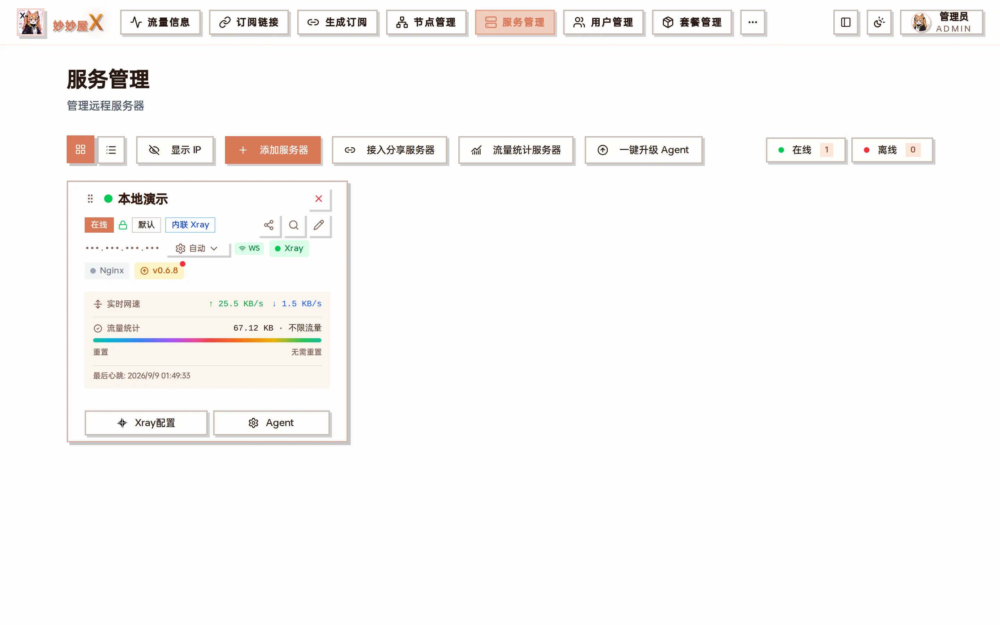

列表视图

## 流量统计服务器

顶部「流量统计服务器」用来选择哪些服务器参与管理员首页的流量汇总：

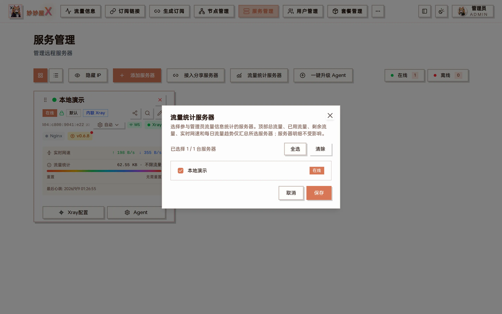

流量统计服务器：首页总流量 / 已用 / 剩余 / 实时网速 / 每日趋势只汇总勾选的服务器，服务器明细不受影响

## 服务器流量统计维度

服务管理列表里的「已用流量」与流量配额限额支持两种数据源,在创建或编辑服务器对话框的「服务器流量数据源」选项里切换。默认值为「Xray 协议流量」；需要对齐 VPS 网卡账单时可改为「系统网卡流量」:

### 系统网卡流量

由 Agent 从 /proc/net/dev 读取物理网卡 RX / TX 累计,包含 Xray 转发、SSH、系统更新、监控上报和 tunnel overhead 等主机流量。通常更接近 VPS 服务商的网卡口径，但服务商采样方式仍可能产生差异。不含 WARP / Tailscale / Docker / WireGuard 等虚拟网卡。

### Xray 协议流量

聚合该服务器 `node_traffic` 中的 Xray inbound + outbound 计数，只统计走 Xray 的数据。节点视图还会进行用户归因、routed 子节点拆分和父节点扣除，因此两个页面不保证相等。

:::note[切换数据源 = 自动迁移历史,显示数值连续]
切换 Xray → 系统时,主控会自动把切换瞬间的 Xray 总累计 + 每日历史 baseline 完整复制到 system 维度;切换瞬间显示的「已用流量」跟切换前 Xray 视角等同,之后系统模式按真实网卡累加,跟 Xray 数据自然分离。反向(系统 → Xray)无需迁移 — Xray 每日快照一直在拍,直接生效。
:::

「流量统计规则」选项(上行 / 下行 / 双向 / 上下行取最大值)对两种数据源同样适用。

卡片的实时上传/下载速率始终来自系统网卡，不随这里的数据源或统计规则切换。

节点视图、用户视图、套餐流量阈值断流逻辑永远走 Xray 维度(系统网卡无法拆分到 tag 或 user),不受此选项影响。

服务管理卡片、首页汇总、流量信息和公开探针的时间范围并不完全相同。完整公式与逐页差异见[流量统计口径](/docs/traffic-accounting)。

## 升级 Agent

主控发布新版本后，卡片上的版本徽标会带红点。点它可以单独升级这一台；顶部「一键升级 Agent」则对所有有新版本的服务器批量升级，无需逐台 SSH 重新执行安装命令。升级过程中 Agent 会重启，服务短暂中断。

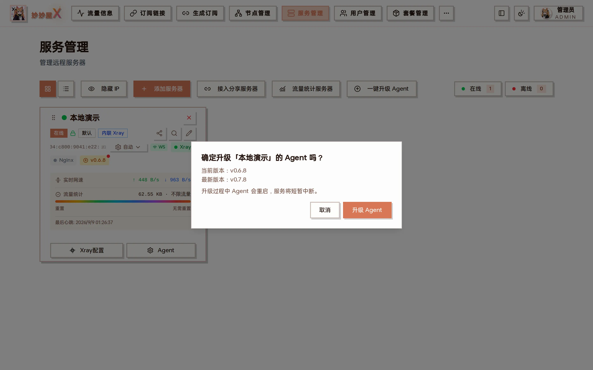

升级单台 Agent：显示当前版本与最新版本

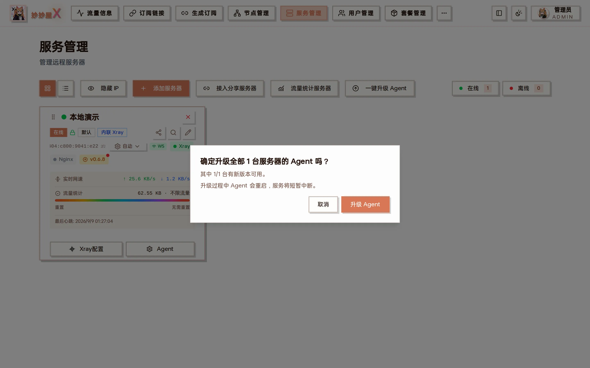

一键升级：统计有多少台可升级

## 分享服务器给其他妙妙屋X

你可以把自己的一台服务器分享给别人的妙妙屋X 主控，让对方也能在其面板里管理该服务器（创建入站、出节点等），而无需把 Agent 令牌直接交出去。

### 分享方（拥有者）

点卡片上的分享图标，在对话框里「生成分享令牌」，把「拥有方地址 + 分享令牌」交给对方。默认接收方只能管理自己创建的入站，看不到本机其他用户的入站与完整 Xray 配置。

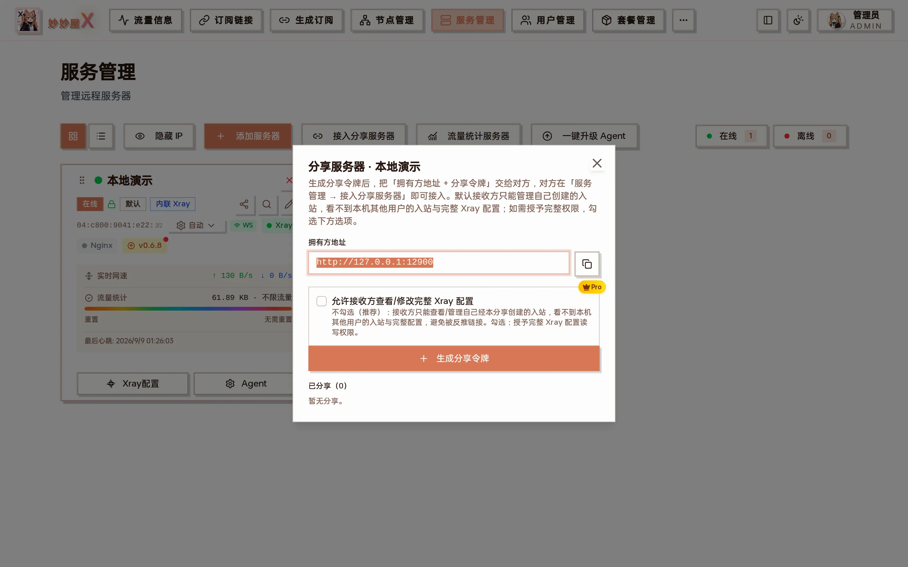

分享服务器：生成分享令牌，可选是否允许接收方查看 / 修改完整 Xray 配置

### 接收方

点顶部「接入分享服务器」，填入对方给的拥有方地址与分享令牌即可。接入后该服务器会作为一台联邦（federated）服务器出现在你的列表里，状态随拥有方上报刷新；入站 / 节点 / Tunnel 管理等均可用。

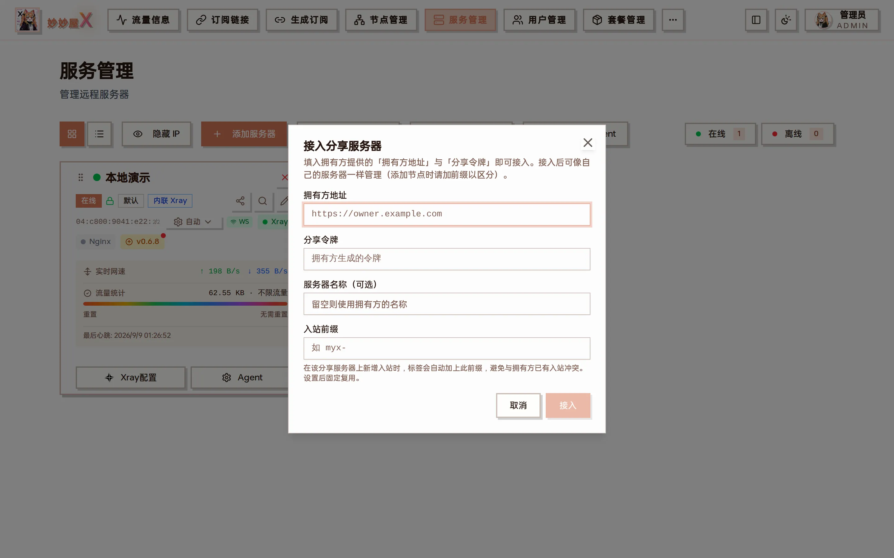

接入分享服务器：拥有方地址、分享令牌、服务器名称、入站前缀

完整说明见 [分享服务器](/docs/share-server)。主控与 Agent、以及主控之间的联邦通信均走加密通道（密钥协商 + 会话缓存），令牌轮换不影响在线管理。
