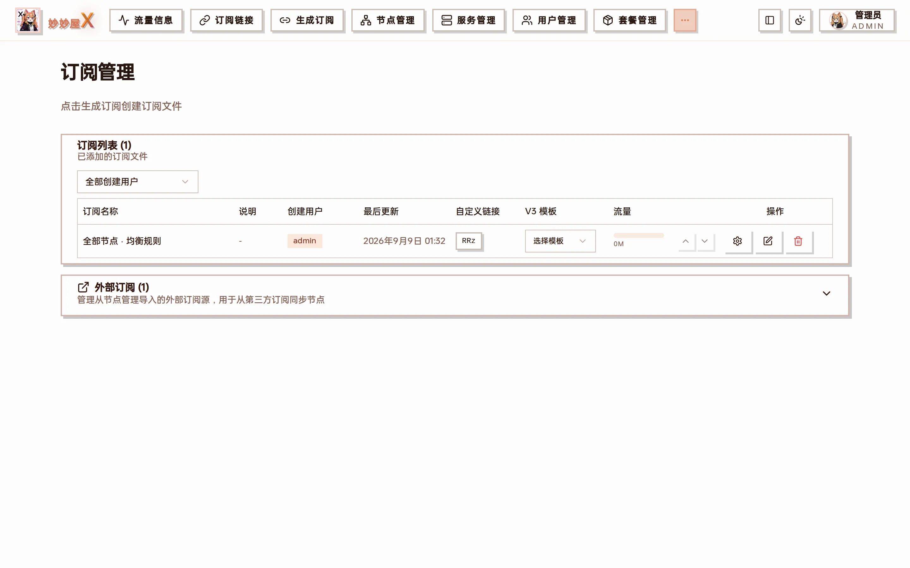

订阅管理 — 上方「订阅列表」是生成的订阅文件，下方「外部订阅」是从节点管理导入的第三方订阅源

## 概述

「订阅管理」页面管理两类东西：

- **订阅列表**：在 [生成订阅](/docs/generator) 页面保存的订阅文件（subscribes 目录下的 YAML）。每个文件可以设置自定义短链、绑定 V3 模板、查看流量。
- **外部订阅**：在 [节点管理 → 导入外部节点 → 订阅导入](/docs/nodes#导入外部节点) 导入的机场订阅源。这里可以查看、手动同步或删除，导入的节点会与本地 Xray 入站生成的节点合并，统一通过订阅系统分发。

## 订阅列表

| 列         | 说明                                                                                       |
| ---------- | ------------------------------------------------------------------------------------------ |
| 订阅名称   | 保存时填写的名称                                                                           |
| 创建用户   | 生成该文件的用户；管理员可用上方下拉筛选                                                   |
| 最后更新   | 文件最近一次生成 / 重新生成的时间                                                          |
| 自定义链接 | 该文件的短码，点击复制 `/x/<短码>` 订阅地址，也可编辑成自定义短码                          |
| V3 模板    | 为该文件绑定一份 V3 模板，绑定后下载时按模板动态生成，新增节点自动进订阅                   |
| 流量       | 该订阅对应的已用 / 限额进度，可上下箭头调整显示限额                                        |
| 操作       | 设置（节点范围 / 标签筛选等）、编辑内容、删除                                              |

## 支持的外部订阅格式

- Clash/mihomo YAML 格式
- Base64 编码的节点列表
- 单行 URI 格式（ss://, vmess://, vless://, trojan://）

## 添加外部订阅

外部订阅在「节点管理」页面导入：

1. 进入「节点管理」，展开「导入外部节点」→「订阅导入」
2. 填写订阅 URL，选择 User-Agent，可选填节点标签
3. 点「导入节点」，系统拉取并解析节点，确认后「保存节点」
4. 回到「订阅管理」，在「外部订阅」区块可以看到这条订阅源

## 自动更新

外部订阅可设置自动更新间隔。系统会定期拉取最新订阅内容，自动更新节点列表；「系统设置 → 订阅」里还可以配置节点名称过滤正则、追加订阅信息、同步流量信息、掉线自动重同步等，见 [系统设置](/docs/system-settings)。

| 更新间隔 | 适用场景           |
| -------- | ------------------ |
| 手动     | 节点稳定，不常变更 |
| 每小时   | 节点频繁变更       |
| 每天     | 一般使用           |
| 自定义   | 按需设置           |

## 流量列

管理员看到所选统计服务器（未选择时为全部服务器）的汇总；仅通过 `selected_tags` 命中的外部订阅会按自身 upload/download/both 规则加入。普通用户只看到自己创建的文件：限额来自主套餐，用量聚合该用户全部套餐凭据，且不加入外部订阅。文件限额可以覆盖显示限额。完整口径见[流量统计口径](/docs/traffic-accounting)。

## 注意事项

- 导入的节点与本地入站节点合并输出
- 可对导入节点进行启用/禁用、重命名操作
- 订阅 URL 变更后需手动触发一次更新
