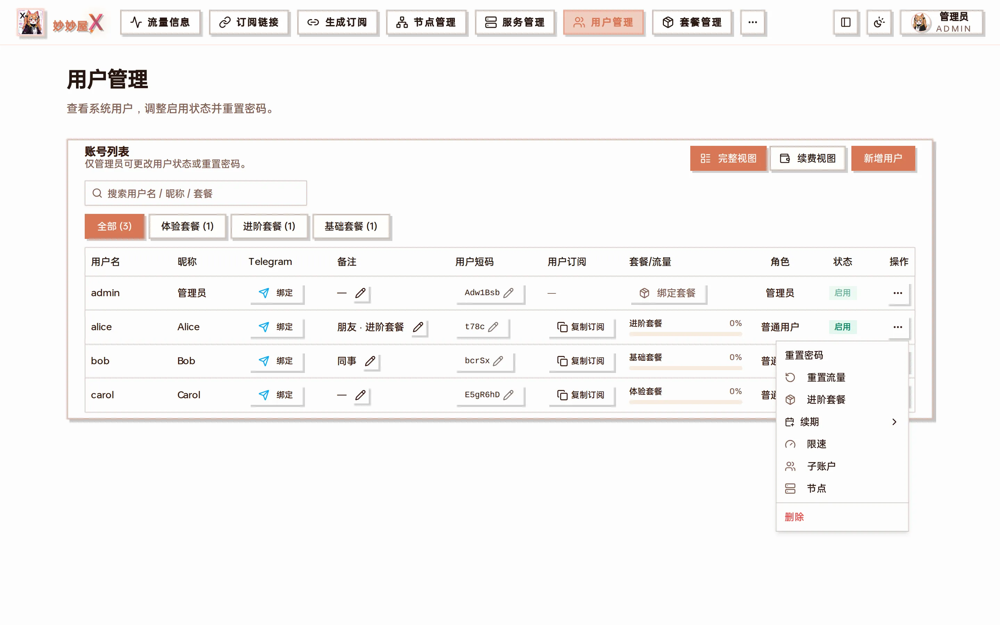
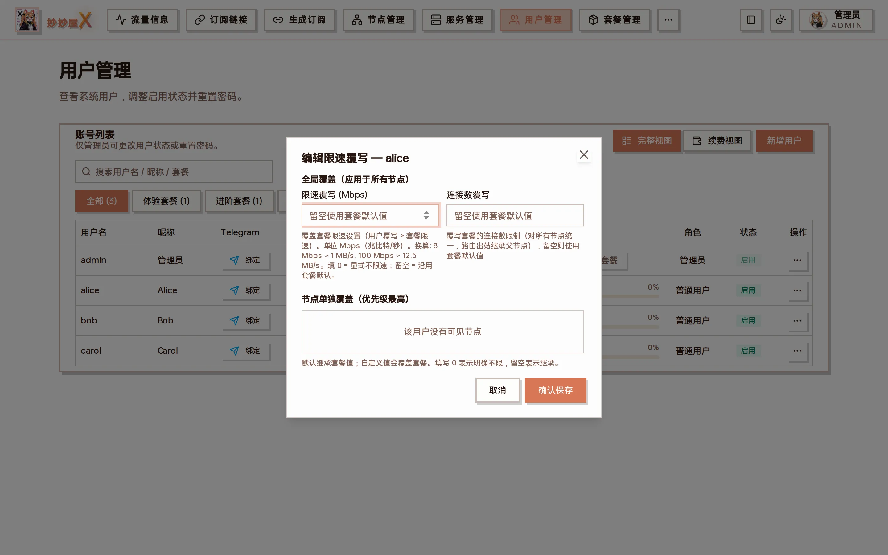
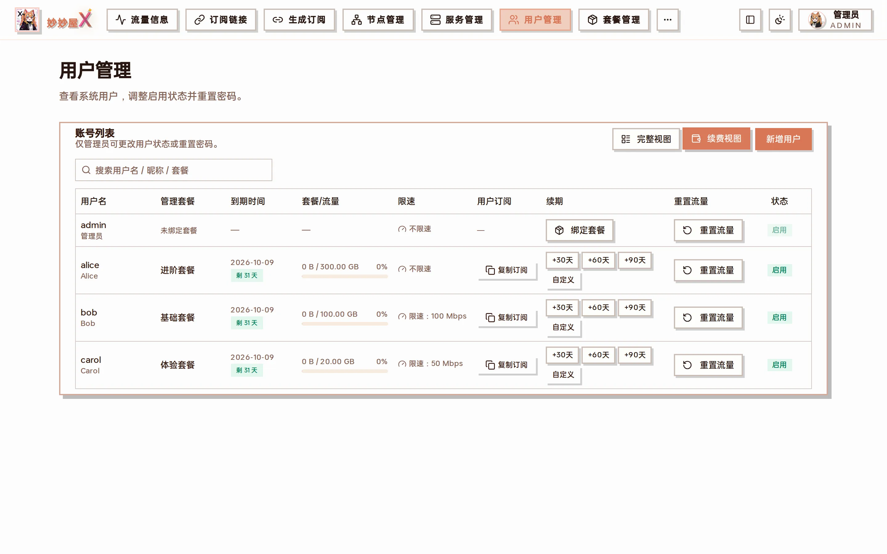

import { DocDemo } from "@/components/docs/islands/users";

用户管理 — 账号列表：用户名 / 昵称 / Telegram 绑定 / 备注 / 用户短码 / 用户订阅 / 套餐与流量进度 / 角色 / 状态 / 操作

## 在线演示:用户管理

6 个 mock 用户,可以创建、绑定套餐、调整启停、复制订阅、删除。流量进度条按当前用量动态变色。

<DocDemo lang="zh" client:load />

## 概述

用户管理模块负责管理订阅用户的账户、权限和订阅令牌。支持管理员和普通用户两种角色。列表上方可以按用户名 / 昵称 / 套餐搜索，也可以按套餐快速筛选；右上角「完整视图 / 续费视图」切换列表形态。

## 用户角色

| 角色     | 权限 | 说明                           |
| -------- | ---- | ------------------------------ |
| 管理员   | 全部 | 系统管理、服务器管理、用户管理 |
| 普通用户 | 订阅 | 查看订阅链接、个人信息         |

## 创建用户

1. 进入「用户管理」页面
2. 点击「新增用户」
3. 填写用户名，邮箱 / 昵称 / 备注按需填写
4. 初始密码默认随机生成，可在创建前改成自己的
5. 点「确认创建」，初始密码会自动复制到剪贴板
6. 系统同时生成用户短码与订阅令牌，可在列表中「复制订阅」

新增用户：用户名、邮箱、昵称、初始密码、备注

## 绑定与管理套餐

未绑定套餐的用户行显示「绑定套餐」按钮；已绑定的用户在操作菜单「…」里点套餐名即可进入「管理套餐」对话框：

管理套餐：已绑定套餐卡片（用量 / 到期 / 解绑）、选择套餐、到期时间（+30 / +60 / +90 天）、每月流量重置、流量覆写

| 项目             | 说明                                                                                                          |
| ---------------- | ------------------------------------------------------------------------------------------------------------- |
| 已绑定套餐       | 每个套餐实例一张卡片，显示已用 / 限额与到期日，可单独解绑                                                      |
| 选择套餐         | 从已创建的套餐模板中选择                                                                                      |
| 到期时间         | 快捷 +30 / +60 / +90 天或手填；到期后自动移除用户的所有入站配置并解绑套餐                                      |
| 启用每月流量重置 | 按指定日期（1–31）重置流量                                                                                    |
| 流量覆写 (GB)    | 用户覆写 > 套餐流量；填 0 = 显式不限流量，留空 = 沿用套餐默认；换套餐或解绑时清除                              |
| 新增为独立套餐   | 同一用户可绑定多个套餐；相同节点会创建独立子账户，流量、连接数和到期时间分别计算                               |

### 示例：给朋友开通一个 30 天的进阶套餐

1. 「新增用户」→ 用户名 `alice`，备注「朋友」，确认创建（初始密码已复制，发给对方）
2. 在 alice 行点「绑定套餐」→ 选「进阶套餐」→ 点「+30天」→「保存该套餐」
3. 列表的「套餐/流量」列出现进度条；点「复制订阅」把订阅链接发给对方
4. 到期前在「续费视图」或操作菜单「续期」里再点 +30 天即可

## 操作菜单

每行最右侧的「…」展开该用户的全部操作：

操作菜单：重置密码、重置流量、管理套餐（显示当前套餐名）、续期、限速、子账户、节点、删除

| 菜单项   | 说明                                                                                                 |
| -------- | ---------------------------------------------------------------------------------------------------- |
| 重置密码 | 生成随机新密码（可改），确认后生效                                                                   |
| 重置流量 | 把该用户当前周期用量清零                                                                             |
| 套餐名   | 打开「管理套餐」                                                                                     |
| 续期     | +30 / +60 / +90 天                                                                                   |
| 限速     | 用户级限速 / 连接数覆写，优先级高于套餐；还可对单个节点单独覆盖，见 [节点限速](/docs/node-ratelimit) |
| 子账户   | 查看该用户在各节点上的子账户（多套餐 / 路由出站会产生独立凭据）                                       |
| 节点     | 该用户自己导入的节点（不含套餐共享池），可一键清空                                                    |
| 删除     | 删除用户及其全部凭据                                                                                 |

限速覆写：全局覆盖（限速 Mbps + 连接数）与节点单独覆盖两层

## 续费视图

「续费视图」把列表切换成以到期时间为核心的形态，每行直接给出 +30 / +60 / +90 / 自定义续期按钮与重置流量，适合月初批量续费：

续费视图

## 订阅令牌

每个用户拥有唯一的订阅令牌（Token），用于订阅链接的身份验证。令牌可重新生成，旧令牌立即失效。列表里的「用户短码」是短链接里的用户标识，点铅笔可以自定义。

## Telegram 绑定

「Telegram」列的「绑定」按钮会生成一条 `/start` 绑定命令，用户在 Telegram 里发给机器人即可完成绑定，之后可用 Mini App 免登录查看自己的套餐与订阅，见 [Telegram 机器人](/docs/tool-mmwx-tgbot)。

## 流量与多套餐

用户列表的用量聚合该用户全部计费凭据，列表限额仍取主套餐。打开“管理套餐”可查看每个套餐实例独立的已用量和限额；相同节点也使用独立凭据、重置基线和到期时间。多套餐时以弹窗内的实例卡片为准。计费公式及“流量信息”页面的明细口径见[流量统计口径](/docs/traffic-accounting)。

## 认证方式

系统使用 JWT 进行 API 认证：

- 登录后获取 JWT Token
- 请求头 MM-Authorization 携带 Token
- Token 过期后需重新登录
