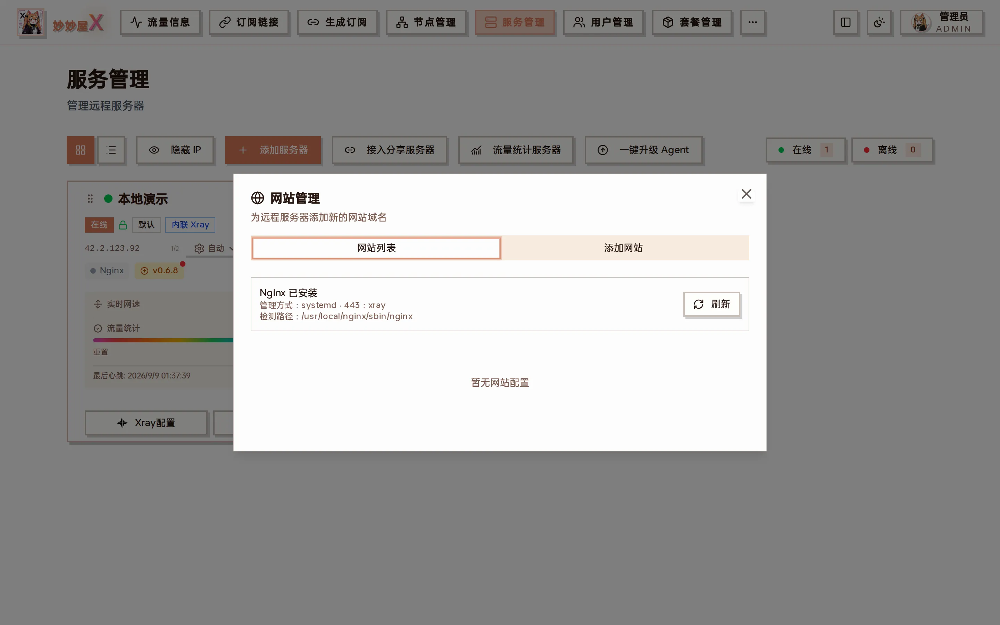

网站管理 — 显示 Nginx 安装状态、管理方式、443 端口占用方，以及该服务器上的网站列表

## 进入网站管理

打开「服务管理」，在目标服务器卡片点「Agent」→「网站管理」。系统会扫描妙妙屋X的默认 Nginx servers 目录，并标记每个站点是静态目录还是反向代理；可在同一页面新增或删除。

Agent 菜单里的「网站管理」

对话框顶部会显示：

- Nginx 是否已安装及检测到的路径（如 /usr/local/nginx/sbin/nginx）
- 管理方式（systemd / OpenRC / SysV / 直接命令 / Docker）
- 443 端口当前由谁占用（xray 表示由 REALITY / Tunnel 接管，nginx 表示直接由 Nginx 监听）

## 添加网站

点「添加网站」，填写域名并选择类型：

### 静态网站

填写域名与服务器上的绝对目录。保存前确认 Agent 对目录具有读取权限。

### 反向代理

填写域名及上游地址，例如 127.0.0.1:8080。WebSocket 和常用转发头由模板统一配置。

### 示例：在已经「偷自己」的服务器上再挂一个博客

1. 服务器已开启偷自己，443 由 xray 接管并转发到 Nginx
2. 「Agent」→「网站管理」→「添加网站」→ 域名 `blog.example.com`，类型「反向代理」，上游 `127.0.0.1:2368`
3. 保存后 Agent 写入 Nginx server 配置并重载；把 blog.example.com 解析到该服务器即可通过 https 访问
4. 证书由主控按域名匹配自动下发（需先在 [证书管理](/docs/certificates) 申请覆盖该域名的证书）

## 安装与运行环境

未安装 Nginx 时可由 Agent 安装；检测到现有 Nginx 时会复用兼容目录。服务控制按环境自动选择：

- systemd、OpenRC 或 SysV 服务管理
- 没有服务管理器时直接使用 nginx 命令启动、重载和停止
- Docker 镜像内置 Nginx，无需 systemctl

:::caution[端口与主控保护]
添加前会检查 80/443 占用。主控已经启用 HTTPS 时，同机 Agent 不允许开启「偷自己」，避免抢占 443 导致面板失联。删除站点只删除妙妙屋X管理的配置，不会删除静态目录或上游应用。
:::
