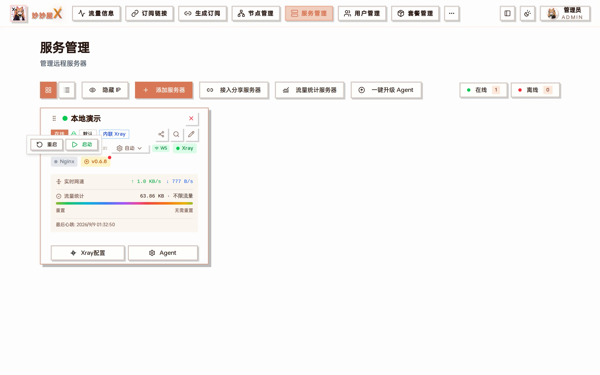

服务管理 → 服务器卡片「Xray配置」：顶部服务控制（启动 / 停止 / 重启）与运行状态，下方指标统计 / 流量统计 / gRPC 状态和可编辑的完整配置

## 入口

所有 Xray / Nginx 服务操作都集中在「服务管理」的服务器卡片上：

| 位置                       | 操作                                                                 |
| -------------------------- | -------------------------------------------------------------------- |
| 卡片「Xray配置」按钮       | 打开 Xray 管理对话框：服务控制、配置文件、入站 / 出站 / 路由管理      |
| 卡片上的 Nginx 徽标        | 点击弹出 Nginx 的启动 / 重启                                          |
| 卡片上的 Xray 徽标         | 显示 Xray 运行状态（绿色运行中 / 灰色未运行）                         |
| 卡片「扫描远程服务」图标   | 重新扫描 Xray / Nginx 状态与版本，并把入站同步到节点表                |
| 卡片「Agent」菜单          | 同步节点、配置历史、下发默认配置、网站管理、升级 / 卸载 Agent          |

点 Nginx 徽标：重启 / 启动

## Xray 安装

- 内联 Xray 模式（PRO）：Agent 自带 xray-core，安装 Agent 即完成，无需单独安装
- 外置 Xray 模式：Agent 一键安装脚本默认会通过 XTLS/Xray-install 安装独立 Xray；也可在服务器卡片上点「安装 Xray」
- 安装过程通过 SSE 流式展示实时进度
- 安装完成后自动触发证书部署（如有配置）
- 安装完成后自动扫描并同步入站到节点表

## Nginx 安装

Nginx 用于 TLS 伪装，将 443 端口的流量转发到 Xray。

- 开启「我要偷自己」的服务器在 Agent 安装完成后会自动安装 Xray + Nginx
- 如果服务器配置了域名，安装时会自动配置 Nginx 反向代理
- 支持 SSE 流式安装进度
- 安装完成后自动触发证书部署
- 站点的增删在「Agent → 网站管理」，见 [Nginx 网站管理](/docs/website-management)

## 服务控制

| 操作 | 说明                                   |
| ---- | -------------------------------------- |
| 启动 | 启动 Xray/Nginx 服务                   |
| 停止 | 停止 Xray/Nginx 服务                   |
| 重启 | 重启 Xray/Nginx 服务（配置变更后需要） |
| 卸载 | 完全卸载 Xray/Nginx                    |
| 扫描 | 扫描服务状态和版本信息，同步入站到节点 |

Xray 管理对话框顶部会显示当前版本（如 `Xray 26.3.27`）与三个状态徽标：指标统计、流量统计、gRPC。三者都为绿色时流量采集与远程管理才完整可用。

## 配置文件管理

「配置管理」选项卡直接展示 Xray 的完整 config.json，可以在线编辑、「格式化」后「保存配置」，保存会自动重启 Xray 生效。修改前建议先到「Agent → 配置历史」确认有快照，改坏了可以一键下发历史版本回滚。

配置历史：主控修改与 Agent 上报都会留档，可预览、可下发（下发前自动 xray test）
